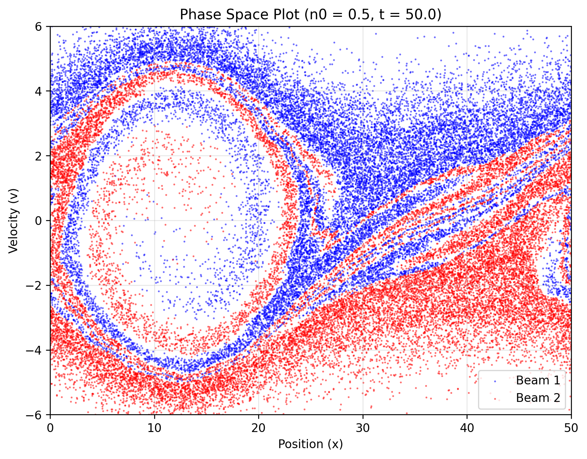
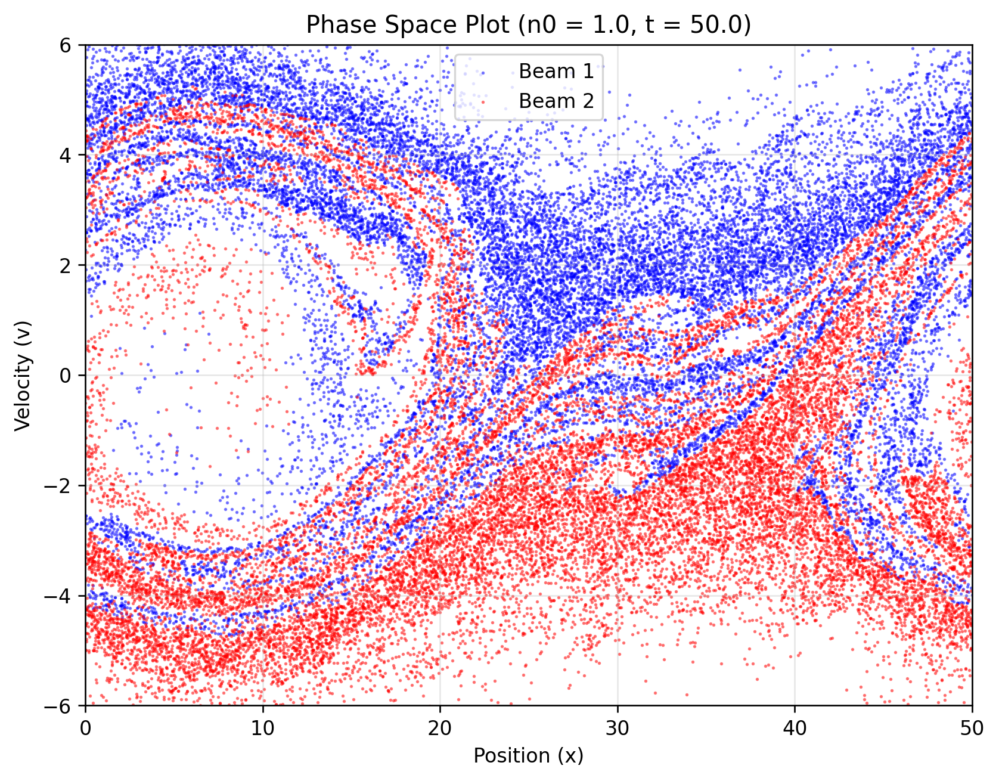
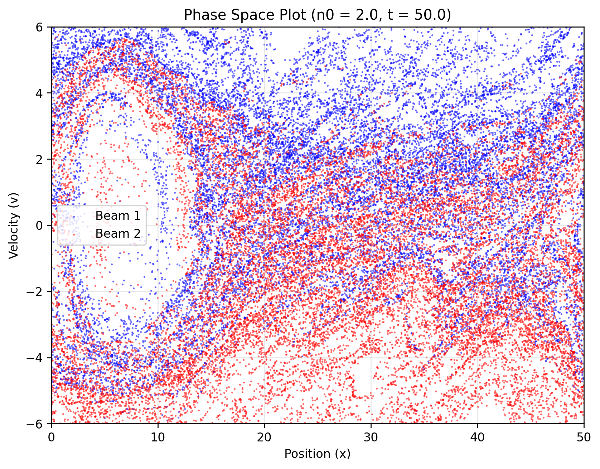
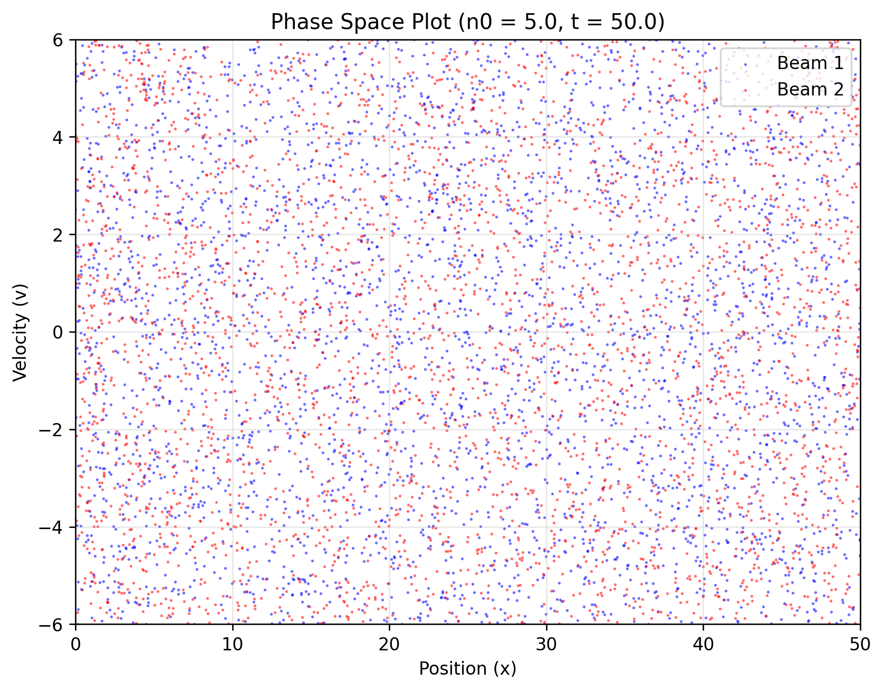

# PICシミュレーションによる二流体不安定性の研究報告

**学籍番号：** 2ES25185E  
**氏名：** LIN HANQING  
**講義名：** Basic Simulation Physics  
**日付：** 2025年7月7日

---

## 1. PICプログラムの概要と物理過程

`pic.py`は、**Particle-In-Cell (PIC)法**を用いて一次元プラズマの**二流体不安定性**をシミュレーションする。逆方向に進む二つの電子ビームに微小な摂動を与え、その時間発展をLeapfrog法で計算する。

プログラムが出力する**位相空間図 (Phase Space Plot)** は、横軸に粒子の**位置 (Position)**、縦軸に**速度 (Velocity)** を示す。これにより、以下の物理過程が可視化される。

1.  **初期状態**: `v = ±3` 付近に二つの電子ビームが明確な層流として存在する。
2.  **不安定性の成長**: 初期摂動が増幅し、電荷密度の不均一（クラスター化）とそれに伴う電場が発生する。
3.  **非線形飽和**: 電場が十分に強くなると、粒子が捕獲され、**位相空間渦 (Phase-space vortex)** が形成され層流構造が崩壊する。

---

## 2. パラメータ研究：電子数密度 n₀ の影響

### 2.1 実験設計

選択肢 **(i)** に従い、パラメータ `n0`（電子数密度）を `0.5, 1.0, 2.0, 5.0` と変化させ、不安定性の特性を調査した。シミュレーション時間は `t=50` とした。

### 2.2 実験結果

#### 2.2.1 n₀ = 0.5

**観察結果**: 一つの明確で巨大な位相空間渦 (a single, large phase-space vortex) が形成される。

#### 2.2.2 n₀ = 1.0

**観察結果**: 大きな渦が崩壊し、より小さく乱雑な複数の渦に変化し、乱流状態へ移行する。

#### 2.2.3 n₀ = 2.0

**観察結果**: 渦構造はほぼ完全に崩壊し、系は高度な乱流状態 (highly turbulent state) となる。

#### 2.2.4 n₀ = 5.0

**観察結果**: 全ての渦構造が消滅し、粒子がランダムに分布する**熱化状態 (thermalized state)** に達する。

### 2.3 結果の分析と考察

#### 2.3.1 不安定性成長率
**観察**: `n0` が大きいほど、不安定性の成長は速く、激しくなる。
**物理的解釈**: 高い `n0` は同じ密度摂動に対してより強い電場を生成し、粒子をより強く加速させるため、不安定性が急速に増幅される。

#### 2.3.2 飽和状態の特性
**観察**: `n0` の増加に伴い、系は「安定した渦」→「乱流」→「熱化状態」へと遷移する。
**物理的解釈**: `n0` が大きいほど飽和電場が強くなり、粒子加熱が激しくなる。高密度では、この効果が極端に強まり、安定した渦構造を維持できず、系全体が無秩序な熱化平衡状態へと急速に移行する。

#### 2.3.3 定量的比較
| n₀ の値 | 速度分布範囲 | 飽和状態の特徴     | 不安定性の強度 |
|----------|-------------|-------------------|----------------|
| 0.5      | ±4          | 単一の大きな渦     | 弱い           |
| 1.0      | ±5          | 複数の小さな渦     | 中程度         |
| 2.0      | ±6          | 高度な乱流         | 強い           |
| 5.0      | ±6          | 熱化／構造なし     | 極めて強い     |

---

## 3. 結論

本研究では、PICシミュレーションを用いて二流体不安定性に対する電子数密度 `n0` の影響を調査した。

**主要な知見:**
- `n0` の増加は、不安定性の成長を著しく加速させる。
- 飽和状態は `n0` に強く依存し、低密度ではコヒーレントな渦構造を形成するが、高密度では乱流を経て最終的に熱化状態に至る。

この結果は、密度がプラズマ不安定性の線形および非線形過程において、極めて重要な役割を果たすことを示している。

