# 1. 什么是功率器件？ (What is a Power Device? / パワーデバイスとは)

## 1-1 功率器件的作用 (Role of Power Devices / パワーデバイスの役割)

在我们的日常生活中，电能是不可或缺的。电能由发电厂产生，通过输配电网络输送到家庭、办公室、工厂等地，并被各种电器、照明设备、个人电脑和动力设备广泛使用。从发电到使用的整个过程中，电能会根据需要被转换成各种电压和电流。这项用于转换电能的控制、电路和器件技术统称为 **电力电子学 (Power Electronics / パワーエレクトロニクス)**。

用于这种电能转换的电力电子电路中的半导体器件，被称为 **功率器件 (Power Device / パワーデバイス)** 或 **功率半导体器件 (Power Semiconductor Device / パワー半導体デバイス)**。电力电子电路中的功率转换，是通过周期性的开关动作，将电能暂时储存在 **电感 (Coil / コイル)** 或 **电容 (Capacitor / コンデンサ)** 中，然后再根据需要取出电能来实现的。因此，功率器件的主要作用，就是作为开关来控制伴随这种转换产生的电流流动。

图1-1所示是一个被称为 **升压转换器 (Boost Converter / 昇圧コンバータ)** 的电路示例。通过交替地将功率器件A和B进行导通/关断（on/off）操作，可以将从输入端输入的能量传递到输出端。此时，如果让功率器件A以 **占空比 (Duty Cycle / デューティ比)** *D* 导通，输出电压 Vout 将被转换为输入电压 Vin 的 1/(1-D) 倍。

为了有效利用电能，需要有能够高效转换功率的电力电子电路。通常，通过减少部件数量和实现小型化，可以降低电路的成本。因此，电力电子电路在不断提高效率的同时，也在向小型化发展。而这种电力电子电路的进步，是由功率器件的性能提升所支撑的。

## 1-2 功率器件的基本工作原理 (Basic Operation of Power Devices / パワーデバイスの基本動作)

功率器件作为开关使用，其基本工作状态有三种：允许电流通过的 **“导通状态 (On-state / オン状態)”**、不允许电流通过的 **“关断状态 (Off-state / オフ状態)”**，以及从导通状态切换到关断状态或从关断状态切换到导通状态的 **“开关状态 (Switching state / スイッチング状態)”**。

首先，在处理电力时，即使在施加电压的情况下也能安全地保持关断状态是首要任务，因此，器件在不被破坏的情况下所能承受的电压，即 **耐压 (Withstand Voltage / 耐圧)**，是最重要的性能指标。

其次，为了实现高效的功率转换，必须减小功率器件产生的损耗。功率器件产生的损耗包括在导通状态下产生的 **导通损耗 (Conduction Loss / 導通損失)** 和在开关状态下产生的 **开关损耗 (Switching Loss / スイッチング損失)**。导通损耗是导通状态下的电流与器件内部电压降的乘积，因此，导通状态下的电阻（**导通电阻 (On-resistance / オン抵抗)**）或导通状态下的电压降（**导通电压 (On-voltage / オン電圧)**）被用作评估低损耗性能的指标。此外，开关损耗与导通/关断切换所需的时间成正比，因此 **开关时间 (Switching Time / スイッチング時間)** 和开关损耗被用作评估低损耗性能的指标。

综上所述，**耐压 (Withstand Voltage / 耐圧)**、**导通电阻 (On-resistance / オン抵抗)**（或 **导通电压 (On-voltage / オン電圧)**）以及 **开关时间 (Switching Time / スイッチング時間)**（或 **开关损耗 (Switching Loss / スイッチング損失)**）是功率器件的重要性能。

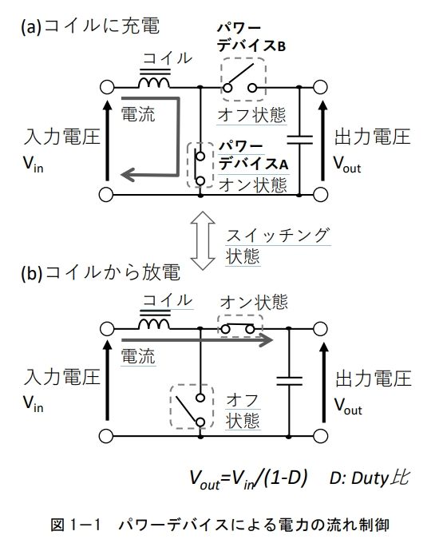

**电力电子电路 (Power Electronics Circuit / パワーエレクトロニクス回路)** 的性能，取决于其内部所使用的功率器件能承受的电压，因此，在确保必要耐压的同时，降低损耗，是改善功率器件性能的关键。

此外，功率器件的开关动作，通常伴随着大电流、高电压的变化。为了减少 **开关损耗 (Switching Loss / スイッチング損失)** 而进行高速开关操作时，会导致电流和电压的急剧变化。此时，电力电子电路中的 **寄生电感 (Parasitic Inductance / 寄生インダクタンス)** 和 **寄生电容 (Parasitic Capacitance / 寄生キャパシタンス)** 会产生 **浪涌电压 (Surge Voltage / サージ電圧)** 和 **浪涌电流 (Surge Current / サージ電流)**，这不仅是产生 **噪声 (Noise / ノイズ)** 的原因，也可能导致器件损坏。因此，开关损耗和噪声、损坏之间存在 **权衡关系 (Trade-off / トレードオフ)**。噪声不仅会影响电路中的其他元件，还会通过布线影响其他电路，因此电路产生的噪声强度受到法规的严格限制。为了满足这些规定而增加滤波器等电路，会导致成本上升、电路体积变大。因此，选择能够在满足噪声规范的同时，实现低损耗、高效率工作的功率器件至关重要。也就是说，改善开关损耗与噪声的权衡关系，也是对功率器件的一项要求。

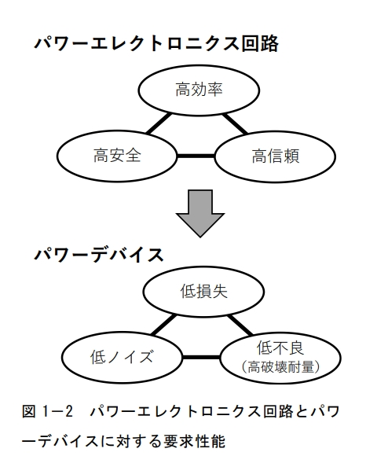

另外，对于功率器件的工作，不仅要求在正常的电路工作下，还要求在诸如瞬时停电或建筑物整体电源投入等非正常状态下也不能损坏。当功率器件损坏时，存储在电力电子电路内部的能量或从电源线供给的能量，会以大电流的形式流过，可能导致器件发热甚至起火。可以预见，高速开关时产生的浪涌电压和浪涌电流会使器件内部的电场强度变高，达到临界电场强度，从而引发 **雪崩击穿 (Avalanche Breakdown / アバランシェ降伏)**，导致器件损坏。因此，开关损耗和抵抗损坏的能力（**破坏耐量 (Destruction Tolerance / 破壊耐量)**）也存在权衡关系。为了避免损坏而增加吸收浪涌的电路，会增加成本和电路尺寸。功率器件需要在预想的工作条件下，具备器件不会损坏的 **鲁棒性 (Robustness / ロバスト性)**（耐量）。也就是说，改善损耗与破坏耐量的权衡关系也是一项要求。

综上所述，对功率器件所要求的功能，并不仅仅是作为控制电力的开关那么简单。如图1-2所示，为了在紧凑的电路中实现高效的电能转换，需要不断改善损耗、噪声和破坏耐量之间的权衡关系。

## 1-3 功率器件的分类 (Classification of Power Devices / パワーデバイスの分類)

使用进行单纯导通/关断（on/off）动作的开关来实现电流切换，需要两个开关。理想情况下，两个开关无延时地交替进行导通/关断操作，但在现实中很难实现。因此，通常一个开关作为 **有源器件 (Active Element / 能動素子)**，另一个开关作为 **无源器件 (Passive Element / 受動素子)**。有源器件是指带有控制信号输入端子的开关元件，而无源器件则是指没有控制端子的 **二极管 (Diode / ダイオード)**。

因此，功率器件可如表1-1所示，大致分为 **开关元件 (Switching Element / スイッチング素子)** 和 **二极管 (Diode / ダイオード)**。开关元件根据其控制端子的种类，又可分为 **MOS门 (MOS Gate / MOSゲート)**（绝缘栅）和 **结型门 (Junction Gate / 接合ゲート)**。MOS门器件中，控制信号是施加的电压，但在开关瞬间，除了流向MOS电容的位移电流外，几乎没有电流流过。

**表1-1 功率器件的分类**
| | **单极性 (Unipolar / ユニポーラ)** | **双极性 (Bipolar / バイポーラ)** |
| :--- | :--- | :--- |
| **开关元件** | | |
| MOS门 | **功率MOSFET** (Power MOSFET) | **IGBT** |
| 结型门 | **JFET, SIT** | **晶闸管 (Thyristor / サイリスタ)**, **GTO**, **双极性晶体管 (Bipolar Tr)** |
| **二极管** | **SBD (肖特基势垒二极管)** | **pin二极管** (pin Diode) |

而关断状态的稳定维持在结型门中是通过对 **pn结 (pn junction / pn接合)** 施加电压来控制的，这一点与MOS门相同，但由于是向pn结施加电压，因此也被称为 **“电压控制型 (voltage-controlled / 電圧制御型)”** 或 **“电流控制型 (current-controlled / 電流制御型)”**。

此外，在无源器件中，其内部流动的载流子要么是电子，要么是空穴，这被称为 **单极性 (unipolar / ユニポーラ)** 器件。而在有源器件中，电子和空穴两种载流子都对导通做出贡献，这被称为 **双极性 (bipolar / バイポーラ)** 器件。

具有代表性的功率器件，如 **功率MOSFET (Power MOSFET)**、**IGBT** 和 **pin二极管 (pin diode / pinダイオード)** 的断面结构如图1-3所示。功率器件为了在电路下方的布线之间流过电流，通常采用纵向的 **垂直结构 (vertical structure / 縦型構造)**。最新的功率器件采用MOS栅极结构，IGBT在MOSFET的表面形成MOS栅极，其下部为通过在平面栅极中挖沟槽而形成的 **沟槽栅极 (trench gate / トレンチゲート)** 结构。各端子的名称，在MOSFET中是 **源极 (Source / ソース)**、**漏极 (Drain / ドレイン)** 和 **栅极 (Gate / ゲート)**；在IGBT中是 **发射极 (Emitter / エミッタ)**、**集电极 (Collector / コレクタ)** 和栅极；而在pin二极管中则是 **阳极 (Anode / アノード)** 和 **阴极 (Cathode / カソード)**。

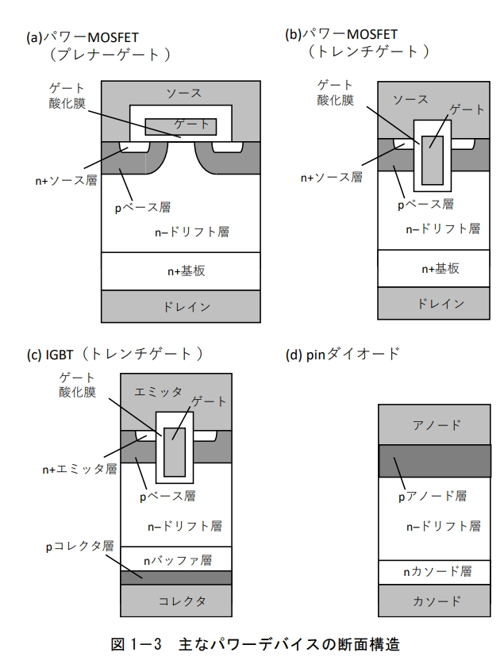

IGBT的栅极名称与功率MOSFET略有不同。但在门极方面是相同的，只是由于它是双极性器件，因此端子被称为发射极和集电极。图1-3中的IGBT展示了沟槽栅极结构，但也有使用平面栅极结构的IGBT。pin二极管的端子名称与模型结构相同，分别为阳极和阴极。

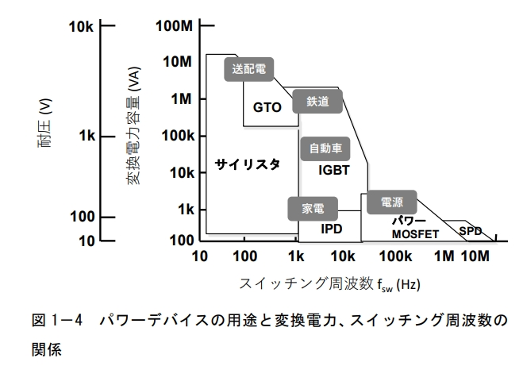

在功率MOSFET、IGBT和pin二极管中，一个共同的特点是，它们都具有一个用于在关断状态下保持耐压，同时使漏电流保持在低水平的 **n-漂移层 (n-drift layer / n-ドリフト層)**。这个n-漂移层的厚度和掺杂浓度可以通过调整来设计所需的耐压。

在设计电力电子电路时，需要根据转换功率的大小来选择合适的耐压和器件类型。需要高耐压的功率器件通常施加的电压也很高。为了实现高耐压，器件内部必须有一个能够承受高电压的厚n-漂移层。通常，厚的漂移层会导致电流难以流过，从而增加导通损耗。为了降低这种导通电阻，不仅需要利用电子的单极性导电，还需要利用电子和空穴两种载流子来使漂移层过饱和，这种操作称为 **电导率调制 (conductivity modulation / 導電率変調)**，它可以降低导通损耗。但另一方面，由于开关时需要排出大量的载流子，导致开关时间变长，开关损耗增加。因此，用于大功率转换的高耐压功率器件，往往更容易产生损耗。

如前所述，功率器件的选择取决于转换功率的大小。例如，在转换像个人电脑或照明设备这样的小功率时，电路的小型化是优先考虑的。如图1-4所示，像功率MOSFET这样的单极性器件会在高开关频率下使用。相反，在转换像输配电或铁路、电动汽车这样的大功率时，由于开关过程中容易产生大的损耗，因此像IGBT或晶闸管这样的双极性器件会在较低的开关频率下使用。

本讲座将介绍与耐压、导通电阻等基本性能相关的设计参数，同时对具有代表性的器件，即二极管、功率MOSFET、IGBT和 **宽禁带半导体 (wide-bandgap semiconductor / ワイドバンドギャップ半導体)** 进行说明。

# 2. 功率器件的基本设计 (Basic Design of Power Devices / パワーデバイスの基本設計)

## 2-1 芯片基本结构 (Basic Chip Structure / チップ基本構造)

功率器件的基本工作原理是，在导通状态下即使有大电流流过，也要保持较低的内部电阻以确保电流路径；而在关断状态下，即使施加了高电压，也必须能够承受。为了实现这一点，功率器件采用了如图2-1所示的 **纵向结构 (Vertical Structure / 縦型構造)**。以功率MOSFET为例，在导通状态下，电子通过反型沟道后，在整个 **漂移层 (Drift Layer / ドリフト層)** 区域扩散，从而实现低电阻。而在关断状态下，通过在表面侧和漂移层之间扩展的 **耗尽层 (Depletion Layer / 空乏層)** 来确保耐压。

与存储器或LSI等其他半导体器件一样，功率器件也是通过从圆形晶圆上切割出多个芯片而制成的。如图2-2所示，在芯片表面形成 **源极/发射极电极 (Source/Emitter Electrode / ソース・エミッタ電極)** 和 **栅极电极 (Gate Electrode / ゲート電極)**，背面形成 **漏极/集电极电极 (Drain/Collector Electrode / ドレイン・コレクタ電極)**。在流过电流的核心区域外围，形成了与漂移层同样用于保持耐压作用的 **终端结构 (Termination Region / 終端領域)**。

在此，我们将阐述为确保耐压而设的漂移层的设计，以及与之相关的导通电阻的理论极限，并进一步阐述终端结构的设计。

## 2-2 漂移层设计与导通电阻的理论极限 (Drift Layer Design and On-Resistance Theoretical Limit / ドリフト設計とオン抵抗の理論限界)

我们将阐述为满足要求的耐压而设计的 n-漂移层的浓度和厚度。如图2-2(a)所示，在关断状态下，p-基底层和n-漂移层构成的pn结上施加了逆向电压。随着施加电压的增加，耗尽层会扩展到低浓度的n-漂移层中。在关断状态下，电流几乎不流动，由施加电压引起的电场由耗尽层来维持，仅在耗尽层中产生电场。

电场分布由n-漂移层的 **不纯物浓度 (Impurity Concentration / 不純物濃度)** 和施加的电压决定。根据 **泊松方程 (Poisson's Equation / ポアソン方程式)**，电场梯度由耗尽层中的固定电荷量决定。耗尽层中的多数载流子是电子，因此不存在。不纯物离子（施主的正电荷）构成了唯一的电荷。电场分布的斜率与n-漂移层的不纯物浓度 $N_{drift}$ 成正比。如图2-3所示，即使施加一个使电场分布面积等于耗尽层厚度的电压，只要不改变不纯物浓度，电场分布的斜率就不会改变。为了保持一定的施加电压，耗尽层会向漏极方向延伸。

如果继续增加施加电压，耗尽层会进一步延伸，p-基底层下的电场强度也会增加。当电场达到峰值，即 **临界电场 (Critical Electric Field / 臨界電界)** $E_{crit}$ 时，就会发生 **雪崩击穿 (Avalanche Breakdown / アバランシェ降伏)**。在雪崩击穿过程中，即使耗尽层中有微小的电流，移动的载流子也会被强电场加速。通过这种移动获得的能量会超过能量带隙，当被加速的载流子与原子碰撞时，会通过 **碰撞电离 (Impact Ionization / インパクトイオン化)** 现象，将价带电子激发到导带，从而产生新的电子-空穴对。这种现象被称为碰撞电离，而通过碰撞电离产生的载流子又被进一步加速，产生新的电子-空穴对的连锁反应，使载流子呈雪崩式增加的现象，被称为雪崩击穿或雪崩现象。

当发生雪崩击穿时，即使在关断状态下也会有大电流流过，因此，雪崩击穿开始时的电压即为耐压，其大小由电场分布决定。因此，从耐压出发，可以根据电场的最大值为临界电场这一条件，通过确定耗尽层的厚度来反推不纯物浓度，进而确定耗尽层的厚度（漂移层厚度）。当临界电场 $E_{crit}$ 到达n+基板时，电场分布为三角形，其面积为耐压 $V_B$。

$$
V_B = \frac{\varepsilon_s E_{crit}^2}{2qN_{drift}} \quad (1)
$$

其中，$\varepsilon_s$ 是真空介电常数（=8.854×10⁻¹⁴ F/cm），$\varepsilon_{Si}$ 是硅的比介电常数（=11.8）。由式(1)可知，为了提高耐压，降低不纯物浓度是有效的。临界电场在材料上是固定的，因此漂移层材料越纯净（不纯物浓度越低），耐压越高。因此，根据设计可变的参数是不纯物浓度和漂移层厚度。

**导通电阻 (On-resistance / オン抵抗)** 由导通状态下流过电流的整个路径的电阻决定。以功率MOSFET为例，电子从源极电极经反型沟道进入n+基板，再流向漏极电极。漂移层电阻是决定耐压的参数。为了降低漂移层电阻，需要减薄漂移层的厚度、提高不纯物浓度。但是，减薄漂移层会导致耐压降低。此外，由于沟道和基板电阻与耐压无关，其值由MOS栅极结构决定，独立于漂移层设计。因此，即使可以忽略漂移层电阻以外的电阻，仅通过设计来降低导通电阻的下限也存在理论极限。然后，为了降低导通电阻，漂移层电阻必须降低。因此，低导通电阻、且高耐压的器件很难获得，二者之间存在 **权衡关系 (Trade-off / トレードオフ)**。

像这样，在设计漂移层时，需要在满足必要耐压的同时，通过确定漂移层的厚度和浓度来导出能够实现最低导通电阻的条件。当漂移层电阻为 $R_{onA}$，漂移层厚度为 $t_{drift}$，不纯物浓度为 $N_{drift}$ 时，最佳设计就是导出漂移层电阻。因此，从 $R_{onA}$ 的公式可得，

$$
R_{onA} = \frac{t_{drift}}{q\mu N_{drift}} \quad (2)
$$

其中，$\mu$ 是 **电子迁移率 (electron mobility / 電子移動度)**。为了降低导通电阻，需要在保持耐压的同时，减薄漂移层、提高浓度。当漂移层的不纯物浓度一定时，将漂移层厚度最大化所能得到的耐压，由下式给出：

$$
E_{crit} = \frac{qN_{drift}}{\varepsilon_s}t_{drift} \quad (3)
$$

也就是说，当耗尽层到达 n+ 基板时，三角形的电场分布设计能够获得最高的耐压。利用式(1)、(3)和式(2)，消去漂移层厚度 $t_{drift}$ 和漂移层浓度 $N_{drift}$，可得导通电阻为：

$$
R_{onA} = \frac{4V_B^2}{\varepsilon_s \mu E_{crit}^3} \quad (4)
$$

由此可知，该导通电阻与耐压的2次方成正比，与临界电场的3次方成反比。这就是导通电阻的理论极限值。

上述内容是基于最密堆积设计进行的阐述。到目前为止，我们一直将临界电场视为一个恒定值，但实际上，它会随耐压而略有变化。因此，严格的耐压-导通电阻理论极限并非与耐压的2次方成正比，而是与耐压的2.5次方成正比。式(4)可以消除临界电场，从而推导出该理论极限。实际上，临界电场并非一个恒定值，即便是以耐压为参考也无法确定。它是由材料决定的常数，是指载流子在走行时发生碰撞电离的概率所决定的碰撞电离系数 $\alpha$。

当雪崩击穿即将发生时，漂移层内绝对会发生碰撞电离。也就是说，当碰撞电离率在漂移层内积分的值为1时（碰撞电离100%发生），元件会因雪崩而击穿。利用表示碰撞电离概率的碰撞电离系数 A，可将碰撞电离率表示为：

$$
\int_{0}^{t_d} K e^{(-\frac{B}{E(x)})} dx = 1 \quad (5)
$$

其中，$E(x)$ 是深度方向上漂移层内的电场。然后，将三角形电场分布代入式(5)的 $E(x)$ 中，

$$
\int_{0}^{t_{drift}} K e^{(-\frac{B}{E_{crit}(1 - \frac{x}{t_{drift}})})} dx = 1 \quad (6)
$$

となり、三角形分布であるから、x=$t_{drift}$では、E=0であり、

$$
E_{crit} = (\frac{BqN_{drift}}{2\varepsilon_s})^{1/2} \quad (7)
$$

由此可知，临界电场依赖于漂移层浓度 $N_{drift}$。然后，利用式(1)~(4)、(7)消去 $N_{drift}$ 和 $E_{crit}$，可得：

$$
R_{onA} = \frac{2 \sqrt{2} V_B^{2.5}}{\varepsilon_s \mu B^{3/2}} \quad (8)
$$

这通常被称为“与耐压的2.5次方成正比”的公式。这就是所谓的 **材料极限 (Material Limit / 材料限界)**，在Si（硅）的情况下，该导通电阻的低极限值被称为 **Si极限 (Si Limit / Si限界)**。Si的导通电阻 $R_{onA, Si}$ 为 1.91×10⁻¹⁰$V_B^{2.5}$ Ωcm²，因此，Si漂移层的导通电阻为 5.93×10⁻⁹$V_B^{2.5}$ Ωcm²。

各耐压下，构成漂移层的浓度 $N_{drift}$ 和厚度 $t_{drift}$ 可由下式表示：

$$
N_{drift} = \frac{\varepsilon_s E_{crit}^2}{2qV_B} \quad (9)
$$

$$
t_{drift} = (16K)V_B^{1.5} \quad (10)
$$

由此可见，漂移层浓度和厚度与单纯的耐压并不成正比或反比关系，需要进行一些修正。

以上所示的公式，对Si（硅）以外的所有材料都同样适用。图2-4展示了使用 **SiC (碳化硅)** 或 **GaN (氮化镓)** 等 **宽禁带半导体 (Wide-bandgap Semiconductor / ワイドバンドギャップ半導体)** 时的材料极限。与Si相比，宽禁带半导体的临界电场要高出一个数量级。因此，漂移层可以做得更薄、浓度可以更高。这意味着，与Si极限相比，其导通电阻可以降低到1/1000这一飞跃性的水平。因此，SiC或GaN等宽禁带半导体作为下一代功率半导体材料备受瞩目，相关的开发正在积极进行中。

## 2-3 终端结构 (Termination Structure / 終端構造)

**终端结构 (Termination Structure / 終端構造)** 是指图2-2所示的、位于流过电流的 **主元胞区域 (Main Cell Region / メインセル領域)** 外围部分的结构。漏极电极等通常与芯片背面电极连接。源极/发射极电极和p-基底层不仅在主元胞区域，也在内侧形成。因此，在终端区域，如图2-5所示，电场不仅从表面向背面方向施加，也从芯片端部向横向施加，因此耗尽层的扩展方式（施加电压的方式）与主元胞区域不同。终端结构是独立设计以应对这种差异的。因此，在设计终端结构时需要特别注意。

终端保护的要点，在于说明为何需要在芯片内特意设置与主元胞区域不同的设计。丸いウェハ内に複数形成された四角いチップは、**切割工艺 (dicing process / ダイシング工程)** によって、一つ一つのチップに切り離される。切り離された断面（チップ端）には、切割工程により机械的な损伤が入った **破坏层 (damaged layer / 破壊層)** が存在する。切割工程の条件によるが、通常、切断面から20μm程度内侧まで损伤が入る。

即使为终端结构设计了与主元胞区域相同的结构，当芯片被切割分离时，如果破坏层中也施加了电场，由于该破坏层存在机械损伤，会有许多结晶缺陷，因此会产生较大的漏电流。这会导致终端结构无法承受预期的耐压，在破坏层处就会发生击穿。因此，通过设计使电场不会施加到破坏层，从而实现稳定的关断状态。

如前所述，在终端区域，耗尽层会向横向和纵向两个方向扩展。因此，横向电场和纵向电场叠加处的电场会成为p-基底层端的电场边界。如图2-5所示，如果终端区域的p-基底层端部施加了电场，横向电场也会变得很高，耐压会降低。由于元件整体的耐压取决于耐压最低的部位，因此终端区域的耐压降低会导致整个元件的耐压也降低。

通常，主元胞区域和终端区域的漂移层是共通的。因此，为了提高终端区域的耐压，需要降低横向电场。为此，需要降低p-基底层的浓度，同时增加厚度，这又会导致导通电阻增加。因此，需要设计出能够在抑制导通电阻增加的同时，实现高耐压的终端结构。

提高耐压的高耐压化的基本要点在于横向电场设计。这是因为横向电场无法像主元胞区域那样仅通过降低浓度来减小。然而，如果终端结构能够巧妙地将横向电场向横向扩展，就可以提高耐压。具体的方法是，在横向上拉长耗尽层，使电场分布平缓。这样，即使施加相同的电压，耗尽层内的电场也会变小。

一个重要的考虑因素是，通常，漂移层的厚度是根据纵向耐压设定的，约为纵向电场的三到四倍。因此，需要设计一种结构，即使将耗尽层在横向扩展这么长的距离，也能维持其扩展。此外，单纯地在横向拉长距离，由于耗尽层中的电场是由不纯物浓度决定的，因此，为了使耗尽层在纵向方向上完全扩展，需要一种能够确保耗尽层厚度的结构，这就是终端结构。

在此，我们将介绍几种主要的终端结构，包括 **保护环 (Guard Ring / ガードリング) (GR)**、**RESURF (Reduced Surface Field)** 结构和 **场板 (Field Plate / フィールドプレート) (FP)** 结构（参见图2-6）。首先，我们来介绍在功率器件中应用最广泛的终端结构——GR终端。

GR终端是由在终端部分的表面形成的多个p型环（GR环）构成的。通常，GR环是 **浮动 (floating / フローティング)** 的，并且与p基底层分开形成。通常，GR环在形成p基底层之前预先形成，因此比p基底层更深。这样一来，p基底端的曲率半径变大，电场集中得到缓和，从而获得高耐压。

当施加电压时，耗尽层随着电压的升高而扩展，电场强度也随之增加。当施加更高的电压时，耗尽层会到达最近的GR环，该GR环的电位也会被施加。这样，最外侧GR环的电场就不会再增加，下一个GR环的耗尽层开始扩展，最外侧的GR环开始抑制其内侧GR环的电场上升。通过依次抑制外侧GR环的电场上升，可以将电场向外扩展，这种环也被称为 **场限环 (Field Limiting Ring)**。

内侧GR环无法抑制电场的原因是，内侧的 **受主离子 (acceptor ion / アクセプタイオン)** 和漂移层的 **施主离子 (donor ion / ドナーイオン)** 的电场力线不会与外侧的受主离子相交。为了实现这种效果，内侧GR环必须完全 **耗尽 (deplete / 空乏化)**。然而，由于内侧GR环的浓度没有上限，因此需要严密的浓度控制。

GR终端的横向电场在GR环之间的间隔中扩展，其电位由GR环之间的间隔决定。因此，终端电场的集中程度取决于GR环的深度和各环之间的间隙等设计参数。如果GR环的间隙决定不当，耗尽层会过早到达外侧的GR环，导致外侧GR环的电场过高。相反，如果GR环的间隙过宽，内侧的电场会变得过高，容易发生雪崩击穿。理想的GR间隙是使所有终端的电场峰值变得相同，此时的间隙是最佳间隙。

接下来，介绍RESURF结构。RESURF（Reduced Surface Field）是在图2-6(b)所示的，在表面上形成比p基底层浓度更低的RESURF层的结构。当施加电压时，耗尽层不仅从p基底层和漂移层的pn结扩展，也从RESURF层和漂移层的pn结扩展。当施加一定程度以上的电压时，RESURF层会完全耗尽。此时，由于RESURF层的电荷量仅由其长度决定，因此横向电场会变小。当施加更高的电压时，RESURF层已经形成的耗尽层会向外侧扩展。

RESURF结构的基本工作原理是RESURF层完全耗尽，因此RESURF层的浓度和长度是设计参数。当完全耗尽时，其下的电场分布由RESURF层中的受主离子数和漂移层中的施主离子数决定。RESURF层浓度低，呈n型掺杂，因此耗尽层中有正电荷。与此设计相同，当耗尽层中存在正电荷时，内侧的电场会上升。相反，RESURF层浓度高，呈p型掺杂，与此设计相同，由于存在负电荷，外侧的电场会上升。如果RESURF层浓度在最终能够形成平坦的电场分布，就可以获得最高的耐压。因此，与GR终端不同，RESURF终端需要严密的浓度控制。

最后，介绍FP结构。如图2-6(c)所示，FP结构是在终端区域表面形成的 **绝缘膜 (insulating film / 絶縁膜)** 上，将源极或栅极延伸形成FP电极的结构。耗尽层的扩展方式与RESURF结构相似，是通过来自FP电极的电场来扩展耗尽层。RESURF结构是通过RESURF层和漂移层的pn结耗尽层来扩展，而FP结构则是通过来自FP电极的电场和绝缘膜、漂移层构成的MIS二极管的电位来扩展耗尽层。

MIS二极管的耗尽层扩展方式由MIS二极管的电容，即绝缘膜的厚度决定，因此FP结构的设计参数是FP电极下的绝缘膜厚度。然后，由于FP电极使耗尽层扩展，因此耗尽层的长度决定了横向电场。因此，FP电极的长度（FP长）也是设计参数。通过改变这些设计参数，可以控制FP电极下方的电场，从而推测出向p基底层电场集中的减少情况。如果绝缘膜薄，FP电极短，则开口部会变窄，耐压会降低。因此，p基底端的电场会变小，但FP电极附近的电场会变大。相反，如果绝缘膜厚，FP电极短，则开口部会变宽，p基底端的电场会变缓和，耐压会升高。通过优化绝缘膜厚度和FP长度，可以获得平坦的电场分布和最高的耐压。将绝缘膜的厚度从内侧向外侧逐渐变厚，可以缓和p基底端和FP端部的电场集中，获得平坦的电场分布和最高耐压。然而，要使厚度逐渐变化，在工艺上是很困难的，因此，通常使用热氧化膜或CVD等堆叠膜，分2-3个阶段改变厚度来形成FP。

FP的优点在于，由于不使用不纯物层，因此与绝缘膜或电极相比，制造工艺相对简单。但是，要应用于高耐压元件，需要数μm厚的绝缘膜。

# 3. 二极管 (Diode / ダイオード)

## 3-1 基本结构与工作原理 (Basic Structure and Operation / 基本構造と動作)

在介绍作为开关元件的功率MOSFET和IGBT之前，我们先来说明一下结构更为简单的两端元件——**二极管 (Diode / ダイオード)**。如表1-1所示，二极管可分为 **单极性 (Unipolar / ユニポーラ)** 的 **肖特基势垒二极管 (Schottky Barrier Diode / ショットキーバリアダイオード, SBD)** 和 **双极性 (Bipolar / バイポーラ)** 的 **pin二极管 (pin Diode / pinダイオード)** 两大类。如图3-1(a)所示，SBD的结构是在n-漂移层和阳极电极的界面处形成肖特基接触。通过这种 **肖特基势垒 (Schottky Barrier / ショットキー接合)** 的电势垒，当对阳极施加正电压（正向偏置）时，漂移层的电子会向阳极电极移动，从而实现正向导通。当对阳极电极施加负电压（反向偏置）时，电流被电势垒阻挡，不会流动。此时，电场由从肖特基接触延伸出的耗尽层来维持。

另一方面，表面形成p-阳极层的pin二极管，其结构如图3-1(b)所示。当施加正向电压时，空穴从p-阳极层注入，电子从n-阴极层注入，p-阳极层和n-漂移层结处的耗尽层收缩，电流开始流动。当施加反向电压时，耗尽层从p-阳极层和n-漂移层的结向n-阴极层方向扩展，电场由扩展的耗尽层维持。

**正向特性 (Forward Characteristics / 順方向特性)** 在图3-2的示意图中有所展示，根据二极管的种类有很大不同。pn结的电势垒较高，而肖特基结的电势垒较低，因此在低正向电压下，SBD更容易导通。然而，由于单极性工作原理，其电阻较高，随着电流增大，pin二极管的导通电压会变得更低。

当反向电压增加时，漂移层内的电场会增强，最终发生雪崩击穿。该电压即为耐压。在正向偏置时，前端所述的n-漂移层的浓度和厚度是根据耐压设计的。而在反向偏置时，由于pn结的电势垒高于肖特基结，所以pin二极管的微小反向漏电流比SBD更小。此外，由于肖特基势垒会随着施加的电压而降低，即存在 **肖特基势垒降低效应 (Schottky Barrier Lowering / 鏡像効果)**，SBD的耐压趋向于在反向漏电流开始增加之前就达到极限。

我们来阐述决定SBD和pin二极管特性的参数。首先，SBD的 **正向导通电压 (Forward On-voltage / 順方向オン電圧)** $V_{FSBD}$ 是肖特基结上施加的电压 $V_{SB}$ 和漂移层电压降 $V_{drift}$ 的和。

$$
V_{FSBD} = V_{SB} + V_{drift} \quad (11)
$$

此时，$V_{SB}$ 与正向电流密度 $J_F$ 的关系为：

$$
J_F = AT^2\exp(-\frac{q\phi_B}{k_B T})\{\exp(\frac{qV_{SB}}{k_B T}) - 1\} \quad (12)
$$

其中，A是理查德森常数，T是绝对温度，$\phi_B$ 是肖特基势垒高度，$k_B$ 是玻尔兹曼常数。而漂移层电压降 $V_{drift}$ 由漂移层电阻 $R_{on}$ 和正向电流密度 $J_F$ 决定。

$$
V_{drift} = R_{on} J_F = \frac{t_{drift}}{q N_{drift} \mu_n} J_F \quad (13)
$$

正如在功率器件基本设计中所述，漂移层电阻与耐压之间存在权衡关系。

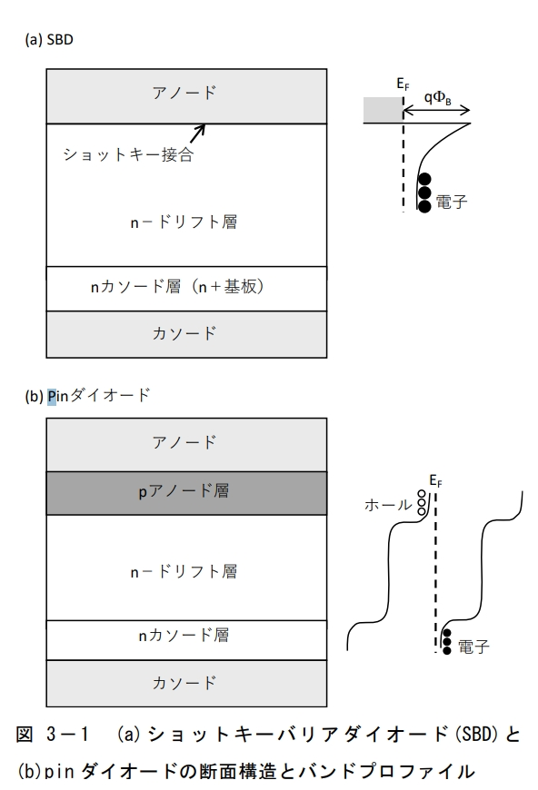

在高正向电压下，pin二极管由于其双极性工作原理，通过电导率调制使漂移层电阻降低，因此其导通电压低于SBD。因此，Si SBD一般用于200V以下，200V以上则使用pin二极管。

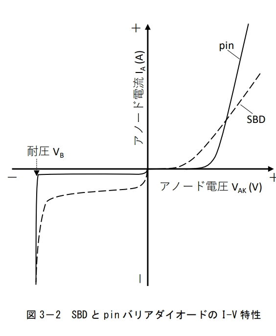

从式(12)可以看出，为了降低逆向漏电流，需要一个大的 **肖特基势垒高度 (Schottky Barrier Height / ショットキー障壁の高さ)** $\phi_B$。但是，从式(12)可以看出，如果 $\phi_B$ 增大，漏电流会减小，但导通时的 $V_{SB}$ 会增大，导通电压也会升高。也就是说，SBD的正向电压和反向漏电流之间存在权衡关系，这可以通过阳极电极的金属种类来调整。另外，为了在高电压施加时抑制漏电流的增加，如图3-3所示，采用了 **结势垒控制肖特基 (Junction Barrier Controlled Schottky, JBS)** 结构或 **沟槽肖特基 (Trench Schottky)** 结构。这些结构通过在阳极金属下方形成p层或多晶硅层，来遮蔽施加在肖特基势垒上的电场，从而抑制高电压施加时因镜面效应导致的势垒降低和漏电流增加。

接下来，我们阐述pin二极管的特性。pin二极管的导通电压 $V_{Fpin}$ 是p-阳极层和n-漂移层结上施加的电压 $V_{pn}$、漂移层电压降 $V_{drift}$、以及n-漂移层和n-阴极层结上施加的电压 $V_{nn}$ 之和。

$$
V_{Fpin} = V_{pn} + V_{drift} + V_{nn} \quad (14)
$$

其中，$V_{pn}$ 和 $V_{nn}$ 的和取决于漂移层内的载流子浓度。

$$
V_{pn} + V_{nn} = \frac{k_B T}{q} \ln(\frac{p_n p_i}{n_i^2}) \quad (15)
$$

其中，$p_n$ 是阳极侧的载流子浓度，$p_i$ 是阴极侧的载流子浓度，$n_i$ 是本征载流子浓度。在高注入状态下，漂移层接近电中性，电子和空穴浓度几乎相等，且载流子产生可忽略不计。此时，p-阳极层和n-阴极层为多数载流子源，电流接近于扩散电流。此时的载流子分布 $p(x)$ 为：

$$
p(x) = \frac{J_F}{2qD_a} \frac{\sinh((L_a - x)/L_a)}{\cosh(d/L_a)} - B \frac{\sinh(x/L_a)}{\sinh(d/L_a)} \quad (16)
$$

其中，$L_a$ 是扩散长度，x是位置，d是位置，$B$ 是一个常数。$L_a$ 定义如下，$\tau$ 是寿命。

$$
L_a = \sqrt{D_a \tau} = \sqrt{\frac{2D_n D_p}{D_n + D_p}\tau} \quad (17)
$$

其中，$D_n$ 和 $D_p$ 分别是电子和空穴的扩散系数。使用式(16)并假设漂移层厚度为 $200\mu m$，可以计算出室温下的载流子分布，如图3-4所示。载流子浓度分布左右不对称，这是由于电子和空穴的迁移率不同造成的。如式(16)所示，随着电流的增加，载流子浓度也会增加。漂移层的电压降 $V_{drift}$ 在正向导通时为：

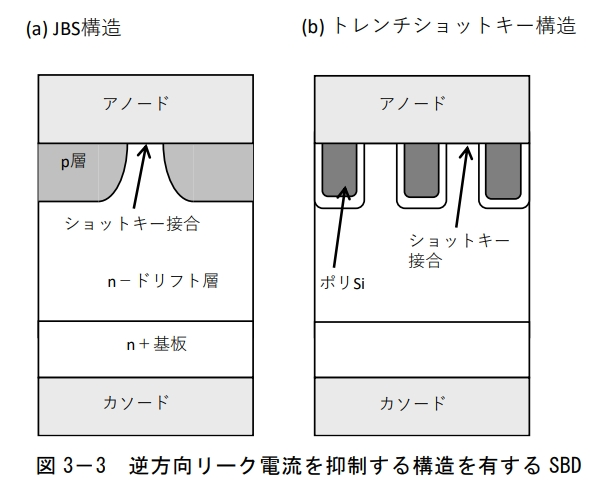

比例关系，它与载流子密度成反比。因此，正向导通电压与电流成反比。但如式(16)所示，实际的函数形式比上述的更复杂，实际上，正向导通电压随电流增加而单调增加。

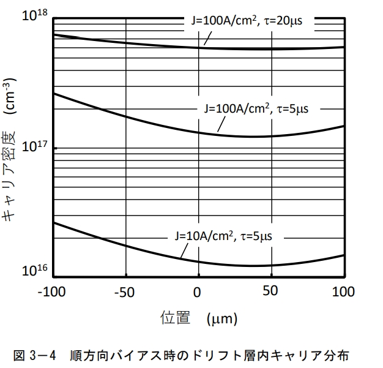

如前所述，SBD的正向导通电压与漂移层电阻成正比，而漂移层电阻又与正向电流无关，因此从式(13)可以看出，导通电压与正向电流成正比增加。与此相对，pin二极管由于其双极性工作原理，抑制了 $V_{drift}$ 的增加。因此，当正向电流较大时，可以获得比SBD更低的导通电压。此外，式(17)表明，扩散长度越长，载流子寿命也越长。当扩散长度长于漂移层厚度时，可以认为载流子在漂移层中的再结合可以忽略不计。此时，漂移层中心的载流子密度降低。这表明漂移层对高耐压器件的影响很大，因为其厚度较厚，而载流子再结合的影响也很大。

## 3-2 反向恢复特性 (Reverse Recovery Characteristics / リカバリー特性)

二极管通过施加电压来切换允许电流流过的导通状态和不允许电流流过的关断状态。通常，在电力电子电路中，二极管与开关元件和负载一起配置。当开关元件从关断切换到导通时，施加在二极管上的电压会发生变化，电流路径也会随之改变。此时，二极管上施加的电压变化与电流切换的时机协同工作的操作，被称为 **二极管恢复动作 (Diode Recovery Operation / ダイオードのリカバリー動作)**。从导通状态（正向偏置）切换到关断状态（反向偏置）的动作称为 **逆向恢复 (Reverse Recovery / 逆回復)**，而从反向方向切换到正向方向的动作称为 **正向恢复 (Forward Recovery / 順回復)**。

在逆向恢复时，在导通状态下注入到漂移层中的载流子，需要施加反向电压，并在耗尽层扩展的同时被扫出。因此，需要花费一定的时间才能将这些载流子扫出，在此期间会产生过度的电流，从而导致损耗。另一方面，在正向恢复时，耗尽层消失，载流子注入到漂移层中，但几乎不产生过电压。因此，二极管的特性主要关注逆向恢复时的特性。

通常，电力电子电路中的负载是电感性负载，如电机等。因此，为了评估其特性，使用如图3-5所示的 **电感负载 (Inductive Load / 誘導性負荷)**（L负载）与二极管和开关元件连接的电路。当开关元件导通时，电流从电源流经电感负载和开关元件（路径A）。当开关元件关断时，路径B被切断，电流从直流电源经电感负载和二极管流动，此时电感负载中储存的能量被释放。此时，施加在二极管上的电压从反向偏置切换到正向偏置。

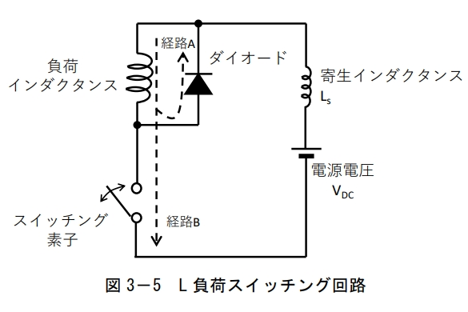

逆向恢复时的电压和电流变化如图3-6所示。当开关元件导通时，流过二极管的电流逐渐减少。之后，二极管内部的载流子被扫出，耗尽层扩展，电流开始沿反向流动。当二极管内的载流子完全耗尽并变为关断状态后，反向电流变为零。但是，受电感负载的影响，电流和电压的变化被延迟，电压变为反向偏置并增加。

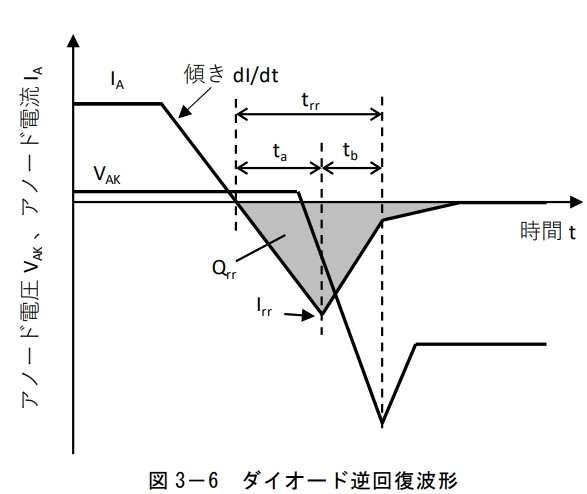

在逆向恢复期间，会流过比稳态时更大的反向电流，并施加高电压，从而产生损耗。此时的损耗被称为 **逆向恢复损耗 (Reverse Recovery Loss / リカバリー損失)**。评估恢复特性所需的参数包括：从电流变为反向到恢复所需的时间（**逆向恢复时间 (Reverse Recovery Time / リカバリー時間)**）$t_{rr}$，峰值反向恢复电流（**反向恢复电流 (Reverse Recovery Current / リカバリー電流)**）$I_{rr}$，以及对逆向恢复时间内的电流进行积分得到的电荷（**逆向恢复电荷 (Reverse Recovery Charge / リカバリーチャージ)**）$Q_{rr}$。这些参数都被用作衡量恢复损耗大小的指标。

$Q_{rr}$ 由导通状态下存在于漂移层中的电荷量决定。因此，在SBD中，它仅由漂移层厚度和浓度决定，而在pin二极管中，它由注入的电子和空穴的量决定，因此pin二极管的 $Q_{rr}$ 比SBD大得多，且逆向恢复损耗也更大。

为了降低pin二极管的导通电压 $V_{Fpin}$，需要提高漂移层内的载流子密度。然而，为了注入大量载流子，需要时间，这会导致产生大的 $I_{rr}$。因此，pin二极管的 $V_{Fpin}$ 和 $E_{rr}$（恢复损耗）之间存在权衡关系。改善这一权衡关系是pin二极管开发的核心课题之一。

二极管开发中的另一个重要性能是低噪声。由于恢复损耗与 $I_{rr}$ 成正比，为了减少损耗，希望尽快结束恢复。然而，如果急剧地改变电流，电压变化和寄生电感的乘积，即浪涌电压会施加在二极管上，成为噪声的来源。因此，使用 **软恢复系数 (Softness Factor / ソフトネス指数)** S (= $t_b/t_a$) 作为低噪声的指标。该指数是逆向恢复后半段与前半段时间的比值。指数越大，即恢复越平缓，噪声越小。S（$t_a$ 短）小的、急剧的电压变化的恢复被称为 **硬恢复 (Hard Recovery / ハードリカバリー)**。

## 3-3 结构的发展 (Structural Evolution / 構造の進展)

改善pin二极管中 $V_{Fpin}$ 和 $E_{rr}$ 权衡关系的有效手段是减薄漂移层的厚度。通过减薄漂移层，由于漂移层电阻的下降，$V_{Fpin}$ 会降低。同时，由于排出的载流子减少，$E_{rr}$ 也会降低。但是，伴随漂移层减薄而来的耐压下降会加速，从而导致硬恢复。

为了在维持软恢复的同时改善这种权衡关系，通常采用在阴极侧设置n-缓冲层的结构，该缓冲层比n-漂移层的电阻更低。如图3-7所示，通过设置缓冲层，即使在施加高反向电压时，耗尽层也不会到达阴极，从而可以抑制急剧的电流变化，并保持软恢复，缩短 $t_a$ 以实现软恢复。

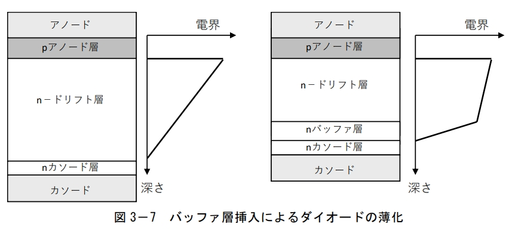

为了进一步改善 $V_{pin}$ 和 $E_{rr}$ 的权衡关系，需要对控制二极管特性的过剩载流子量进行控制。如图3-8所示，通过重金属扩散或电子束/质子束照射，在漂移层内局部形成复合中心。由此，可以保持导通所需的载流子，同时缩短恢复时间。通过重金属扩散或电子束照射，在整个漂移层中形成复合中心，而质子束或氦照射则在与照射能量相应的深度形成复合中心。通过形成局部复合中心，可以缩短载流子寿命，从而缩短再结合所需的时间。虽然载流子浓度降低，导致 $V_{pin}$ 增加，但通过进行适当的控制，可以获得比 $E_{rr}$ 降低效果更大的改进。但是，复合中心在常温下也会工作，导致反向漏电流增加。高温下漏电流增加，由漏电流引起的发热会导致漏电流进一步增加，从而引发热失控。形成复合中心的位置和密度根据二极管的种类和条件而异。因此，在考虑寿命控制的工艺条件时，需要考虑工作保证温度。

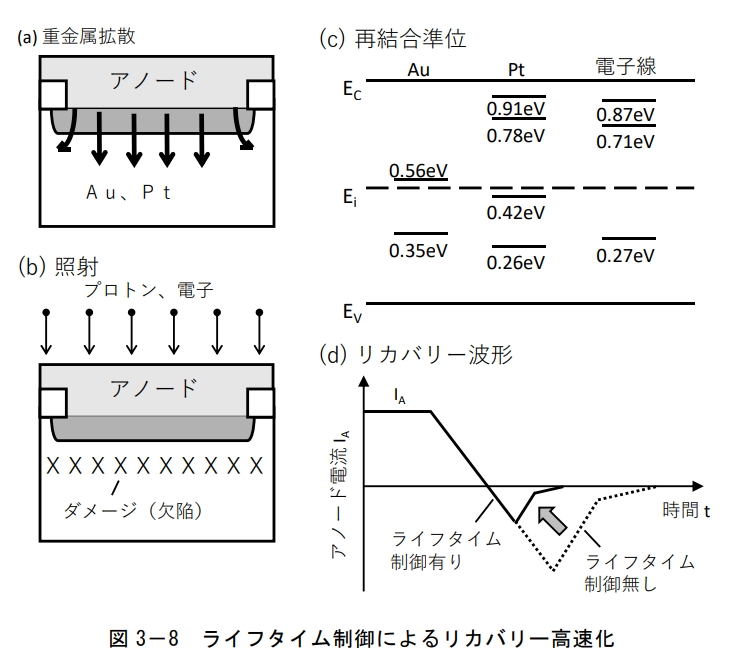

近年来，作为上述方法的补充，还提出了控制从阳极和阴极注入载流量的方法。图3-9(a)所示的 **SPEED (Self-adjusting P-Emitter Efficiency Diode)** 结构通过在阳极侧设置低浓度p层和高浓度p层，从阳极注入空穴。在图(b)的 **SC (Schottky Controlled) diode** 结构中，通过在从阳极注入的空穴之间设置肖特基接触，使电子从阴极侧注入，从而实现注入控制和高速化。图(c)所示的 **CIBH** 结构通过在n-缓冲层上部形成p层，从阴极注入电子。图(d)的 **RFC** 结构通过在n-缓冲层上部形成p层，同时注入电子和空穴。在RFC结构中，当恢复时，从p层注入的空穴与电子再结合，从而实现软恢复和高速化。

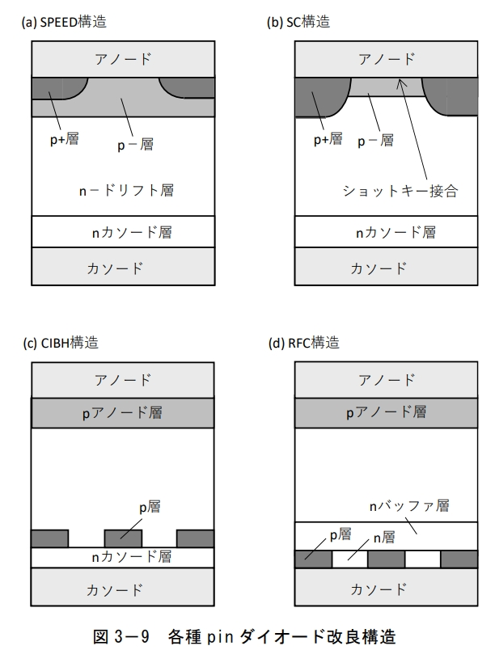

通过这些改进措施，在确立 $V_{Fpin}$ 和 $E_{rr}$ 的权衡关系以及与噪声之间的权衡关系的同时，性能得到系统性的提升。

# 4. 功率MOSFET (Power MOSFET / パワーMOSFET)

## 4-1 基本单元设计 (Basic Cell Design / 基本セル設計)

功率MOSFET的基本工作原理，如前所述，是在导通状态下，通过对栅极施加比阈值电压更高的电压，在MOS栅极下方形成 **反转沟道 (Inversion Channel / 反転チャネル)**，从而使电子可以从源极流向漏极。如图4-1所示，反转沟道的 **夹断 (Pinch-off / ピンチオフ)** 现象与LSI或存储器中使用的横向型MOSFET相同。在导通状态下，漏极电流的饱和区大小取决于漏极电压，而饱和区之外的线性区的斜率，则由 **导通电阻 (On-resistance / オン抵抗)** 决定。通常，功率器件在导通损耗较小的状态下使用，因此，饱和区与饱和电压相对应的线性区域的斜率，即为该区域的导通电阻。

当对栅极施加低于阈值电压的电压时，反转沟道消失，电流路径被切断，进入关断状态。在此状态下，如果继续增加漏极电压，耗尽层会在漂移层内扩展，电场强度增加，临界电场达到时，雪崩击穿开始。由此，关断状态下的漏极电流也开始流动，此时的漏极电压 $V_{ds}$ 即为耐压。与耐压相关的漂移层设计已在前文论述，因此这里我们将重点讨论决定导通电阻的基本单元设计。

导通电阻由导通电流路径上所有电阻成分的总和构成。以 **平面栅极结构 (Planar Gate Structure / プレーナーゲート構造)** 为例，如图4-2所示，导通电阻可分为：沟道电阻 $R_{ch}$、p-基底层之间的电阻（JFET电阻）$R_{JFET}$、漂移层电阻 $R_{drift}$、以及基板电阻 $R_{sub}$。如前所述，导通电阻与耐压之间存在权衡关系，而构成导通电阻的这些要素的比例，会根据耐压的高低而变化。对于低耐压器件，漂移层电阻所占比例较小，而沟道电阻或JFET电阻、基板电阻等成为主要成分。因此，为了提高效率，有必要找出构成要素中比例最高的部分，并将其降低。

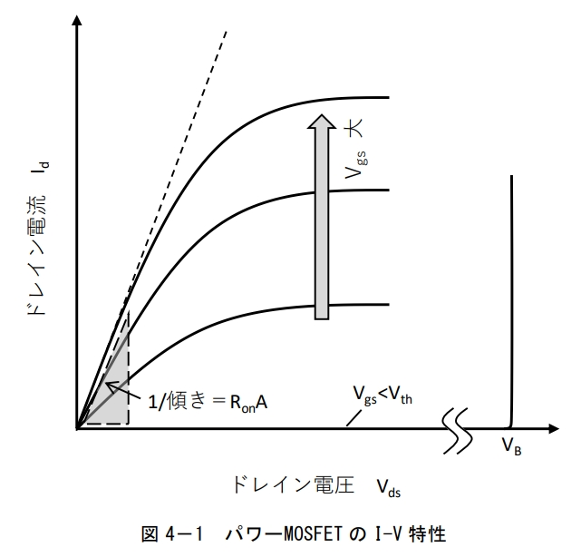

沟道电阻 $R_{ch}$ 由反转沟道中的载流子密度和沟道长度 $L_{ch}$、形成该沟道的单元数量决定。

$$
R_{ch} = \frac{L_{ch} W_{cell}}{2 \mu_n C_{ox} (V_{GS} - V_{th})} \quad (18)
$$

其中，$W_{cell}$ 是单元宽度，$\mu_n$ 是沟道电子迁移率。由于两个沟道是并联形成的，所以分母中有2。$n_{ch}$ 是反转沟道中超出阈值电压 $V_{th}$ 的栅极电压 $V_{GS}$ 在MOS栅极界面处感应出的电子面密度，与 $Q=CV$ 的关系，可以由式(18)的右边近似得出。但是，$t_{ox}$ 是MOS栅极的氧化膜厚度。由于MOS栅极界面由晶格弛豫引起的散射，$\mu_{ch}$ 约为体迁移率 $\mu_{sub}$ 的1/3。

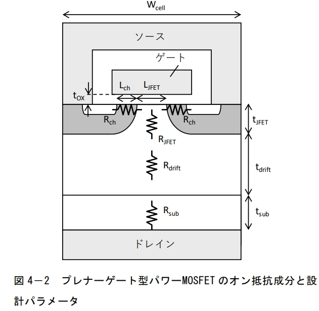

为了降低式(18)中的 $R_{ch}$，需要减小 $W_{cell}$、$L_{ch}$、或 $t_{ox}$。根据比例缩小（微缩）定律，通过将单元宽度和沟道长度同比例缩小，横向型MOSFET的沟道电阻可以与栅极长度的二次方成比例地减小。但是，在功率器件中，施加在栅极上的电压几乎是固定的，因此 $t_{ox}$ 不能减小。为了减小 $t_{ox}$，需要减小 $L_{ch}$，但这会导致 **短沟道效应 (Short-channel Effect / 短チャネル効果)**，因此需要适应耐压的实际设计。目前，实际应用的 $W_{cell}$ 的微缩仅限于0.5µm，且缩小的规模受工艺技术的限制。

JFET电阻 $R_{JFET}$ 由JFET区域的厚度 $t_{JFET}$ 和浓度 $N_{JFET}$，加上p-基底层间的距离（JFET宽度）和单元宽度 $W_{cell}$ 的比值（形成JFET n-层的区域组合）等参数决定。

$$
R_{JFET} = \frac{W_{cell}}{q n_{JFET} \mu_n t_{JFET}} \quad (19)
$$

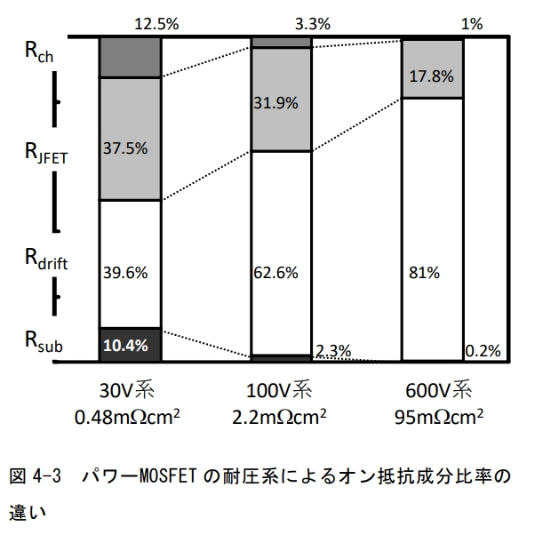

如上所述，减小 $W_{cell}$ 是可能的，但同时 $L_{JFET}$ 也会变窄，缩小的效果会被抵消。如果 $L_{JFET}$ 过小，短沟道效应会变得显著，因此减少 $t_{JFET}$ 来寻求效果也不是一个好策略。因此，作为 $R_{JFET}$ 的对策，如图4-4所示，在JFET区域中形成n型掺杂，以提高 $N_{JFET}$。只要JFET区域两侧的p-基底层之间的耗尽层不延伸到影响耐压的程度，就可以提高 $N_{JFET}$。为了进一步降低 $R_{JFET}$，采用了如图所示的 **沟槽栅极结构 (Trench Gate Structure / トレンチゲート構造)**。在沟槽栅极结构中，由于JFET区域本身不存在，所以 $R_{JFET}$ 为零。另外，在平面栅极结构中，即使 $W_{cell}$ 减小到 $L_{ch}$ 的2倍左右也无法缩小，但在沟槽栅极结构中，$W_{cell}$ 可以与 $L_{ch}$ 独立设计，通过将源极-栅极接触区域与沟槽分开，可以进一步缩小单元，因此可以实现导通电阻和耐压的平衡。这使得 $R_{ch}$ 和 $R_{JFET}$ 的支配性降低，主要用于中等耐压（耐压200V以下）的功率MOSFET。

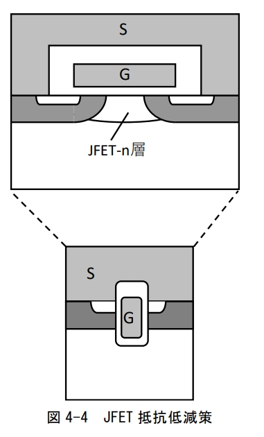

最后，我们来说明基板电阻 $R_{sub}$。功率MOSFET是在高浓度掺杂的n+基板上通过磊晶生长形成低浓度n-漂移层，再在其表面形成MOS栅极结构而制成的。由于n+基板是在漂移层下方支撑其存在的，与耐压设计无关，电性上仅仅是作为单层电阻。因此，$R_{sub}$ 与 $R_{drift}$ 同样由厚度和浓度决定。

$$
R_{sub} = \frac{t_{sub}}{q n_{sub} \mu_n} \quad (20)
$$

其中，$n_{sub}$ 是基板掺杂浓度，$t_{sub}$ 是基板厚度。为了降低 $R_{sub}$，需要减小 $t_{sub}$。然而，基板电阻在总导通电阻中占显著比例的低耐压MOSFET，可能将p-基板用作降低导通电阻的基板。此时，在芯片化后组装到封装中时，为了保证所需的机械强度，需要保留一定的 $t_{sub}$。

## 4-2 开关特性 (Switching Characteristics / スイッチング特性)

功率MOSFET是栅极电压控制通断的开关元件，在设计开关特性时，需要从必要的内部参数出发，确定决定这些参数的要素。理解开关动作，需要从动态、即时的观点出发，分析参数。当开关工作时，栅极电压的变化会引起漏极电流的变化，同时，器件内部的电容会发生充放电，导致电场和耗尽层的变化。从另一个动态角度看，栅极电压的施加会产生或消除反转沟道，从而控制漏极电流的通断，与之相伴随的是漂移层中耗尽层的伸缩。为了理解这种动态的器件运动，需要理解电路动作和器件内部的物理动作。

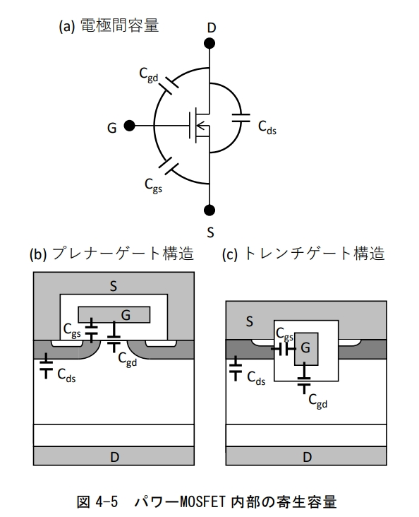

首先，器件的内部寄生电容如图4-5所示，所有电容都存在于器件内部。如图(b)、(c)所示，这些电容的内部结构由决定。栅极-源极电容 $C_{gs}$，是在源极电极与p-基底层和栅极氧化膜之间形成的。栅极-漏极电容 $C_{gd}$（也称 **米勒电容 (Miller Capacitance / ミラー容量)**），是栅极氧化膜和p-基底层与n-漂移层之间的MOS二极管的容量，以及栅极氧化膜和漂移层之间的耗尽层电容的串联。而漏极-源极电容 $C_{ds}$，是p-基底层和漂移层的pn结的耗尽层电容。各电容的电荷量因漏极电压而异，因此电容值也随之变化。如图4-6所示，电容对电压的依赖性并不恒定。但是，$C_{gs}$ 在施加栅极电压时（$V_{gs}$ > 0V）几乎不依赖于漏极电压，而 $C_{gd}$ 和 $C_{ds}$ 的大小关系，则由决定容量的器件构造的尺寸决定。

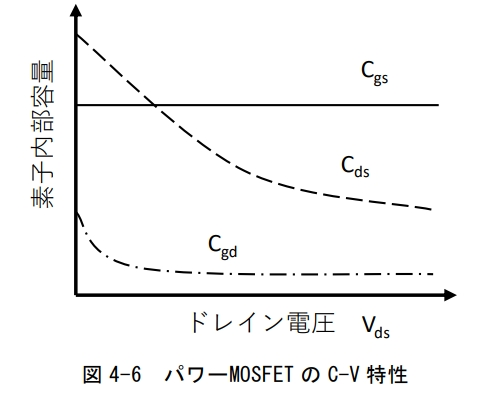

在电力电子电路中，寄生电感的评估也至关重要。这些电感是二极管和开关特性评估中的重要电路（参考图3-5）。在此，我们说明从导通状态切换到关断状态的 **关断 (Turn-off / ターンオフ)** 动作，和从关断状态切换到导通状态的 **导通 (Turn-on / ターンオン)** 动作。

关断动作的波形如图4-7所示，图4-8说明了各个状态下的电路和器件内部情况。**状态①（初始状态）**，功率MOSFET处于导通状态，器件内部存在反转沟道，可以流过电流。当栅极输入信号从 $V_{G(ON)}$ 变为零时，进入 **状态②（延迟期间）**。此时，储存在栅极电容 $C_{gs}$ 中的能量通过外部栅极电阻 $R_g$ 和内部栅极电阻 $r_g$ 放电，栅极电压 $V_{gs}(t)$ 按下式所示下降：

$$
V_{gs}(t) = V_{G(ON)} \exp \left( \frac{-t}{C_{gs}(R_g+r_g)} \right) \quad (21)
$$

在此期间，栅极电压的变化并不改变漏极电流。当 $V_{gs}$ 下降到不再能使电流流动时，即 $V_{gs} = V_{th} + \frac{I_{dON}}{g_m}$ 时，漏极电流开始减小。此时，栅极电压由于米勒效应被钳位在 $V_{G(M)}$，并保持恒定，如式(22)所示。

$$
V_{G(M)} = V_{th} + \frac{I_{dON}}{g_m} \quad (22)
$$

但 $g_m$ 是相互跨导。**状态②** 的期间，反转沟道并未消失，器件内部电流持续流动，漏极电压或漏极电流不发生变化。这个期间称为 **关断延迟时间 (Turn-off Delay Time / ターンオフディレイ時間)** $t_{d(off)}$，由式(21)和(22)可得：

$$
t_{d(off)} = C_{gs}(R_g+r_g)\ln \left| \frac{V_{G(ON)}}{V_{G(M)}} \right| \quad (23)
$$

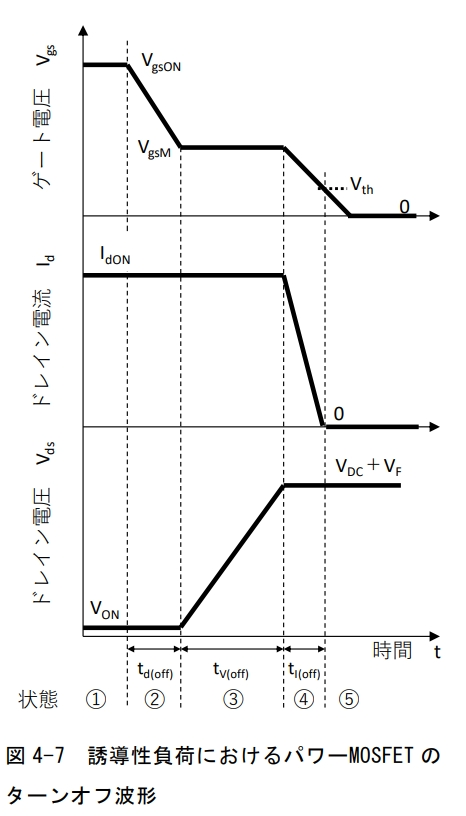

随着电流切换到二极管，漏极电压开始上升，直到二极管的导通电压 $V_F$。这是 **状态③（米勒期间）**。在此期间，通过栅极电阻对电容 $C_{gd}$ 的充电开始。充电电流是栅极电阻上的压降 $V_{gs}(t)$，漏极电压 $V_{ds}(t)$ 为：

$$
V_{ds}(t) = V_{ON} + \frac{g_m V_{G(M)}(t-t_{d(off)})}{C_{gd}(R_g+r_g)} \quad (24)
$$

此时，$V_{ON}$ 是导通时的漏极电压。这个期间称为 **米勒期间 (Miller Period / ミラー期間)**，器件内部，漏极电压上升，耗尽层在漂移层内扩展。漏极电压上升到 $V_{DC}+V_F$ 的期间，即 **电压上升时间 (Voltage Rise Time / 電圧立ち上がり時間)** $t_{v(off)}$ 为：

$$
t_{v(off)} = \frac{C_{gd}(R_g+r_g)(V_{DC}+V_F-V_{ON})}{g_m V_{G(M)}} \quad (25)
$$

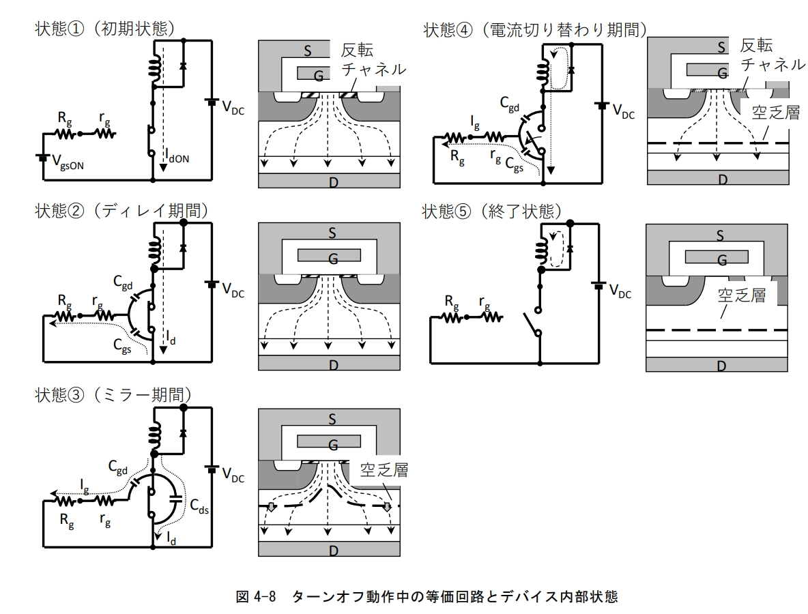

$V_{ds}$ 的上升导致电流流向二极管，当功率MOSFET的电流变为零时，即 **状态④（电流切换期间）**。$V_{gs}$ 从米勒电平 $V_{G(M)}$ 开始下降，漏极电流变为零。与状态③类似，$V_{gs}$ 的表达式如式(26)所示：

$$
V_{gs}(t) = (V_{th} + \frac{I_{dON}}{g_m}) \exp \left( \frac{-t}{C_{gs}(R_g+r_g)} \right) \quad (26)
$$

$V_{gs}$ 下降到 $V_{th}$ 的时间 $t_{f(off)}$ 为：

$$
t_{f(off)} = C_{gs}(R_g+r_g)\ln \left| \frac{g_m V_{th} + I_{dON}}{g_m V_{th}} \right| \quad (27)
$$

此时，器件内部的反转沟道消失，电流变为零，耗尽层扩展到漂移层。仅有此状态的 **状态⑤** 中，关断动作完成。

如式(23), (25), (27)所示，各个期间的持续时间与电容和栅极电阻成正比。也就是说，为了实现高速开关，需要减小这些值。但是，当开关高速化时，电流变化率 $di/dt$ 和电压变化率 $dv/dt$ 会变得非常大，回路中的寄生电感和电容会产生浪涌电压和浪涌电流，成为噪声和损坏的原因。因此，噪声和损耗之间存在权衡关系，外部栅极电阻的大小需要根据这一点进行调整。如果内部栅极电阻过大，开关速度则不受外部栅极电阻调节。特别是在需要高速开关的情况下，必须充分减小内部栅极电阻 $r_g$。此外，通常的开关动作，是以上述状态的切换时间为基准，对从10%变化到90%变化的电压或电流进行测量和定义。

接下来，我们说明 **导通 (Turn-on / ターンオン)** 动作。如图4-9所示，导通动作中，二极管和MOSFET的电流路径切换决定了动作波形。**状态①** 是关断状态，进入 **状态②** 后，栅极输入信号加入，$V_{gs}$ 上升，但此时漏极电压和漏极电流均无变化。这个时间称为 **导通延迟时间 (Turn-on Delay Time / ターンオンディレイ時間)** $t_{d(on)}$，其表达式为：

$$
t_{d(on)} = C_{gs}(R_g+r_g)\ln \left| \frac{V_{G(ON)}}{V_{G(ON)}-V_{th}} \right| \quad (28)
$$

如图4-10所示，此时，反转沟道尚未形成，耗尽层扩展到漂移层。当 $V_{th}$ 开始导通，进入 **状态③**，漏极电流 $I_{dON}$ 开始流动，其时间 $t_{r(on)}$ 为：

$$
t_{r(on)} = C_{gs}(R_g+r_g)\ln \left| \frac{g_m(V_{G(ON)}-V_{th})}{g_m(V_{G(ON)}-V_{th})-I_{dON}} \right| \quad (29)
$$

此时，漏极电流中叠加了二极管的 **反向恢复电流 (Reverse Recovery Current / 逆回復電流)** $I_{rr}$。浪涌电压的产生和电流的峰值 $I_{dON}+I_{rr}$ 都很重要。器件内部形成反转沟道，电流可以流动，但漏极电压尚未下降，耗尽层仍然存在。

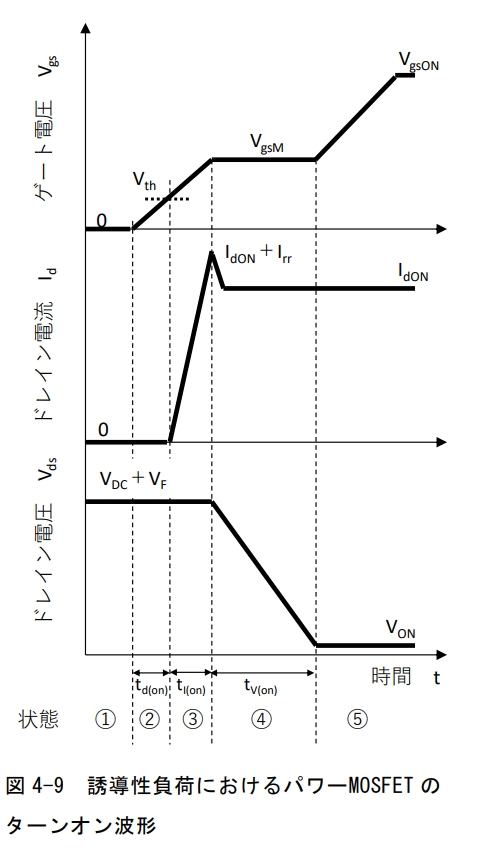

当电流从二极管切换到功率MOSFET时，进入 **状态④**。与关断时相反，栅极电阻上的电流对 $C_{gd}$ 进行放电，漏极电压的 $dV/dt$ 由此决定。米勒期间的时间 $t_{r(on)}$ 与关断时同样由式(25)给出。漏极电压下降伴随着耗尽层的收缩，直到 **状态⑤**，导通动作完成。

导通和关断动作的速度同样由栅极电荷决定。为了实现高速导通，需要有小的栅极电荷和栅极电阻。但是，栅极电荷存在于芯片面积中，单个器件的容量依赖于电压，仅用一个容量值来与其他器件比较是困难的。在这种情况下，以 **栅极电荷 (Gate Charge / ゲート電荷)** 作为比较开关损耗的指标。通常，将米勒期间中对电容充电所必须的 **栅极-漏极电荷 (Gate-Drain Charge / ゲート・ドレイン電荷)** $Q_{gd}$ 和 **栅极-源极电荷 (Gate-Source Charge / ゲート・ソース電荷)** $Q_{gs}$ 相加得到的 $Q_g (=Q_{gs}+Q_{gd})$ 作为指标。功率MOSFET产生的总损耗（开关损耗和导通损耗的和）由芯片面积决定，因此 $R_{on} \times Q_{gd}$ 或 $R_{on} \times Q_{sw}$ 可作为指标。特别是在高开关频率下使用的低耐压器件，这个指标能很好地反映性能。而高耐压器件则在低开关频率下使用，导通损耗成为主要损耗，因此 $R_{on} \times A$ 可作为性能指标。通过这种方式，根据应用环境选择合适的性能指标。

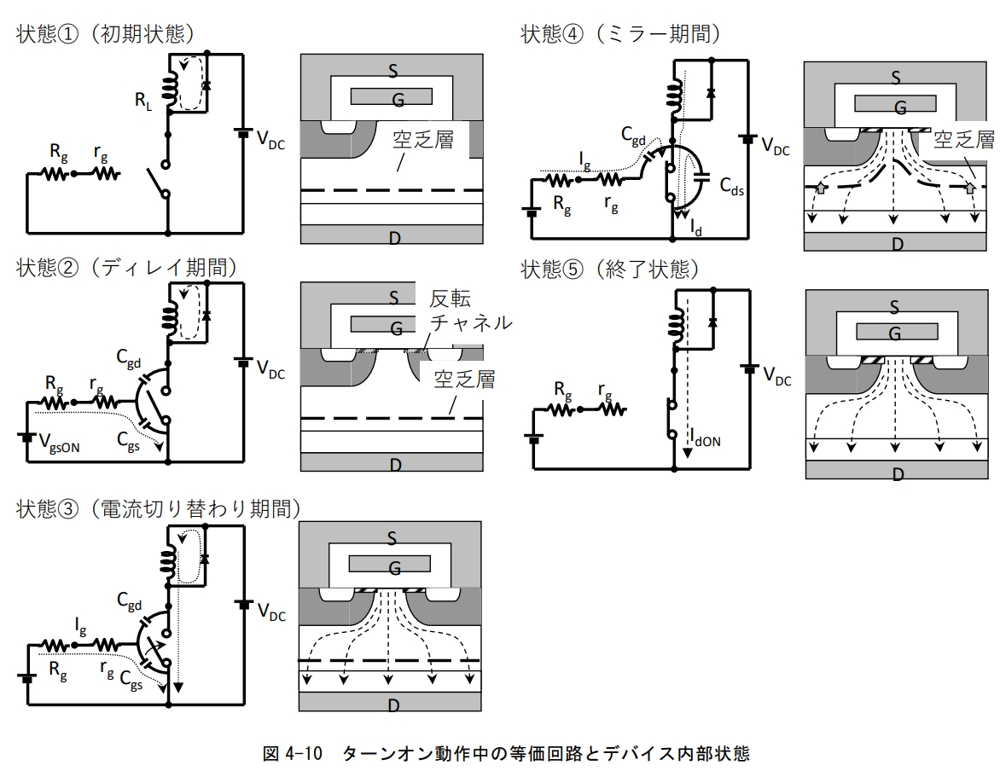

## 4-3 破坏耐量 (Breakdown Tolerance / 破壊耐量)

功率MOSFET在非常规工作条件下可能发生破坏，主要有两种情况：一种是关断状态下施加了超过耐压的过电压导致雪崩击穿；另一种是导通状态下过电流导致过热。这两种情况都可能导致器件损坏。我们将阐述 **雪崩耐量 (Avalanche Tolerance / アバランシェ耐量)**，即通过雪崩击穿而安全消耗能量的能力，以及定义了这种耐量的 **安全工作区 (Safe Operating Area, SOA / 安全動作領域)**。

首先，说明雪崩耐量。作为评估功率电子电路内部受动元件能量的测试，是在 **非钳位感性开关 (Unclamped Inductive Switching, UIS)** 电路中进行的。该评估电路如图4-11所示，也被称为模拟电感性负载开关测试的电路。在此电路中，流经二极管的电流被切断时，存储在电感中的能量由关断状态下的MOSFET承受，电流不流过的能量会使电压上升。

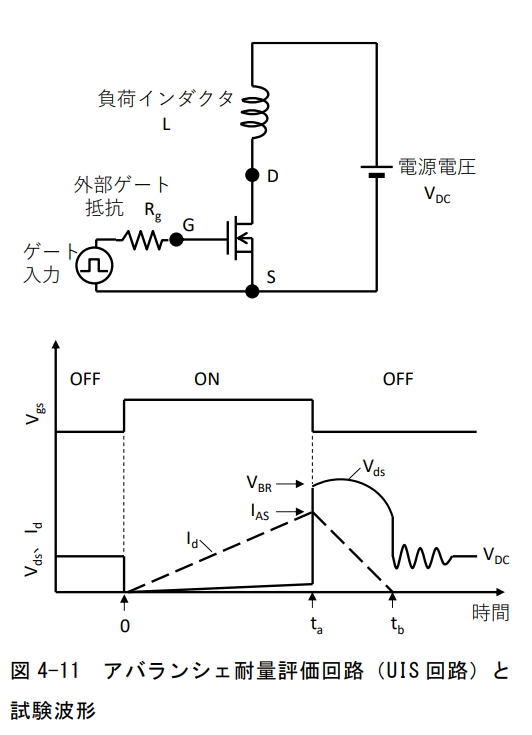

最初，MOSFET导通，在负载电感上存储能量。然后，当MOSFET关断，为了继续让电流流过而消耗存储的能量，由于没有二极管来续流，漏极电压会上升到雪崩击穿开始的电压（耐压）。漏极电流 $I_{d}(t)$ 在此期间消耗能量，电流减小。

$$
I_d(t) = I_{AS} - \frac{V_{BR} - V_{DC}}{L} (t-t_0) \quad (30)
$$

当漏极电流变为零时，不再需要雪崩击穿，$V_{ds}$ 下降到电源电压。雪崩击穿期间消耗的能量 $E_{AS}$ 是电压和电流的乘积对时间的积分。

$$
E_{AS} = \int_{t_0}^{t_1} V_{ds}I_d dt = \frac{1}{2}L I_{AS}^2 \frac{V_{BR}}{V_{BR}-V_{DC}} \quad (31)
$$

如果假设式(31)中的钳位电压 $V_{BR}$ 是恒定的，那么能量将以热的形式消耗，器件温度会上升。如果温度上升导致雪崩击穿变得不稳定，可能会导致器件损坏。因此，雪崩耐量越大，消耗的能量也越大，而在关断状态下，漏极电压的波形是恒定的，不具有雪崩击穿所特有的尖峰。评估时，可以通过延长 $t_0$ 来增加 $I_{AS}$，从而可以评估不会损坏的最大 $I_{AS}$，即雪崩耐量。

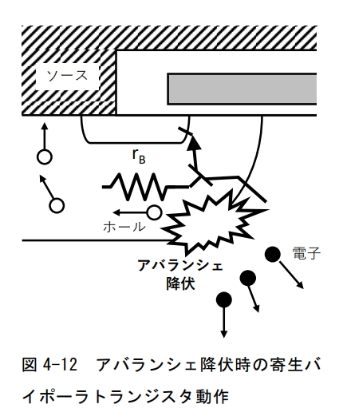

对雪崩耐量构成威胁的是，如图4-12所示，寄生双极晶体管的动作。功率MOSFET内部存在由n+源极/p-基底层/n-漂移层构成的n-p-n晶体管。这个晶体管在正常开关动作时是不工作的。但是，当雪崩击穿发生时，产生的空穴会流向p-基底层。这会导致p-基底层电位上升，n+源极层和p-基底层之间的结变为正向偏置，超过一定程度后，寄生双极晶体管就会导通。一旦导通，由于正反馈效应，电流会进一步集中，导致更大的电流流过。如果电流集中导致发热，双极晶体管的温度会上升，电流更容易流动，从而导致正反馈，最终热失控而损坏。

为了避免这种寄生双极晶体管的动作，需要减小p-基底层的电阻 $r_b$。如图4-13所示，通过在源极电极的接触孔下方增加高浓度的p+接触层，或形成深的p+接触层，来降低 $r_b$。通过在源极接触下方形成沟槽，并将p+接触层连接到源极，可以有效地将雪崩击穿产生的空穴从p-基底层下的接触层快速排出，从而抑制寄生双极晶体管的动作，这在沟槽栅极结构中是可行的，因此，即使在低耐压MOSFET中也广泛采用。

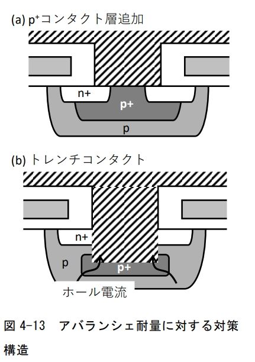

其次，是 **安全工作区 (Safe Operating Area, SOA)**。SOA的决定因素如图4-14所示，包括导通电阻、额定电流、耐热（非破坏）、耐压等。只要在图中所围成的区域内工作，器件就不会损坏。各边由定义的额定值决定，低漏极电压下的电流由导通电阻限制。最大漏极电流由保证的额定电流决定。在此之上的恒定功率和高电压大电流区域由非破坏（热限制）特性决定。器件的安全性由允许的损耗、器件的保证温度和封装的热阻决定。因此，SOA的斜线部分是允许损耗的区域。通过电，温度和周围温度会变化，封装或温度变化的工作条件会改变实际的斜线位置。

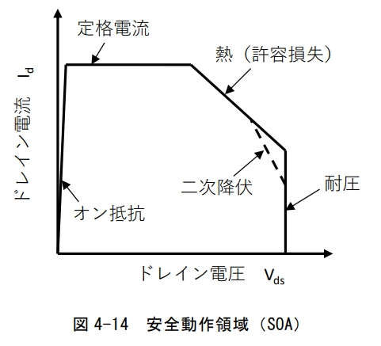

## 4-4 结构进展 (Advancements in Structure / 構造の進展)

功率MOSFET是应用LSI和存储器中开发的微细加工技术而发展起来的。最初是平面栅极结构，后来微细化不断推进。其效果是，当厚度变薄时，如图4-15所示，耐压被分成了两部分。漂移层电阻大的高耐压器件几乎达到了Si的极限，但通过在漂移层中交替形成长条形的p层和n层的 **超级结 (Super Junction, SJ)** 结构，低导通电阻得以实现。SJ结构中，漂移层的耗尽层横向扩展，从而使整个漂移层耗尽，漂移层浓度设计可以突破材料极限，实现了低导通电阻。之后，沟道电阻和JFET电阻支配的低耐压器件中，采用了沟槽栅极结构，微细化也得到了推进。之后，无法用漂移层电阻解释的低导通电阻，由 **精细间距 (Fine Pitch, FP)** 结构实现。

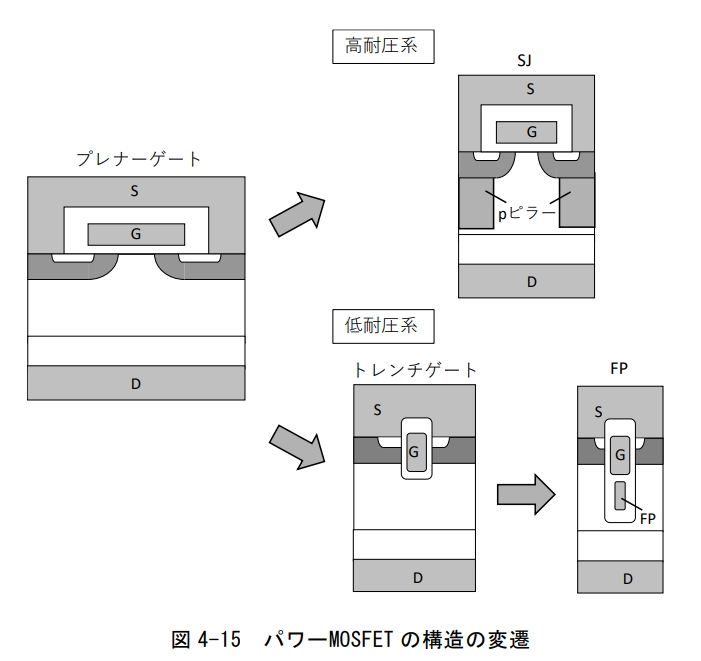

我们来说明SJ结构的低导通电阻。SJ结构的导通电阻 $R_{onSJ}$ 由n层的电阻决定。

$$
R_{onSJ} = \frac{t_{SJ}}{q n_{SJ} \mu_n} \quad (32)
$$

其中，$t_{SJ}$ 是SJ层的厚度（漂移层厚度），$n_{SJ}$ 是n层的浓度（见图4-16）。漂移层的半导体层由p层和n层形成，面积各占一半，因此，在关断状态下，当施加漏极电压时，横向耗尽层扩展，SJ结构完全耗尽。此时的横向电场 $E_L$ 为：

$$
E_L = \frac{q N_{SJ} W_{np}}{\varepsilon_s} \quad (33)
$$

其中，$W_{np}$ 是p层和n层的宽度。SJ结构中，通过使p层浓度和n层浓度相等，即完全空乏化，可以将其视为均匀的不纯物层。完全耗尽时，纵向电场 $E_L$ 在整个漂移层内均匀分布，此时的耐压 $V_B$ 为：

$$
V_B = E_{crit} t_{SJ} - \frac{1}{2}E_L W_{np} \quad (34)
$$

由于需要高耐压，因此也需要减小 $E_L$。但从式(33)可以看出，减小 $N_{SJ}$ 会导致导通电阻上升。也就是说，在SJ结构中，导通电阻和耐压的权衡关系依然存在，但需要选择能最大程度改善权衡关系的 $N_{SJ}$。利用式(33)和(34)，可得：

$$
R_{on}A_{SJ} = \frac{2 V_B^2 W_{np}}{ \varepsilon_s \mu_n (E_{crit}^2 - E_L^2)} \times \frac{1}{A_{SJ}} \quad (35)
$$

其中，$A_{SJ}$ 是SJ结构的 **纵横比 (Aspect Ratio / アスペクト比)** (=$t_{SJ}/W_{SJ}$=$t_{SJ}/(4W_{np})$)。用 $E_L$ 对(35)微分，可求得最佳 $E_L$。然后，与材料极限同样，用碰撞电离系数K消去 $E_{crit}$，可得：

$$
R_{on}A_{SJ} = \frac{3 \sqrt{3} V_B^2}{4 \varepsilon_s \mu_n E_{crit}^2} \times \left( \frac{3}{2} K V_B \right)^{1/2} = \frac{1.44 K^{1/2} V_B^{2.5}}{\varepsilon_s \mu_n A_{SJ}} \quad (36)
$$

这与式(8)所示的材料极限同样，与耐压的2.5次方成比例。SJ结构的一个特点是，导通电阻 $R_{onSJ}$ 与 $A_{SJ}$ 成反比。如式(32)所示，为了降低导通电阻，必须提高 $N_{SJ}$。为了维持耐压，必须减小 $W_{SJ}$。也就是说，需要增大 $A_{SJ}$。通过实现 $A_{SJ}>0.72$，可以获得低于材料极限的导通电阻。随着SJ结构的微细化，低导通电阻得以持续。

在低耐压器件中，通过使工艺复杂化而不采用SJ结构，也可以获得低导通电阻，因此采用了FP结构。FP结构中，栅极被深埋成沟槽状，氧化膜和FP电极也被埋入。在关断状态下，沟槽侧壁的氧化膜面向横向扩展的耗尽层，与SJ结构同样，漂移层完全耗尽，得到平坦的电场分布。这使得在维持耐压的同时，可以提高漂移层浓度。由于不需要追加p层，因此对浓度控制的要求不那么严格。由于FP电极是在栅极电极下方形成的，栅极-漏极的对向面积很小，$C_{gd}$ 减小。因此，FP结构在低导通电阻化的同时，也具有高速化的优点，被广泛用于低耐压器件。

SJ结构和FP结构在理论极限上是相同的，通过增大纵横比可以降低导通电阻。随着微细化的持续，不论耐压如何，15~20年间导通电阻降低了1/10。

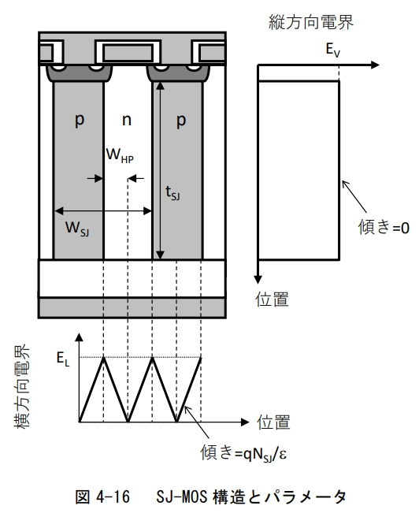

# 5 IGBT

## 5-1 基本构造与工作原理 (Basic Structure and Operation / 基本構造と動作)

IGBT是一种与功率MOSFET相同的 **MOS门 (MOS Gate / MOSゲート)** 型开关元件。如图5-1所示，其表面具有MOS门结构，**发射极 (Emitter / エミッタ)** 连接到n+发射极层和p基区，**集电极 (Collector / コレクタ)** 连接到p集电极层。p基区/n-漂移层/p集电极层的pnp晶体管与MOS门结合形成，因此被命名为 **绝缘栅双极晶体管 (IGBT - Insulated Gate Bipolar Transistor)** 的缩写。图中展示的是 **沟槽栅极 (Trench Gate / トレンチゲート)** 结构，但也有使用与功率MOSFET相同的 **平面栅极 (Planar Gate / プレーナーゲート)** 结构的情况。

当对栅极施加电压时，会形成一个 **沟道 (Channel / チャネル)**，电子通过这个沟道从n+发射极层注入到n-漂移层。此时，p集电极层和n-漂移层形成的pn结变为正向偏置，p集电极层向n-漂移层注入空穴。这使得发射极-集电极之间导通（**导通状态 (On-state / オン状態)**），电流得以流过。

在 **关断状态 (Off-state / オフ状態)** 下，与功率MOSFET相同，p基区和n-漂移层之间的pn结上会形成 **空乏层 (Depletion Layer / 空乏層)** 来维持电压。但是，如果空乏层延伸到p集电极层，p集电极和n-漂移层形成的pn结就会被反向偏置，注入的空穴会引发 **雪崩击穿 (Avalanche Breakdown / アバランシェ降伏)**，从而导致器件在低于其设计耐压时损坏。因此，在设计IGBT的 **漂移层 (Drift Layer / ドリフト層)** 时，主要有两种设计方法。一种是防止空乏层到达p集电极层的设计，称为 **非穿通型 (NPT: Non-Punch Through / ノンパンチスルー)**。另一种是在p集电极层和漂移层之间设置一个高掺杂浓度的n-缓冲层（**n-buffer layer / n-バッファ層**），以阻止空乏层延伸，从而可以使漂移层做得更薄，这种设计被称为 **穿通型 (PT: Punch Through / パンチスルー)**。

IGBT的 **集电极电流-集电极电压特性 (Collector current - Collector voltage characteristics / コレクタ電流－コレクタ電圧波形)** 如图5-2所示。由于集电极侧的pn结需要正向偏置电压才能让电流开始流动，因此其电压-电流特性存在一个由该pn结电压决定的偏移电压，这一点与功率MOSFET的线性沟道电阻特性不同。这是由注入漂移层的电子和空穴共同作用（即 **电导率调制 (conductivity modulation / 導電率変調)**）引起的，它显著降低了漂移电阻。因此，尽管在零电流附近，功率MOSFET的 **导通电压 (On-voltage / オン電圧)** 更低，但在大电流区域，IGBT的导通电压通常更低。在关断状态下，IGBT与功率MOSFET一样，通过p基区-漂移层结的空乏层延伸来承受电压，当空乏层内的电场达到临界电场强度时，会发生雪崩击穿，这决定了其耐压。

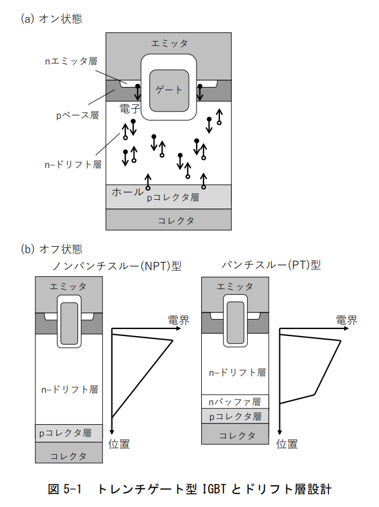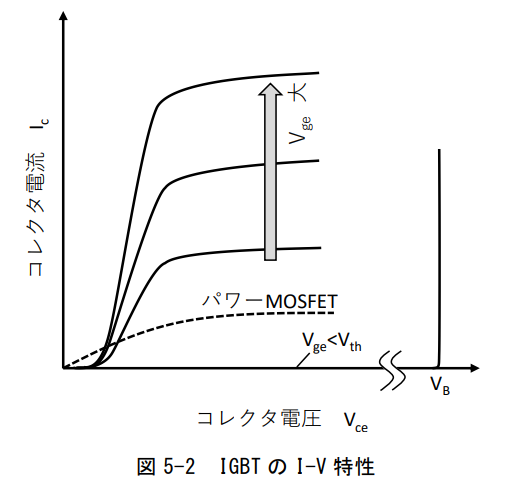

与仅靠电子（或空穴）导电的 **单极性器件 (Unipolar Device / ユニポーラ素子)** 不同，IGBT通过 **电导率调制 (Conductivity Modulation / 導電率変調)** 效应，显著降低了漂移层的电阻。单极性器件的材料电阻限制了其高耐压化，因此，在需要高耐压、低导通电阻的应用中，会使用IGBT和功率MOSFET。两者之间的分界电压大约在400~900V。

IGBT通过电导率调制以低导通电压传导大电流，但在关断操作时，需要时间来清除漂移层中积累的载流子。因此，与功率MOSFET相比，其 **关断时间 (Turn-off time / ターンオフ時間)** 更长，**关断损耗 (Turn-off Loss / ターンオフ損失)** 也更大。因此，它不适用于高的 **开关频率 (Switching Frequency / スイッチング周波数)**。正因为如此，对于需要在大电流（10A以上）和较低开关频率下工作的电机驱动等应用，通常使用IGBT；而对于需要在100kHz以上高开关频率下工作的电源等应用，则使用功率MOSFET。

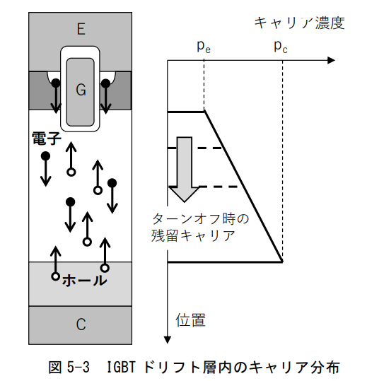

## 5-2 开关特性 (Switching Characteristics / スイッチング特性)

通过增加从集电极注入的空穴，可以增加漂移层内的载流子密度，从而降低导通电压。但是，在关断时，所有这些载流子都必须被清除，这导致导通电压和 **关断时间 (Turn-off time / ターンオフ時間)** 之间存在明显的权衡关系。

为了解释导通电压和关断损耗之间的权衡关系，我们使用漂移层中的 **载流子分布 (Carrier Profile / キャリア分布)** 进行说明。这里，我们做一些简化假设：1）漂移层中的复合是一次线性的（参考图5-3）。2）p集电极注入效率可以设定。3）栅极电压在高速下工作，关断时沟道电流能迅速被切断。

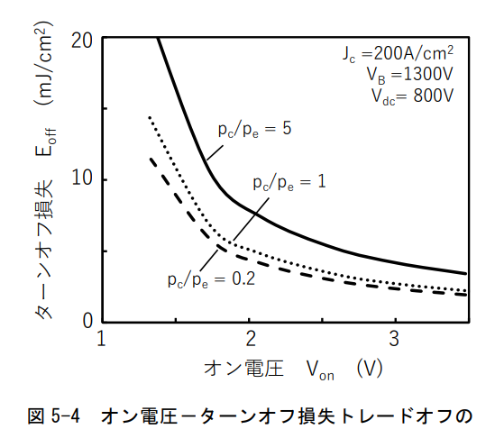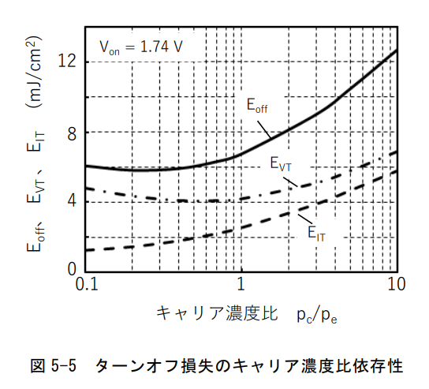

导通电压 $V_{\text{on}}$ 是IGBT导通路径上各部分压降之和，即：

$$
V_{\text{on}} = V_{\text{pn}} + V_{\text{drift}} + V_{\text{ch}} = V_{\text{pn}} + R_{\text{drift}}I_{\text{c}} + R_{\text{ch}}I_{\text{c}} \quad (37)
$$

其中，为了让空穴注入到n-漂移层中，需要在集电极侧pn结上施加的正向偏置电压为 $V_{\text{pn}}$，$V_{\text{drift}}$ 是漂移层的压降，$V_{\text{ch}}$ 是沟道的压降。$V_{\text{pn}}$ 由集电极侧的载流子密度决定，表达式为：

$$
V_{\text{pn}} = \frac{kT}{q} \ln\left(\frac{n p_e}{n_i^2}\right) \quad (38)
$$

其中，$p_e$ 是发射极侧的载流子浓度，$p_c$ 是集电极侧的载流子浓度。$R_{\text{drift}}$ 由电导率调制增加的载流子浓度分布 $n(x)$ 决定。

$$
\frac{1}{R_{\text{drift}}} = q(\mu_n+\mu_p)\int n(x)dx \quad (39)
$$

其中，$\mu_n$ 是 **电子迁移率 (electron mobility / 電子移動度)**，$\mu_p$ 是 **空穴迁移率 (hole mobility / ホール移動度)**。另一方面，功率MOSFET同样在式(18)中有所表示。关断时，需要寻求漂移层的空穴排出。漂移层中积累的载流子一经排出，空乏层便会上升。空乏层厚度 $W_{\text{dep}}$ 与集电极电压 $V_{\text{ce}}$ 的关系为：

$$
W_{\text{dep}}(t) = \sqrt{\frac{2\epsilon_s V_{\text{ce}}(t)}{qN_{\text{drift}}}} \quad (40)
$$

因此，关断时漂移层内的电荷密度 $Q_{\text{drift}}$ 为：

$$
Q_{\text{drift}}(t) = Q_0 - Q_{\text{dep}}(t) = \frac{q(p_e+p_c)l_{\text{drift}}}{2} - J_n t \quad (41)
$$

而且，$Q_{0}$ 是关断前的电荷密度，$Q_{\text{dep}}$ 是空乏化时排出的电荷密度，$J_n$ 是漂移层中的电子电流，$t$ 是时间。$J_n$ 是漂移电流与扩散电流之和，可表示为：

$$
J_n = \frac{\mu_n J_c - qD_a \frac{dn(x)}{dx}}{\mu_n+\mu_p} = \frac{\mu_n J_c - qD_a \frac{p_e-p_c}{l_{\text{drift}}}}{\mu_n+\mu_p} \quad (42)
$$

因此，排出电荷 $Q_{\text{dep}}$ 是将空乏层 $W_{\text{dep}}$ 用尽所致，所以：

$$
Q_{\text{dep}}(t) = q \int_0^{W_{\text{dep}}} n(x)dx \approx qp_eW_{\text{dep}}(t) + \frac{qp_e}{2l_{\text{drift}}}[W_{\text{dep}}(t)]^2 = J_n t \quad (43)
$$

通过解析式(40)、(42)、(43)可以求解 $V_{\text{ce}}(t)$。与功率MOSFET一样，关断损耗是电压电流重叠增加的过程（**米勒期间 (Miller period / ミラー期間)**）和集电极电流减少的过程（**电流切断期间 (current cut-off period / 電流切替わり期間)**）中产生的。米勒期间中，集电极电流是恒定的，此期间的损耗 $E_f$ 为：

$$
E_f = \int I_c V_{\text{ce}}(t) dt \quad (44)
$$

而且，$t_{tf}$ 是集电极电压达到电源电压 $V_{\text{DC}}$ 所需的时间。电流切换期间流过的电流，是为了排出漂移层内残留载流子而流动的电流，在此期间产生的损耗 $E_{tf}$ 为：

$$
E_{\text{tf}} = \int V_{\text{ac}} I_{\text{tail}} dt = V_{\text{ac}}Q_{\text{drift}}(t_{vr}) \quad (45)
$$

$E_f$ 和 $E_{tf}$ 的和即为关断损耗 $E_{\text{off}}$。

将这些式子计算出的结果如图5-4所示。漂移层内的总载流子量增加会导致导通电压降低，但关断损耗会增加，呈现出权衡关系。这个权衡关系通过减小 $p_e/p_c$ 比值得到改善。为了实现低的权衡关系，发射极侧浓度高、集电极侧浓度低的载流子分布是有效的。这是因为，漂移层内的载流子排出和集电极电压上升的方式会延伸。$p_e/p_c$ 比值越大，空乏层会越早延伸，集电极电压会越早上升。

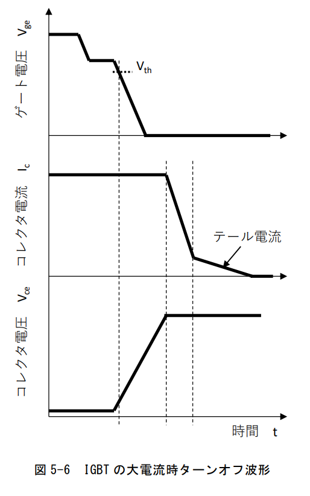

此外，当空乏层延伸时，如果集电极电压上升，集电极侧的空乏层会变宽，但集电极电流几乎不变（参考图5-5）。另外，关断后残留的电荷 $Q_{\text{drift}}$ 越多，关断损耗也越大。当 $p_e/p_c$ 比值较小时，发射极侧会存在大量载流子，因此开始时空乏层容易延伸，$E_{\text{off}}$ 较小。但是，在与导通电压相同的条件下，如果减小 $p_e/p_c$ 比值，$Q_{p}$ 会增大，空乏化所需时间变长，$E_{f}$ 会增大。综上所述，可以估计最佳的 $p_e/p_c$ 比值在0.2~0.3左右。

接下来，介绍功率MOSFET和IGBT的开关波形差异。功率MOSFET的关断动作是基于栅极电荷的充放电，而双极性动作的IGBT则需要额外考虑载流子的注入和抽出。在功率MOSFET中，**米勒期间 (Miller period / ミラー期間)** 中集电极电压上升，但IGBT中是 $V_{\text{ce}}$ 上升后，$I_{\text{c}}$ 才下降，这是因为反向沟道被消除，如图5-6的大电流关断波形所示。电路内的电流路径切换完成之前，IGBT必须持续导通，因此在导通状态下，大量载流子存在于漂移层中。为了排出这些大量的载流子，需要集电极电流持续流过。因此，首先 $V_{\text{ce}}$ 上升，之后 $I_{\text{c}}$ 继续流动。当 $V_{\text{ce}}$ 达到电源电压后，空乏层不会再延伸，漂移层中的载流子是通过扩散和复合慢慢排出的，残留的载流子会急剧减少，形成缓慢下降的 **拖尾电流 (tail current / テール電流)**。

开关时的 $C_{\text{ge}}$ 和 $C_{\text{gc}}$ 的充放电通过栅极电阻进行，与功率MOSFET一样控制栅极电压的速度。但是，通过减小栅极电阻来快速关断，漂移层内残留的载流子会增加，导致 $V_{\text{ce}}$ 上升。如图5-7所示，当载流子残留时，空乏层会进一步延伸，即使施加的电压低于耐压，内部电场也可能达到临界电场强度，引发 **雪崩击穿 (avalanche breakdown / アバランシェ降伏)**。这种现象被称为 **动态雪崩 (dynamic avalanche / ダイナミックアバランシェ)**。发生动态雪崩时，漂移层内会新产生电子-空穴对，使空乏层延伸得更慢，载流子排出恶化。结果是，$dV/dt$ 变小，关断时间变长。由于这个原因，单纯减小栅极电阻来降低 $E_{\text{off}}$ 是有局限的，而IGBT中，通过抑制动态雪崩的发生来减小栅极电阻，从而降低 $E_{\text{off}}$。

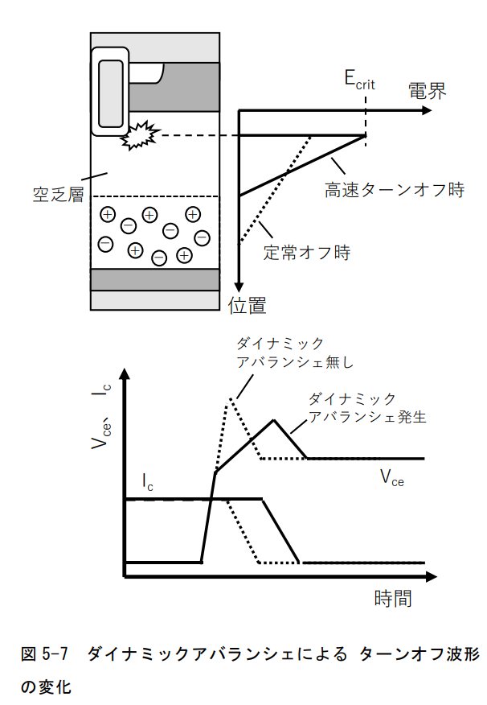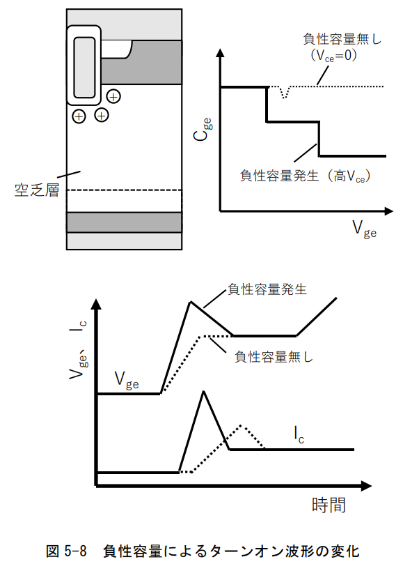

关断波形中也可以看到双极性动作的影响。如果 $V_{\text{ce}}=0$， $C_{\text{gc}}$ 是由栅极氧化膜容量决定的，$V_{\text{ce}}$ 变化时，它也是恒定的。然而，在关断状态下，集电极上施加高电压。这导致关断动作中 $V_{\text{ce}}$ 上升时，栅极-漏极之间的空乏层容量的影响变小。

### 5-3 破坏耐量 (Destruction Toughness / 破壊耐量)

与功率MOSFET一样，IGBT在高电压、大电流下也容易损坏。这里，我们将说明与器件内部的短路耐量和击穿耐量相关的主要损坏模式。如图5-9所示，IGBT内部的n+发射极层、p基区、n-漂移层和p集电极层形成了 **npn晶体管 (npn transistor)** 和 **pnp晶体管 (pnp transistor)**，这两者相互连接构成了 **寄生晶闸管 (parasitic thyristor / 寄生サイリスタ)**。晶闸管是一种一旦导通，即使栅极电压归零也会维持导通状态的元件。在关断操作中，p基区会流过空穴电流 $I_h$，如果p基区的电阻过高，npn晶体管就会导通，从而发生 **闭锁 (latch-up / ラッチアップ)**。一旦发生闭锁，就无法关断，器件会因过电流而损坏。因此，在p基区表面设置高浓度p+接触层，降低p基区的电阻，以防止闭锁，这种结构被称为 **非闭锁IGBT (non-latch-up IGBT / ノンラッチアップIGBT)**。

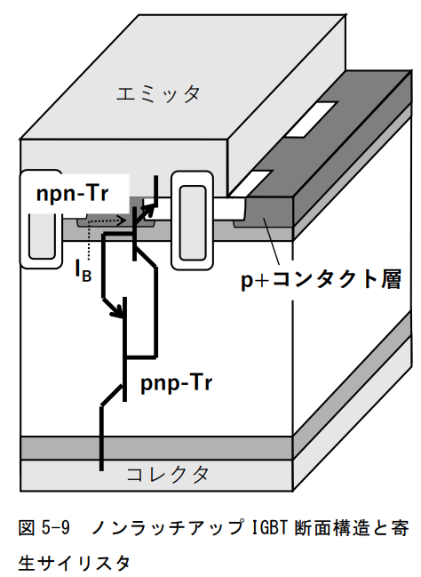

IGBT普及的一个原因，是与MOS栅极驱动的功率器件相比，它作为双极性动作的元件，其关断比晶闸管和GTO更高速，且破坏耐量更大。由于器件损坏，IGBT的关断需要称为 **短路耐量 (short-circuit withstand time / 短絡耐量)** 的大 $I_c$ 遮断能力，通常设计为能承受额定电流的2~3倍。如图5-10所示，IGBT主要用于电机驱动的 **逆变电路 (inverter circuit / インバータ回路)**。如果逆变电路的任一臂发生故障，例如上臂或下臂的IGBT同时导通（**臂短路 (arm short-circuit / アーム短絡)**）或电机本身损坏（**负载短路 (load short-circuit / 負荷短絡)**），IGBT就会进入短路状态。

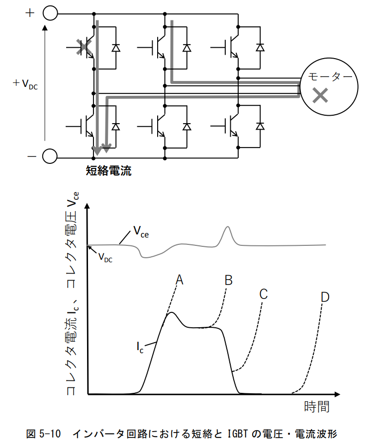

### 5-4 构造的演变 (Evolution of Structure / 構造の変遷)

如前所述，IGBT的低损耗化是通过改善 $E_{\text{off}}-V_{\text{on}}$ 的权衡关系来实现的，而改变 **载流子分布 (carrier profile / キャリアプロファイル)** 是有效的。为此，通过减薄 **pin二极管 (pin diode)** 的漂移层、降低漂移电阻、改善载流子注入等观点来改进权衡关系。这也是IGBT结构演变的原因。

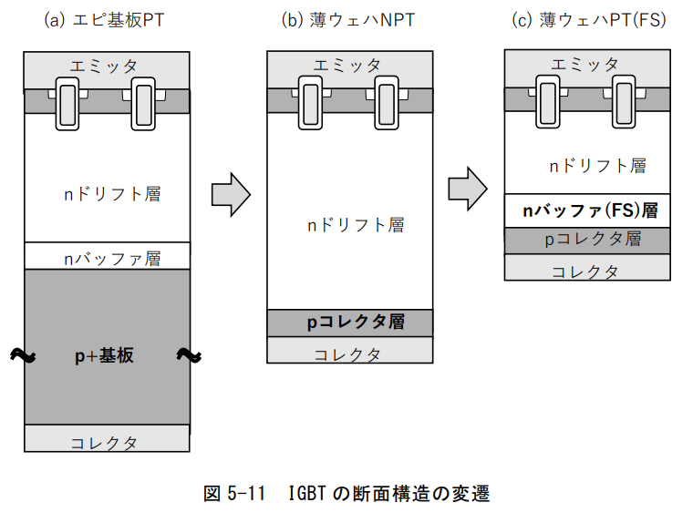

主要的结构演变如图5-11所示。IGBT开发初期，是在p+基板上生长n-外延层来形成的。之后，在表面形成了MOS栅极结构。由于p+基板较厚，空穴注入量难以从集电极侧控制，因此，采用了 **裸晶圆 (raw wafer)** 结构，在其耐压所需的厚度处进行研磨，然后从背面注入p型离子形成p集电极层，实现了 **薄晶圆 (thin wafer / 薄ウェハ)** NPT结构。此后，随着工艺技术的发展，又实现了 **场截止型 (Field-Stop / フィールドストップ, FS)** IGBT，其名称来自英飞凌（Infineon）公司。

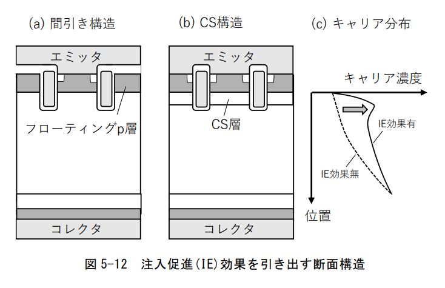
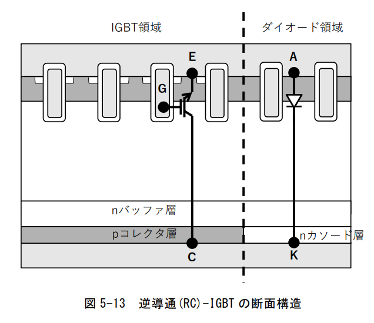

此外，**反向导通IGBT (Reverse Conducting IGBT / RC-IGBT)** 也被商业化。通常，在逆变电路中，电流从发射极流向集电极，但也有反向流动的需求。通常，IGBT是反向截止的，因此需要并联一个pin二极管。而RC-IGBT将IGBT和集电极侧的元件集成为一个芯片，通过共用引线键合和终端部分，实现了比分立器件更小的芯片尺寸，从而有望实现恒定功率下的成本降低。

# 6 宽禁带半导体器件 (Wide-Bandgap Semiconductor Devices / ワイドバンドギャップ半導体デバイス)

## 6-1 宽禁带半导体器件的定位 (Positioning of Wide-Bandgap Semiconductor Devices / ワイドバンドギャップ半導体デバイスの位置づけ)

采用 **硅 (Silicon / Si)** 材料的功率器件已经实用化，至今已过了约40年。在此期间，Si器件的性能被逐步推向其材料的理论性能极限。在这种情况下，作为今后进一步飞跃性地提升性能，打破其极限的手段，采用耐压性能优于Si的 **宽禁带半导体 (Wide-Bandgap Semiconductor / ワイドバンドギャップ半導体)** 的器件正受到越来越多的关注。

如基本设计部分所述，功率器件的重要性能指标之一是 **导通电阻 (On-resistance / オン抵抗)** 与 **耐压 (Withstand Voltage / 耐圧)** 之间的权衡关系。材料的物性决定了其极限，导通电阻的极限值与材料 **临界电场 (Critical Electric Field / 臨界電界)** 的三次方成反比。因此，与Si相比，具有更高临界电场的宽禁带半导体，有望实现飞跃性的低导通电阻。图6-1展示了Si器件和宽禁带半导体器件的电场分布示意图。耐压由能够承受的电荷量，即电场分布在临界电场以下的面积决定。电场分布的斜率是 **空乏层 (Depletion Layer / 空乏層)** 中的净不纯物浓度，因此，如果空乏层的厚度，即漂移层的厚度相同，耐压也就相同。如果临界电场高，即使在相同的耐压下，也可以提高不纯物浓度，从而获得更低的导通电阻。

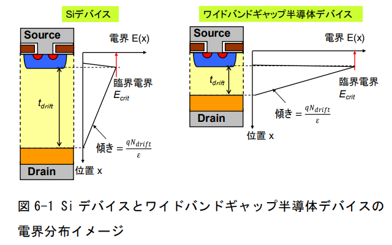

此外，导通电阻的大小与产生电子-空穴对所需的能量大小有关，如果能量大，则更难发生 **雪崩击穿 (Avalanche Breakdown / アバランシェ降伏)**。因此，宽禁带半导体具有高临界电场。正因如此，宽禁带半导体器件与Si器件相比，低导通电阻值得期待。

作为可用于功率器件的宽禁带半导体材料，具有比Si高10倍以上临界电场的 **碳化硅 (Silicon Carbide / SiC / 炭化ケイ素)** 和 **氮化镓 (Gallium Nitride / GaN / 窒化ガリウム)** 受到了关注。图6-2展示了作为耐压极限的导通电阻。Si的耐压极限约为1/200，而GaN的耐压极限约为1/2400。正如所预期的那样，可以实现飞跃性的低导通电阻，因此，宽禁带半导体器件作为下一代功率器件备受瞩目。

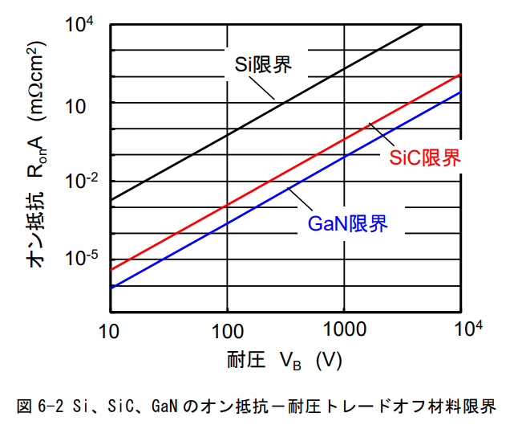 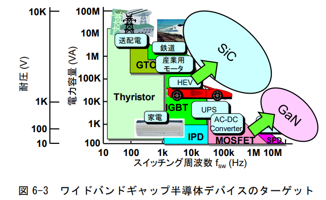

飞跃性的性能提升，不仅仅是替换Si功率器件，还为迄今为止Si功率器件无法实现的动作领域和应用领域开辟了可能性。因此，如图6-3所示，对高耐压、大容量以及高频应用的适应性正在扩大。耐高压、大容量的SiC，有望取代Si-IGBT或晶闸管，而高速动作的GaN则有望取代Si-MOSFET，从而适应更高频率的应用。

## 6-2 SiC器件 (SiC Devices / SiCデバイス)

### (a) SiC晶圆 (SiC Wafer / SiCウェハ)

SiC晶体存在多种晶体结构，如立方晶的3C-SiC或六方晶的4H-SiC、6H-SiC等，功率器件主要使用4H-SiC。与Si晶体不同，SiC是通过升华法来生长晶体的，其晶体生长速度非常慢，这是提高良率和降低成本的难题。因此，SiC晶圆的结晶生长速度与Si相比为1/1000的程度。而且，SiC晶圆口径目前为4~6英寸（100~150 mm），与Si晶圆的口径（200~300 mm）相比要小。由于这些原因，生产效率低，成本也非常高。解决SiC器件普及的一大课题就是降低晶圆成本。

### (b) SiC器件的验证与产品化 (Device Demonstration and Commercialization / デバイス実証・製品化)

SiC器件方面，最初产品化的是SBD，于2001年由英飞凌（Infineon）公司开始销售。通常，耐压600V的Si二极管中，双极性器件pin二极管被使用，而SiC中，单极性器件SBD也能获得同等的导通电压。将双极性器件改为单极性器件，可以从根本上减少 **反向恢复损耗 (Reverse Recovery Loss / リカバリー損失)**（参考图6-4）。由于反向恢复引起的噪声降低和开关损耗降低的需求强烈，从适配器和大型电源开始使用。

之后，在电机应用中的逆变电路中，SiC-SBD与Si-pin二极管替换，开关损耗得到降低。但Si-IGBT依然存在，反向恢复损耗和IGBT的关断损耗并未减少的效果很有限。于是，SiC-SBD和Si-IGBT组合的混合型产品被商业化，2012年在东京地铁银座线上实现了商业化。

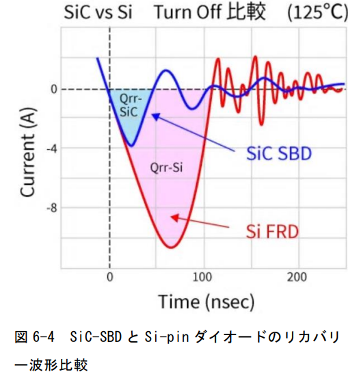

然而，使用与Si相同的工艺来制造SiC-MOSFET的商业化却遇到了困难。截面结构与Si-MOSFET相同，制造工艺也使用相同的工程，但由于是化合物半导体，MOS界面的界面準位密度高，沟道迁移率仅为Si的1/10左右。因此，即使在高临界电场下可以降低漂移电阻，但沟道电阻高，无法发挥出材料极限所预期的低导通电阻。

为此，改善沟道迁移率的研究开发活跃进行，虽然在平面结构上进展不大，但采用了迁移率较高的面，并实现了低导通电阻的 **平面栅极 (Planar Gate / プレーナーゲート)** 器件，以高耐压器件为中心开始产品化。之后，为了进一步降低沟道电阻，采用了沟道长度可以缩短的 **沟槽栅极 (Trench Gate / トレンチゲート)** 结构（参考图6-5），从2017年起多家公司实现了商业化。目前，SiC-MOSFET已在电动汽车的SiC-MOSFET中得到应用，并已取代Si-IGBT的全SiC模块在小田急线和山手线、东海道新干线（N700S系）等铁道中得到实用化。

现状是，SiC-SBD单体、SiC-MOSFET单体的分立器件、混合型SiC-SBD和Si-IGBT组合的模块以及结合了SiC-MOSFET和SiC-SBD的 **全SiC模块 (Full-SiC module / Full-SiCモジュール)** 已经产品化。分立器件的耐压为600V~1700V，模块则在耐压600V~3300V的范围内广泛展开。

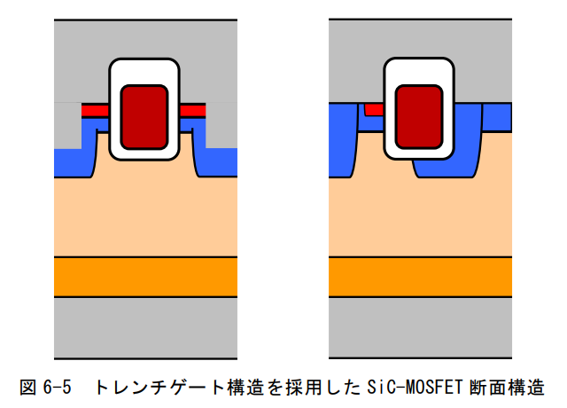

### (c) SiC器件的课题 (Challenges of SiC Devices / SiCデバイスの課題)

SiC功率器件，是为了实现超越Si功率器件极限的高性能，其验证和实用化正在进行中。但是，要积极取代Si功率器件，还面临着许多普及的障碍和课题，这与成本和信赖性有关。成本方面，晶圆成本高是主要原因，但工艺成本也很高。这是因为SiC材料非常硬，加工性差，且许多多晶型体共存，导致结晶缺陷容易产生，抑制良率和热处理温度也比Si高，导致设备昂贵。由于这些原因，生产性低、芯片成本高，现阶段被用于高性能可以弥补昂贵成本的应用中，尚未达到大规模普及。

信赖性方面也存在课题，MOS界面和p-n二极管的安定性是首先要解决的问题。如前所述，因为是化合物半导体，MOS界面的準位密度比Si高10倍以上。因此，由于界面準位的电荷俘获，栅极阈值电压的变动也高出10倍以上。在界面準位附近有电子俘获，在阈值电压附近有空穴俘获，当栅极长时间施加电压时，阈值电压会变动。

SiC-MOSFET也和Si-MOSFET一样，在逆变电路中，需要使用反并联的二极管，如果可以使用体二极管，就不需要并联SiC-SBD。但是，体二极管工作时，由于漂移层中基底面缺陷的影响，导通电压上升。这会导致漂移层内的载流子再结合能增加，基底面缺陷扩大。为了对策，正在研究在不降低基底面缺陷的情况下增加电导率的方法，以及使用SBD来避免体二极管工作的方法。

## 6-3 GaN器件 (GaN Devices / GaNデバイス)

### (a) GaN晶圆 (GaN Wafer / GaNウェハ)

蓝色发光二极管和激光器中使用的GaN是众所周知的，但发光器件的芯片面积小，因此使用的GaN晶圆也小，2英寸是主流。功率器件所要求的大面积芯片制造，目前还没有看到途径。因此，GaN功率器件的制造，是通过在Si基板上进行 **异质外延生长 (heteroepitaxial growth / ヘテロエピタキシャル成長)** 的手段。Si基板上生长GaN晶体时，由于晶格不匹配达-17%之大，需要夹入缓解晶格失配的 **缓冲层 (buffer layer / バッファ層)** 等。通过在Si基板上生长GaN层，实现了GaN晶体的高品质生长。这与SiC不同，解决晶圆成本的课题已初现曙光。

### (b) GaN器件的验证与产品化 (GaN Device Demonstration and Commercialization / デバイス実証・製品化)

GaN中，难以通过p型和n型的离子注入和扩散形成pn结，因此难以制造出像Si或SiC那样的纵向导通器件，也难以制造使用缓冲层的纵向功率MOSFET或IGBT。因此，利用晶体生长和电极形成来制造的横向器件——**HEMT (High Electron Mobility Transistor / 高電子移動度トランジスタ)** 被采用（参考图6-6）。HEMT结构中，在AlGaN/GaN界面由于自发极化和压电极化产生了高浓度的 **二维电子气 (2DEG / 2次元電子ガス)**，从而实现了移动。因此，沟道电阻和漂移电阻也能降低，低压下也能实现低导通电阻。要获得高耐压，需要拉大栅-漏极间距，但为了实现高耐压，需要加厚异质外延生长层。

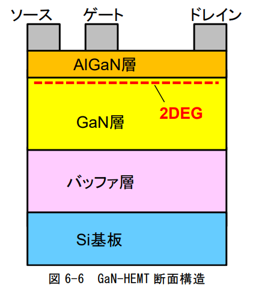

### (c) GaN器件的课题 (Challenges of GaN Devices / GaNデバイスの課題)

GaN-HEMT的高速开关动作，已在器件单体验证，但实用化开始后，更进一步的普及仍面临以下三个主要课题：1) **电流崩塌 (Current Collapse / 電流コラプス)**，2) **常关型 (Normally-off / ノーマリーオフ)**，3) **雪崩耐量 (Avalanche Tolerance / アバランシェ耐量)**。

**电流崩塌** 是指在器件上施加电压后，电流流过时导通电阻增加的现象。产生原因是界面或晶体缺陷引起的电子俘获。施加电压时，2DEG沟道中的电子被电场加速，俘获到表面或异质结生长层中的缺陷中。之后，即使栅极导通，被俘获的电子也会形成负的固定电荷，使2DEG沟道的电子难以恢复，导通电阻增加。

**常关型** (Normally-off)，是指栅极电压为零时器件处于关断状态。如前所示，Si功率器件是MOS栅极，而SiC功率器件是p基区的反向偏置沟道来形成导通状态，因此栅极电压为零时是关断的，属于常关型。然而，GaN-HEMT即使栅极无偏置，AlGaN/GaN界面也会形成2DEG。因此，栅极电压为零时沟道也是导通的，属于常开型器件。

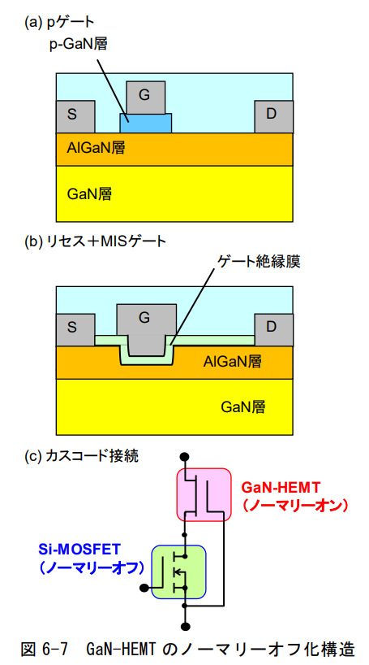

为了实现常关型化，正在研究三种结构（参考图6-7）。1) p-栅极，2) AlGaN层再生+MIS栅极，3) **级联 (Cascode / カスコード)** 连接。

**雪崩耐量** (Avalanche Tolerance) 指的是器件的抗击穿能力。在Si或SiC功率器件中，雪崩击穿时产生的空穴会通过p基区排出，即使发生雪崩击穿也不会立即损坏，具有一定程度的耐量。然而，GaN-HEMT中不存在连接到源极的p层，因此空穴难以排出。因此，雪崩击穿产生的空穴在内部积累，其空穴电荷使电场上升，进一步促进雪崩击穿的正反馈发生，导致器件损坏。实现常关型的p栅极结构，虽然可以经由p-GaN层向栅极排出空穴，但由于AlGaN/GaN异质界面存在势垒，无法快速排出空穴，其雪崩耐量约为Si-MOSFET的1/1000，非常小。功率器件要求包括异常情况在内的安全运行，因此，提高GaN-HEMT的雪崩耐量是普及的一大课题。