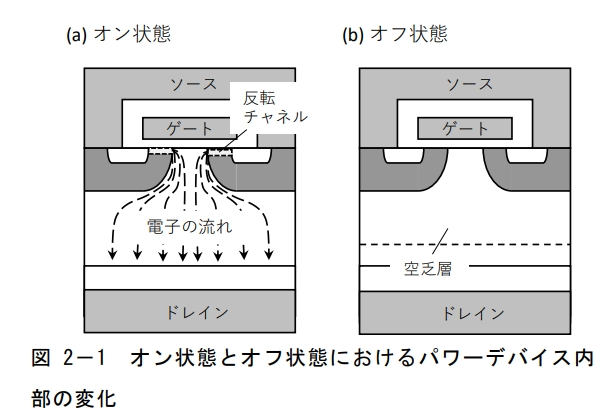
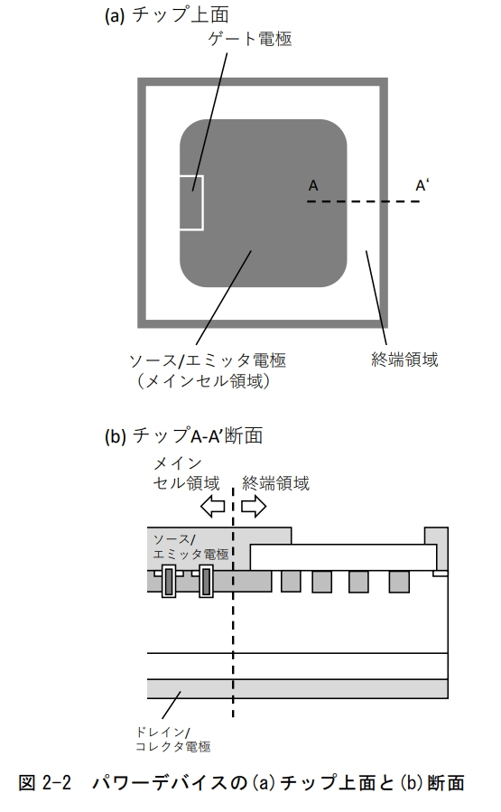
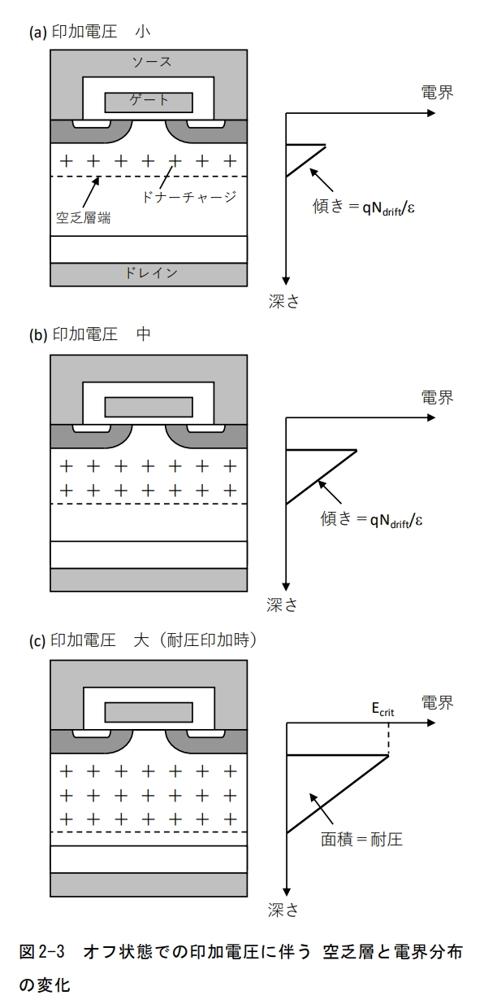
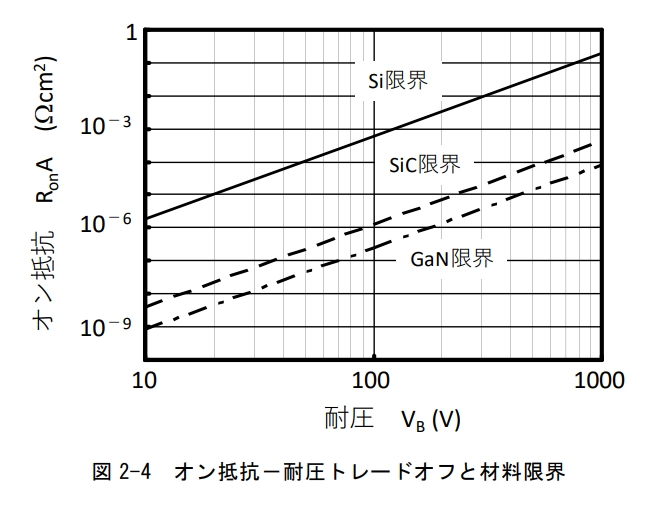
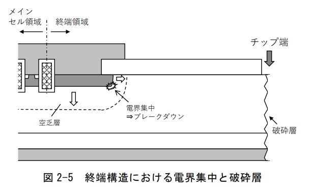
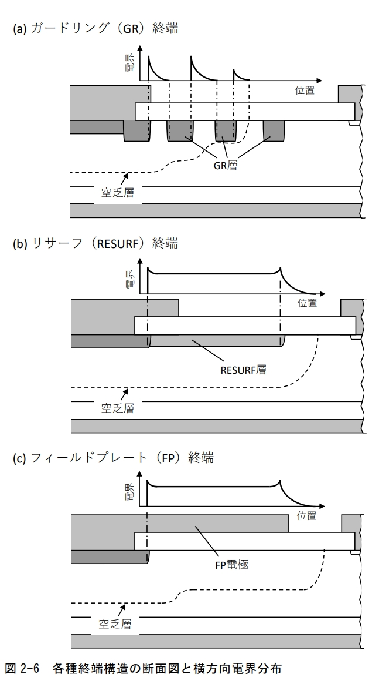

# 2. 功率器件的基本设计 (Basic Design of Power Devices / パワーデバイスの基本設計)

## 2-1 芯片基本结构 (Basic Chip Structure / チップ基本構造)

功率器件的基本工作原理是，在导通状态下即使有大电流流过，也要保持较低的内部电阻以确保电流路径；而在关断状态下，即使施加了高电压，也必须能够承受。为了实现这一点，功率器件采用了如图2-1所示的 **纵向结构 (Vertical Structure / 縦型構造)**。以功率MOSFET为例，在导通状态下，电子通过反型沟道后，在整个 **漂移层 (Drift Layer / ドリフト層)** 区域扩散，从而实现低电阻。而在关断状态下，通过在表面侧和漂移层之间扩展的 **耗尽层 (Depletion Layer / 空乏層)** 来确保耐压。

与存储器或LSI等其他半导体器件一样，功率器件也是通过从圆形晶圆上切割出多个芯片而制成的。如图2-2所示，在芯片表面形成 **源极/发射极电极 (Source/Emitter Electrode / ソース・エミッタ電極)** 和 **栅极电极 (Gate Electrode / ゲート電極)**，背面形成 **漏极/集电极电极 (Drain/Collector Electrode / ドレイン・コレクタ電極)**。在流过电流的核心区域外围，形成了与漂移层同样用于保持耐压作用的 **终端结构 (Termination Region / 終端領域)**。

在此，我们将阐述为确保耐压而设的漂移层的设计，以及与之相关的导通电阻的理论极限，并进一步阐述终端结构的设计。

## 2-2 漂移层设计与导通电阻的理论极限 (Drift Layer Design and On-Resistance Theoretical Limit / ドリフト設計とオン抵抗の理論限界)

我们将阐述为满足要求的耐压而设计的 n-漂移层的浓度和厚度。如图2-2(a)所示，在关断状态下，p-基底层和n-漂移层构成的pn结上施加了逆向电压。随着施加电压的增加，耗尽层会扩展到低浓度的n-漂移层中。在关断状态下，电流几乎不流动，由施加电压引起的电场由耗尽层来维持，仅在耗尽层中产生电场。

电场分布由n-漂移层的 **不纯物浓度 (Impurity Concentration / 不純物濃度)** 和施加的电压决定。根据 **泊松方程 (Poisson's Equation / ポアソン方程式)**，电场梯度由耗尽层中的固定电荷量决定。耗尽层中的多数载流子是电子，因此不存在。不纯物离子（施主的正电荷）构成了唯一的电荷。电场分布的斜率与n-漂移层的不纯物浓度 $N_{drift}$ 成正比。如图2-3所示，即使施加一个使电场分布面积等于耗尽层厚度的电压，只要不改变不纯物浓度，电场分布的斜率就不会改变。为了保持一定的施加电压，耗尽层会向漏极方向延伸。

如果继续增加施加电压，耗尽层会进一步延伸，p-基底层下的电场强度也会增加。当电场达到峰值，即 **临界电场 (Critical Electric Field / 臨界電界)** $E_{crit}$ 时，就会发生 **雪崩击穿 (Avalanche Breakdown / アバランシェ降伏)**。在雪崩击穿过程中，即使耗尽层中有微小的电流，移动的载流子也会被强电场加速。通过这种移动获得的能量会超过能量带隙，当被加速的载流子与原子碰撞时，会通过 **碰撞电离 (Impact Ionization / インパクトイオン化)** 现象，将价带电子激发到导带，从而产生新的电子-空穴对。这种现象被称为碰撞电离，而通过碰撞电离产生的载流子又被进一步加速，产生新的电子-空穴对的连锁反应，使载流子呈雪崩式增加的现象，被称为雪崩击穿或雪崩现象。

当发生雪崩击穿时，即使在关断状态下也会有大电流流过，因此，雪崩击穿开始时的电压即为耐压，其大小由电场分布决定。因此，从耐压出发，可以根据电场的最大值为临界电场这一条件，通过确定耗尽层的厚度来反推不纯物浓度，进而确定耗尽层的厚度（漂移层厚度）。当临界电场 $E_{crit}$ 到达n+基板时，电场分布为三角形，其面积为耐压 $V_B$。

$$
V_B = \frac{\varepsilon_s E_{crit}^2}{2qN_{drift}} \quad (1)
$$

其中，$\varepsilon_s$ 是真空介电常数（=8.854×10⁻¹⁴ F/cm），$\varepsilon_{Si}$ 是硅的比介电常数（=11.8）。由式(1)可知，为了提高耐压，降低不纯物浓度是有效的。临界电场在材料上是固定的，因此漂移层材料越纯净（不纯物浓度越低），耐压越高。因此，根据设计可变的参数是不纯物浓度和漂移层厚度。

**导通电阻 (On-resistance / オン抵抗)** 由导通状态下流过电流的整个路径的电阻决定。以功率MOSFET为例，电子从源极电极经反型沟道进入n+基板，再流向漏极电极。漂移层电阻是决定耐压的参数。为了降低漂移层电阻，需要减薄漂移层的厚度、提高不纯物浓度。但是，减薄漂移层会导致耐压降低。此外，由于沟道和基板电阻与耐压无关，其值由MOS栅极结构决定，独立于漂移层设计。因此，即使可以忽略漂移层电阻以外的电阻，仅通过设计来降低导通电阻的下限也存在理论极限。然后，为了降低导通电阻，漂移层电阻必须降低。因此，低导通电阻、且高耐压的器件很难获得，二者之间存在 **权衡关系 (Trade-off / トレードオフ)**。

像这样，在设计漂移层时，需要在满足必要耐压的同时，通过确定漂移层的厚度和浓度来导出能够实现最低导通电阻的条件。当漂移层电阻为 $R_{onA}$，漂移层厚度为 $t_{drift}$，不纯物浓度为 $N_{drift}$ 时，最佳设计就是导出漂移层电阻。因此，从 $R_{onA}$ 的公式可得，

$$
R_{onA} = \frac{t_{drift}}{q\mu N_{drift}} \quad (2)
$$

其中，$\mu$ 是 **电子迁移率 (electron mobility / 電子移動度)**。为了降低导通电阻，需要在保持耐压的同时，减薄漂移层、提高浓度。当漂移层的不纯物浓度一定时，将漂移层厚度最大化所能得到的耐压，由下式给出：

$$
E_{crit} = \frac{qN_{drift}}{\varepsilon_s}t_{drift} \quad (3)
$$

也就是说，当耗尽层到达 n+ 基板时，三角形的电场分布设计能够获得最高的耐压。利用式(1)、(3)和式(2)，消去漂移层厚度 $t_{drift}$ 和漂移层浓度 $N_{drift}$，可得导通电阻为：

$$
R_{onA} = \frac{4V_B^2}{\varepsilon_s \mu E_{crit}^3} \quad (4)
$$

由此可知，该导通电阻与耐压的2次方成正比，与临界电场的3次方成反比。这就是导通电阻的理论极限值。

上述内容是基于最密堆积设计进行的阐述。到目前为止，我们一直将临界电场视为一个恒定值，但实际上，它会随耐压而略有变化。因此，严格的耐压-导通电阻理论极限并非与耐压的2次方成正比，而是与耐压的2.5次方成正比。式(4)可以消除临界电场，从而推导出该理论极限。实际上，临界电场并非一个恒定值，即便是以耐压为参考也无法确定。它是由材料决定的常数，是指载流子在走行时发生碰撞电离的概率所决定的碰撞电离系数 $\alpha$。

当雪崩击穿即将发生时，漂移层内绝对会发生碰撞电离。也就是说，当碰撞电离率在漂移层内积分的值为1时（碰撞电离100%发生），元件会因雪崩而击穿。利用表示碰撞电离概率的碰撞电离系数 A，可将碰撞电离率表示为：

$$
\int_{0}^{t_d} K e^{(-\frac{B}{E(x)})} dx = 1 \quad (5)
$$

其中，$E(x)$ 是深度方向上漂移层内的电场。然后，将三角形电场分布代入式(5)的 $E(x)$ 中，

$$
\int_{0}^{t_{drift}} K e^{(-\frac{B}{E_{crit}(1 - \frac{x}{t_{drift}})})} dx = 1 \quad (6)
$$

となり、三角形分布であるから、x=$t_{drift}$では、E=0であり、

$$
E_{crit} = (\frac{BqN_{drift}}{2\varepsilon_s})^{1/2} \quad (7)
$$

由此可知，临界电场依赖于漂移层浓度 $N_{drift}$。然后，利用式(1)~(4)、(7)消去 $N_{drift}$ 和 $E_{crit}$，可得：

$$
R_{onA} = \frac{2 \sqrt{2} V_B^{2.5}}{\varepsilon_s \mu B^{3/2}} \quad (8)
$$

这通常被称为“与耐压的2.5次方成正比”的公式。这就是所谓的 **材料极限 (Material Limit / 材料限界)**，在Si（硅）的情况下，该导通电阻的低极限值被称为 **Si极限 (Si Limit / Si限界)**。Si的导通电阻 $R_{onA, Si}$ 为 1.91×10⁻¹⁰$V_B^{2.5}$ Ωcm²，因此，Si漂移层的导通电阻为 5.93×10⁻⁹$V_B^{2.5}$ Ωcm²。

各耐压下，构成漂移层的浓度 $N_{drift}$ 和厚度 $t_{drift}$ 可由下式表示：

$$
N_{drift} = \frac{\varepsilon_s E_{crit}^2}{2qV_B} \quad (9)
$$

$$
t_{drift} = (16K)V_B^{1.5} \quad (10)
$$

由此可见，漂移层浓度和厚度与单纯的耐压并不成正比或反比关系，需要进行一些修正。

以上所示的公式，对Si（硅）以外的所有材料都同样适用。图2-4展示了使用 **SiC (碳化硅)** 或 **GaN (氮化镓)** 等 **宽禁带半导体 (Wide-bandgap Semiconductor / ワイドバンドギャップ半導体)** 时的材料极限。与Si相比，宽禁带半导体的临界电场要高出一个数量级。因此，漂移层可以做得更薄、浓度可以更高。这意味着，与Si极限相比，其导通电阻可以降低到1/1000这一飞跃性的水平。因此，SiC或GaN等宽禁带半导体作为下一代功率半导体材料备受瞩目，相关的开发正在积极进行中。

## 2-3 终端结构 (Termination Structure / 終端構造)

**终端结构 (Termination Structure / 終端構造)** 是指图2-2所示的、位于流过电流的 **主元胞区域 (Main Cell Region / メインセル領域)** 外围部分的结构。漏极电极等通常与芯片背面电极连接。源极/发射极电极和p-基底层不仅在主元胞区域，也在内侧形成。因此，在终端区域，如图2-5所示，电场不仅从表面向背面方向施加，也从芯片端部向横向施加，因此耗尽层的扩展方式（施加电压的方式）与主元胞区域不同。终端结构是独立设计以应对这种差异的。因此，在设计终端结构时需要特别注意。

终端保护的要点，在于说明为何需要在芯片内特意设置与主元胞区域不同的设计。丸いウェハ内に複数形成された四角いチップは、**切割工艺 (dicing process / ダイシング工程)** によって、一つ一つのチップに切り離される。切り離された断面（チップ端）には、切割工程により机械的な损伤が入った **破坏层 (damaged layer / 破壊層)** が存在する。切割工程の条件によるが、通常、切断面から20μm程度内侧まで损伤が入る。

即使为终端结构设计了与主元胞区域相同的结构，当芯片被切割分离时，如果破坏层中也施加了电场，由于该破坏层存在机械损伤，会有许多结晶缺陷，因此会产生较大的漏电流。这会导致终端结构无法承受预期的耐压，在破坏层处就会发生击穿。因此，通过设计使电场不会施加到破坏层，从而实现稳定的关断状态。

如前所述，在终端区域，耗尽层会向横向和纵向两个方向扩展。因此，横向电场和纵向电场叠加处的电场会成为p-基底层端的电场边界。如图2-5所示，如果终端区域的p-基底层端部施加了电场，横向电场也会变得很高，耐压会降低。由于元件整体的耐压取决于耐压最低的部位，因此终端区域的耐压降低会导致整个元件的耐压也降低。

通常，主元胞区域和终端区域的漂移层是共通的。因此，为了提高终端区域的耐压，需要降低横向电场。为此，需要降低p-基底层的浓度，同时增加厚度，这又会导致导通电阻增加。因此，需要设计出能够在抑制导通电阻增加的同时，实现高耐压的终端结构。

提高耐压的高耐压化的基本要点在于横向电场设计。这是因为横向电场无法像主元胞区域那样仅通过降低浓度来减小。然而，如果终端结构能够巧妙地将横向电场向横向扩展，就可以提高耐压。具体的方法是，在横向上拉长耗尽层，使电场分布平缓。这样，即使施加相同的电压，耗尽层内的电场也会变小。

一个重要的考虑因素是，通常，漂移层的厚度是根据纵向耐压设定的，约为纵向电场的三到四倍。因此，需要设计一种结构，即使将耗尽层在横向扩展这么长的距离，也能维持其扩展。此外，单纯地在横向拉长距离，由于耗尽层中的电场是由不纯物浓度决定的，因此，为了使耗尽层在纵向方向上完全扩展，需要一种能够确保耗尽层厚度的结构，这就是终端结构。

在此，我们将介绍几种主要的终端结构，包括 **保护环 (Guard Ring / ガードリング) (GR)**、**RESURF (Reduced Surface Field)** 结构和 **场板 (Field Plate / フィールドプレート) (FP)** 结构（参见图2-6）。首先，我们来介绍在功率器件中应用最广泛的终端结构——GR终端。

GR终端是由在终端部分的表面形成的多个p型环（GR环）构成的。通常，GR环是 **浮动 (floating / フローティング)** 的，并且与p基底层分开形成。通常，GR环在形成p基底层之前预先形成，因此比p基底层更深。这样一来，p基底端的曲率半径变大，电场集中得到缓和，从而获得高耐压。

当施加电压时，耗尽层随着电压的升高而扩展，电场强度也随之增加。当施加更高的电压时，耗尽层会到达最近的GR环，该GR环的电位也会被施加。这样，最外侧GR环的电场就不会再增加，下一个GR环的耗尽层开始扩展，最外侧的GR环开始抑制其内侧GR环的电场上升。通过依次抑制外侧GR环的电场上升，可以将电场向外扩展，这种环也被称为 **场限环 (Field Limiting Ring)**。

内侧GR环无法抑制电场的原因是，内侧的 **受主离子 (acceptor ion / アクセプタイオン)** 和漂移层的 **施主离子 (donor ion / ドナーイオン)** 的电场力线不会与外侧的受主离子相交。为了实现这种效果，内侧GR环必须完全 **耗尽 (deplete / 空乏化)**。然而，由于内侧GR环的浓度没有上限，因此需要严密的浓度控制。

GR终端的横向电场在GR环之间的间隔中扩展，其电位由GR环之间的间隔决定。因此，终端电场的集中程度取决于GR环的深度和各环之间的间隙等设计参数。如果GR环的间隙决定不当，耗尽层会过早到达外侧的GR环，导致外侧GR环的电场过高。相反，如果GR环的间隙过宽，内侧的电场会变得过高，容易发生雪崩击穿。理想的GR间隙是使所有终端的电场峰值变得相同，此时的间隙是最佳间隙。

接下来，介绍RESURF结构。RESURF（Reduced Surface Field）是在图2-6(b)所示的，在表面上形成比p基底层浓度更低的RESURF层的结构。当施加电压时，耗尽层不仅从p基底层和漂移层的pn结扩展，也从RESURF层和漂移层的pn结扩展。当施加一定程度以上的电压时，RESURF层会完全耗尽。此时，由于RESURF层的电荷量仅由其长度决定，因此横向电场会变小。当施加更高的电压时，RESURF层已经形成的耗尽层会向外侧扩展。

RESURF结构的基本工作原理是RESURF层完全耗尽，因此RESURF层的浓度和长度是设计参数。当完全耗尽时，其下的电场分布由RESURF层中的受主离子数和漂移层中的施主离子数决定。RESURF层浓度低，呈n型掺杂，因此耗尽层中有正电荷。与此设计相同，当耗尽层中存在正电荷时，内侧的电场会上升。相反，RESURF层浓度高，呈p型掺杂，与此设计相同，由于存在负电荷，外侧的电场会上升。如果RESURF层浓度在最终能够形成平坦的电场分布，就可以获得最高的耐压。因此，与GR终端不同，RESURF终端需要严密的浓度控制。

最后，介绍FP结构。如图2-6(c)所示，FP结构是在终端区域表面形成的 **绝缘膜 (insulating film / 絶縁膜)** 上，将源极或栅极延伸形成FP电极的结构。耗尽层的扩展方式与RESURF结构相似，是通过来自FP电极的电场来扩展耗尽层。RESURF结构是通过RESURF层和漂移层的pn结耗尽层来扩展，而FP结构则是通过来自FP电极的电场和绝缘膜、漂移层构成的MIS二极管的电位来扩展耗尽层。

MIS二极管的耗尽层扩展方式由MIS二极管的电容，即绝缘膜的厚度决定，因此FP结构的设计参数是FP电极下的绝缘膜厚度。然后，由于FP电极使耗尽层扩展，因此耗尽层的长度决定了横向电场。因此，FP电极的长度（FP长）也是设计参数。通过改变这些设计参数，可以控制FP电极下方的电场，从而推测出向p基底层电场集中的减少情况。如果绝缘膜薄，FP电极短，则开口部会变窄，耐压会降低。因此，p基底端的电场会变小，但FP电极附近的电场会变大。相反，如果绝缘膜厚，FP电极短，则开口部会变宽，p基底端的电场会变缓和，耐压会升高。通过优化绝缘膜厚度和FP长度，可以获得平坦的电场分布和最高的耐压。将绝缘膜的厚度从内侧向外侧逐渐变厚，可以缓和p基底端和FP端部的电场集中，获得平坦的电场分布和最高耐压。然而，要使厚度逐渐变化，在工艺上是很困难的，因此，通常使用热氧化膜或CVD等堆叠膜，分2-3个阶段改变厚度来形成FP。

FP的优点在于，由于不使用不纯物层，因此与绝缘膜或电极相比，制造工艺相对简单。但是，要应用于高耐压元件，需要数μm厚的绝缘膜。