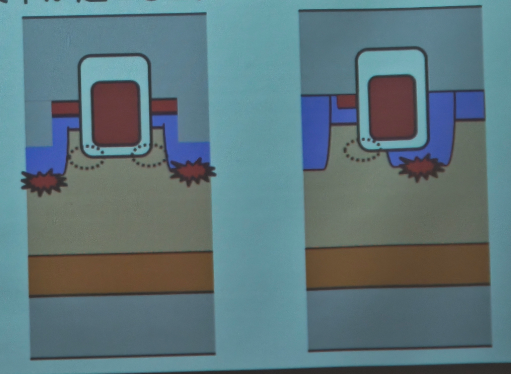
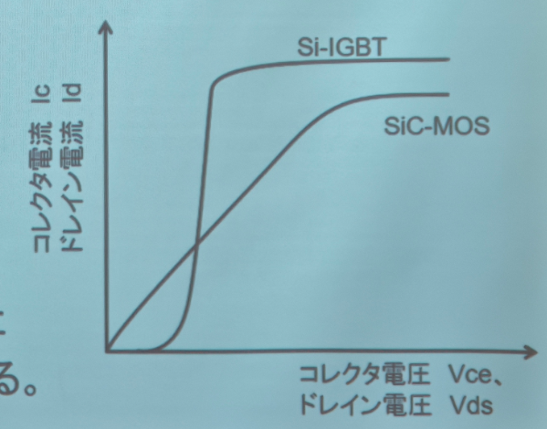
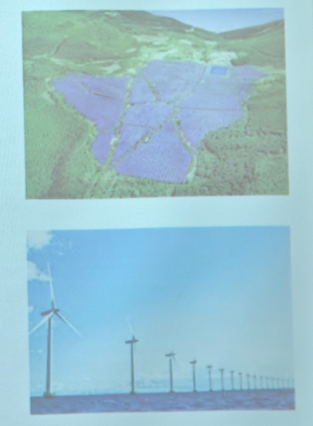

# 功率器件工程基础 第1次习题 (Power Device Engineering Fundamentals - 1st Exercise)

**日期:** 2025.6.16 (星期一)

**【课题】**

请参考示例，求出下列各种漂移层情况下的电场分布、耐压和电阻。
但是，临界电场和迁移率等常数请使用与示例相同的值。

---

### **(例) Example**

*   **器件结构:**
    *   n- 漂移层掺杂浓度: $3 \times 10^{14} \text{ cm}^{-3}$
    *   漂移层厚度: 50 µm

*   **电场分布与计算:**

    

*   **公式与结果:**
    *   **临界电场 (Critical Electric Field / 臨界電界):** $0.2 \text{ MV/cm}$
    *   **耐压 (Withstand Voltage / 耐圧):**
        耐压 = 电场分布图的面积 = $\frac{1}{2} \times \text{临界电场} \times \text{厚度}$
        $= \frac{1}{2} \times 0.2 \text{ MV/cm} \times 50 \text{ µm} = 500 \text{ V}$
    *   **漂移电阻 (Drift Resistance / ドリフト抵抗):**
        电阻 = $\frac{\text{厚度}}{\text{电子电荷} \times \text{迁移率} \times \text{掺杂浓度}}$
        $= \frac{50 \text{ µm}}{1.6 \times 10^{-19} \times 1400 \times 3 \times 10^{14}} \approx 75 \text{ mΩcm}^2$

---

### **(课题1) Exercise 1**

*   **器件结构:**
    *   n- 漂移层掺杂浓度: $6 \times 10^{14} \text{ cm}^{-3}$
    *   漂移层厚度: 50 µm
*   **结果:**
    *   **耐压 (Withstand Voltage / 耐圧):** $250 \text{ V}$
    *   **电阻 (Resistance / 抵抗):** $37.5 \text{ mΩcm}^2$

---

### **(课题2) Exercise 2**

*   **器件结构:**
    *   n- 漂移层掺杂浓度: $1.8 \times 10^{14} \text{ cm}^{-3}$
    *   漂移层厚度: 50 µm
*   **结果:**
    *   **耐压 (Withstand Voltage / 耐圧):** $700 \text{ V}$
    *   **电阻 (Resistance / 抵抗):** $125 \text{ mΩcm}^2$

---

### **(课题3) Exercise 3**

*   **器件结构 (双层漂移区):**
    *   上层 n- 掺杂浓度: $3 \times 10^{14} \text{ cm}^{-3}$
    *   下层 n- 掺杂浓度: $1.5 \times 10^{14} \text{ cm}^{-3}$
    *   总厚度: 50 µm
*   **结果:**
    *   **耐压 (Withstand Voltage / 耐圧):** $540 \text{ V}$
    *   **电阻 (Resistance / 抵抗):** $105 \text{ mΩcm}^2$

---

### **(课题4) Exercise 4**

*   **器件结构 (双层漂移区):**
    *   上层 n- 掺杂浓度: $1.5 \times 10^{14} \text{ cm}^{-3}$
    *   下层 n- 掺杂浓度: $3 \times 10^{14} \text{ cm}^{-3}$
    *   总厚度: 50 µm
*   **结果:**
    *   **耐压 (Withstand Voltage / 耐圧):** $660 \text{ V}$
    *   **电阻 (Resistance / 抵抗):** $105 \text{ mΩcm}^2$

# 功率器件工程基础 第2次习题 (Power Device Engineering Fundamentals - 2nd Exercise)

**日期:** 2025.6.23 (星期一)

**【课题】**

请比较在耐压为30V、100V、600V时，**SBD (肖特基势垒二极管)** 和 **pin二极管** 的 **导通电压 (On-voltage / オン電圧)**。
但是，各耐压下的条件如下表所示。

| 耐压 (Withstand Voltage) | 30V | 100V | 600V |
| :--- | :--- | :--- | :--- |
| **电流密度 (Current Density / 電流密度)** $J_f$ | 2000A/cm² | 500A/cm² | 100A/cm² |
| **SBD** | | | |
| 结电压 (Junction Voltage / 接合電圧) $V_j$ | 0.3V |
| 漂移电阻 (Drift Resistance / ドリフト抵抗) $R_{\text{drift}}$ | 0.03mΩcm² | 0.6mΩcm² | 50mΩcm² |
| **导通电压 (On-voltage / オン電圧)** $V_{\text{on}}$ | **0.36V** | **0.6V** | **5.3V** |
| **pin 二极管** | | | |
| 结电压 (Junction Voltage / 接合電圧) $V_j$ | 0.7V |
| 漂移电阻 (Drift Resistance / ドリフト抵抗) $R_{\text{drift}}$ | 0.02mΩcm² | 0.3mΩcm² | 5mΩcm² |
| **导通电压 (On-voltage / オン電圧)** $V_{\text{on}}$ | **0.74V** | **0.85V** | **1.2V** |

---

### **计算公式:**

导通电压由结电压和漂移电压两部分构成，计算公式如下：

*   漂移电压: $V_{\text{drift}} = J_f \times R_{\text{drift}}$
*   导通电压: $V_{\text{on}} = V_j + V_{\text{drift}}$

---
 

# 演习：高速开关 (Exercise: High-Speed Switching)

### **【问】**

如果将栅极电阻降为零，理论上开关时间也应该能变为零，但实际上却不能。这是为什么？

### **【答】**

理论上，如果栅极电阻为零，开关时流过的电流将为无穷大，那么为电容充电的时间（即开关时间）就会变为零。

然而，在实际情况中，**器件内部的栅极电阻** 和 **布线的寄生电感** 都不可能为零。因此，栅极电流无法超过一定的限度，开关时间也就不会变为零。

为此，在要求高速开关的应用中，需要选用内部栅极电阻和封装电感都较低的器件。

# 演习：IGBT与pin二极管的区别 (Exercise: Difference between IGBT and pin diode)

### **【问】**

在IGBT中，为了降低 **导通电压 (On-voltage / オン電圧)**，会采用促进 **注入增强 (Injection Enhancement / IE) 效应** 的表面结构。然而，在二极管中，仅使用平坦的扩散层。这种差异是为什么？

### **【答】**

在二极管中，空穴和电子分别从阳极和阴极的扩散层注入并移动。对于移动过来的载流子，扩散层会形成一个 **势垒 (Potential Barrier / ポテンシャルバリア)**，从而使载流子在漂移层中积累。

而另一方面，IGBT的发射极侧是 **p基区 (p-base layer / pベース層)**，对于空穴来说不存在势垒，因此载流子难以在发射极侧积累。

为此，在IGBT中，需要一种能够在发射极侧形成势垒的结构，以促使载流子在此积累。

***

# 演习：SiC沟槽栅MOS (Exercise: SiC Trench Gate MOS)

### **【问】**

在SiC沟槽栅MOS中，p层被形成在比沟槽栅底部更深的位置。这是什么原因？

### **【答】**

*   SiC的临界电场约为 **3MV/cm**。
*   SiO₂的击穿电场约为 **7MV/cm**。

如果在沟槽的边角处发生电场集中，那么在SiC发生雪崩击穿之前，栅极的氧化膜就会被绝缘击穿。

因此，从 **保护栅极绝缘** 和 **确保漏极耐压** 的角度出发，需要形成一个更深的p层。

***

# 演习：车载SiC-MOS (Exercise: Automotive SiC-MOS)

### **【问】**

近年来，SiC-MOS在电动汽车逆变器中的应用备受关注。从Si-IGBT切换到SiC-MOS的理由是什么？

### **【答】**

Si-IGBT和SiC-MOS的导通状态I-V特性不同。在 **低电流** 区域，SiC-MOS的导通电压更低。

对于需要长距离行驶的电动汽车而言，电池尺寸大，成本占比也高。

通过 **减小损耗**，可以使电池做得更小、更便宜。因此，即使使用价格高昂的SiC-MOS，从整体来看也能够 **降低成本和电费**。

***

# 演习：面向可再生能源的器件 (Exercise: Devices for Renewable Energy)

### **【问】**

可再生能源应用被认为是未来功率器件业务的增长引擎之一。用于可再生能源的器件需要具备哪些特点？

### **【答】**

*   由于设备通常安装在山区或海上，发生故障时 **维修困难**。
    *   ⇒ 因此，需要 **不易损坏、更加可靠** 的器件。
*   需要具备 **耐热（耐高温/低温）、耐湿、耐盐害** 的特性。
*   最近，用于 **测量劣化程度的传感器和监控功能** 的研究正变得日益活跃。

***

# 第8回 测试说明 (Explanation of the 8th Test)

*   **时间与地点:** 8月4日（星期一） 8:40开始，于301讲义室进行。
*   **形式:** 笔试。
*   **参考资料:**
    *   允许携带打印好的、已上传至Moodle的资料。
    *   **不可** 使用平板电脑或PC等终端设备查阅资料。
*   **考试规定:**
    *   考试开始30分钟后，提交试卷者方可提前退场。
    *   **但是，提前退场者不可再次进入考场。**
    *   考试开始后迟到30分钟以上者，**不可参加本次考试。**