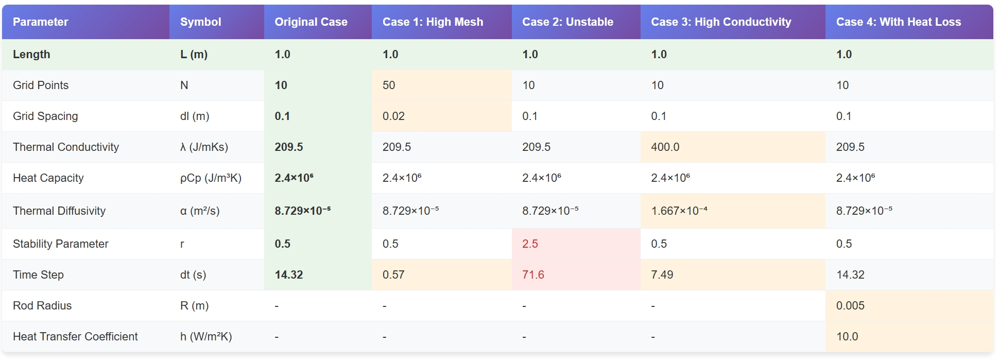
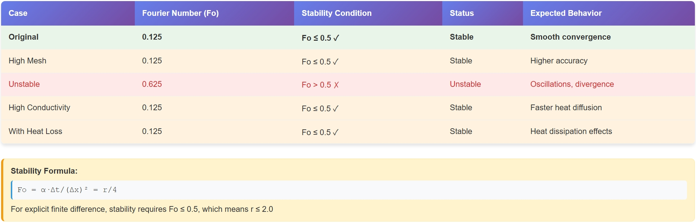
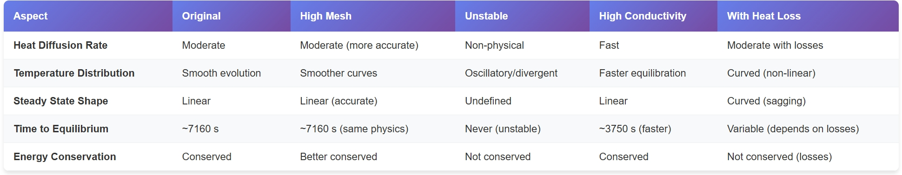
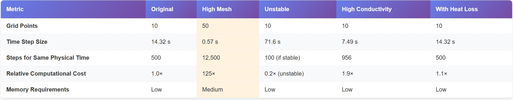
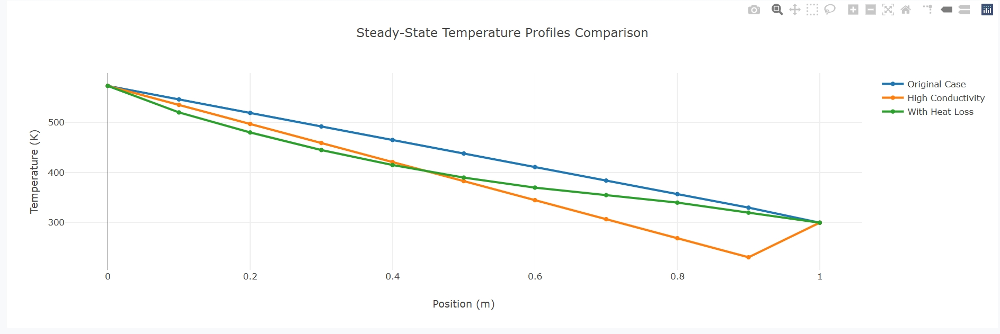
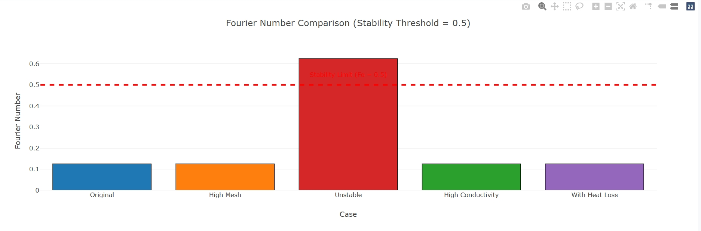
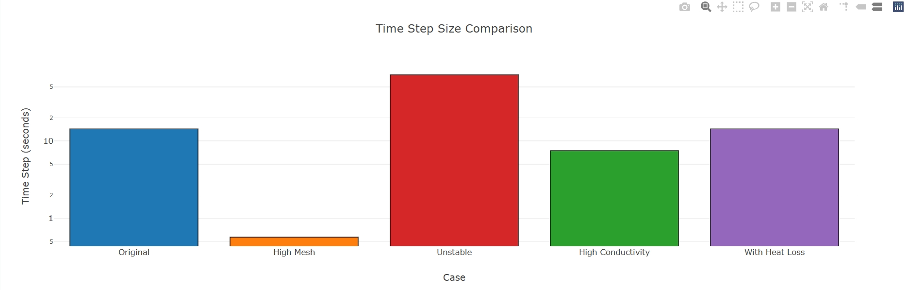

<div style="font-size: 15px; line-height: 1.3;"> 

# Modeling and Simulation Report: 1D Unsteady Heat Conduction
**<u>Kasuya Lab, Student ID: 2ES25185E, Name: LIN HANQING</u>**


## 1. System Definition

The system to be solved is a one-dimensional heat conduction problem within a solid rod of length $L$. The temperature distribution $T(x,t)$ evolves with time $t$ and spatial coordinate $x$.

**Governing Equation:**
The general form of the one-dimensional unsteady heat conduction equation with a heat loss term $q$ is:
$$
\rho C_p \frac{\partial T}{\partial t} = \lambda \frac{\partial^2 T}{\partial x^2} - q
$$
where:
*   $T$ is temperature [K]
*   $t$ is time [s]
*   $x$ is the spatial coordinate [m]
*   $\rho$ is density [kg/m³]
*   $C_p$ is specific heat capacity [J/kgK]
*   $\rho C_p$ is the volumetric specific heat capacity [J/m³K] (`rhoCp` in the code)
*   $\lambda$ is thermal conductivity [W/mK or J/mKs] (`lm` in the code)
*   $q$ is the volumetric heat loss rate [W/m³ or J/m³s]

The thermal diffusivity $\alpha$ is defined as:
$$
\alpha = \frac{\lambda}{\rho C_p} \quad [m^2/s]
$$
In the provided Python code, the heat loss term `q` is initialized to zero (`q[:] = 0`), so the specific equation solved in the core loop is:
$$
\rho C_p \frac{\partial T}{\partial t} = \lambda \frac{\partial^2 T}{\partial x^2}
$$
or
$$
\frac{\partial T}{\partial t} = \alpha \frac{\partial^2 T}{\partial x^2}
$$

**Initial Conditions:**
At time $t=0$, the entire rod is set to a low temperature $T_L$, except for the boundary at $x=L$, which is set to $T_H$.
*   $T(x, 0) = T_L$ for $0 \le x < L$
*   $T(L, 0) = T_H$

This is implemented in the code as:
`T[:] = TL`
`T[N+1] = TH` (This effectively means the node at $x=L$ has an initial temperature of $T_H$)

**Boundary Conditions:**
For all time $t > 0$, the temperatures at both ends of the rod are fixed:
*   Dirichlet boundary condition at $x=0$: $T(0, t) = T_L$
*   Dirichlet boundary condition at $x=L$: $T(L, t) = T_H$

These conditions are maintained in the code by setting `T[0] = TL` and `T[N+1] = TH` and not updating these nodes in the main computation loop.

**The physical system described:**
The system is a one-dimensional rod of length $L$. Initially, most of the rod is at temperature $T_L$, with one end ($x=L$) held at a higher temperature $T_H$ and the other end ($x=0$) held at $T_L$. The simulation tracks how the temperature profile within the rod evolves over time as heat conducts from the hot end to the cold end, with no internal heat generation or heat loss to the surroundings (since $q=0$).

## 2. Derivation of Discretized Equation (FVM)

We use the Finite Volume Method (FVM) to discretize the governing equation $\rho C_p \frac{\partial T}{\partial t} = \lambda \frac{\partial^2 T}{\partial x^2}$.

Consider a general control volume (CV) $P$ of width $\Delta x$ centered around node $i$. The interfaces of the control volume are at $w$ (west) and $e$ (east) respectively.
Integrate the governing equation over the control volume $\Delta V = A \Delta x$ (for 1D, we assume cross-sectional area $A=1$, so $\Delta V = \Delta x$) and a time interval $\Delta t = t^{n+1} - t^n$:

$$
\int_{t^n}^{t^{n+1}} \int_{CV} \rho C_p \frac{\partial T}{\partial t} dV dt = \int_{t^n}^{t^{n+1}} \int_{CV} \lambda \frac{\partial^2 T}{\partial x^2} dV dt
$$

Assuming $\rho C_p$ and $\lambda$ are constant:
$$
\rho C_p \int_{CV} (T_i^{n+1} - T_i^n) dV = \lambda \int_{t^n}^{t^{n+1}} \left[ \left( \frac{\partial T}{\partial x} \right)_e - \left( \frac{\partial T}{\partial x} \right)_w \right] dt
$$

Here, $T_i^n$ is the temperature at node $i$ at time step $n$.
The left-hand side (storage term) becomes:
$$
\rho C_p (T_i^{n+1} - T_i^n) \Delta x
$$
For the right-hand side (diffusion term), using an explicit scheme (fluxes are calculated at time $n$):
The gradients at the cell interfaces $e$ (east) and $w$ (west) are approximated as:
$$
\left( \frac{\partial T}{\partial x} \right)_e \approx \frac{T_{i+1}^n - T_i^n}{\Delta x_e}
$$
$$
\left( \frac{\partial T}{\partial x} \right)_w \approx \frac{T_i^n - T_{i-1}^n}{\Delta x_w}
$$
For a uniform mesh, $\Delta x_e = \Delta x_w = \Delta x$ (distance between cell centers).
The RHS thus becomes:
$$
\lambda \left[ \frac{T_{i+1}^n - T_i^n}{\Delta x} - \frac{T_i^n - T_{i-1}^n}{\Delta x} \right] \Delta t
$$
Combining LHS and RHS:
$$
\rho C_p (T_i^{n+1} - T_i^n) \Delta x = \lambda \left[ \frac{T_{i+1}^n - T_i^n}{\Delta x} - \frac{T_i^n - T_{i-1}^n}{\Delta x} \right] \Delta t
$$
Rearranging to solve for $T_i^{n+1}$:
$$
T_i^{n+1} = T_i^n + \frac{\lambda \Delta t}{\rho C_p (\Delta x)^2} (T_{i+1}^n - 2T_i^n + T_{i-1}^n)
$$
Let $\alpha = \frac{\lambda}{\rho C_p}$ (thermal diffusivity) and $Fo = \frac{\alpha \Delta t}{(\Delta x)^2}$ (Fourier number or numerical diffusion number).
$$
T_i^{n+1} = T_i^n + Fo (T_{i+1}^n - 2T_i^n + T_{i-1}^n)
$$
This is the standard FTCS (Forward-Time Central-Space) explicit scheme.

Now, let's connect this to the formula in the code:
`T[i] = (ce[i]*To[i+1] + cw[i]*To[i-1] + (co[i]-ce[i]-cw[i])*To[i]) / co[i]`
where `To` is $T^n$ and `T` is $T^{n+1}$.
The coefficients in the code are defined as:
*   `dl` is $\Delta x$.
*   `ce[i] = lm / (0.5*(dx[i]+dx[i+1]))`. For an internal uniform mesh, `dx[i]=dx[i+1]=dl`, so `ce[i] = lm / dl = \lambda / \Delta x`.
*   `cw[i] = lm / (0.5*(dx[i]+dx[i-1]))`. Similarly, `cw[i] = lm / dl = \lambda / \Delta x`.
*   `co[i] = rhoCp * dx[i] / dt = \rho C_p \Delta x / \Delta t`.

Substituting these into the code's equation:
$$
T_i^{n+1} = \frac{1}{\frac{\rho C_p \Delta x}{\Delta t}} \left( \frac{\lambda}{\Delta x} T_{i+1}^n + \frac{\lambda}{\Delta x} T_{i-1}^n + \left( \frac{\rho C_p \Delta x}{\Delta t} - \frac{\lambda}{\Delta x} - \frac{\lambda}{\Delta x} \right) T_i^n \right)
$$
$$
T_i^{n+1} = \frac{\Delta t}{\rho C_p \Delta x} \left( \frac{\lambda}{\Delta x} (T_{i+1}^n + T_{i-1}^n) + \left( \frac{\rho C_p \Delta x}{\Delta t} - \frac{2\lambda}{\Delta x} \right) T_i^n \right)
$$
$$
T_i^{n+1} = \frac{\lambda \Delta t}{\rho C_p (\Delta x)^2} (T_{i+1}^n + T_{i-1}^n) + \left( 1 - \frac{2\lambda \Delta t}{\rho C_p (\Delta x)^2} \right) T_i^n
$$
$$
T_i^{n+1} = T_i^n + \frac{\lambda \Delta t}{\rho C_p (\Delta x)^2} (T_{i+1}^n - 2T_i^n + T_{i-1}^n)
$$
This matches the FTCS scheme derived above. The coefficients `ce`, `cw`, and `co` represent appropriately scaled thermal conductance and temporal accumulation terms.

## 3. Explanation of the Numerical Simulation Code

```python
## python, 1d unsteady HCE, explicit method: (rhoCp*dT/dt=lmd^2T/dx^2 -q with fixed B.C.)
## t: temperature, x: coordinate, q: heat loss [J/m3s], a = lm/rhoCp: thermal diffusivity [m2/s]
# Import necessary libraries
import copy as cp                     # For deep copying arrays (to store temperature distributions for animation)
import numpy as np                    # For numerical operations, especially array manipulation
import matplotlib.pyplot as plt       # For plotting static graphs
import matplotlib.animation as an     # For creating animations
import math                           # For math functions (not explicitly used in this snippet, but often useful)
import sys                            # For system-specific parameters and functions (not explicitly used)

#### Explicit simulation ################################################
##   Q1: Define coeficients and equations for explicit simulation
#########################################################################

## definition
L    = 1.0    # cavity length [m] - Total length of the simulation domain
N    = 10     # number of girds [-] - Number of control volumes (cells). Total nodes are N+2 (including boundaries).
dl   = L/N    # grid spacing [m] - Width of each control volume (delta x)
TL   = 300.0  # low temperature  [K] - Temperature at the left boundary (x=0)
TH   = 500.0  # high temperature [K] - Temperature at the right boundary (x=L)
crit = 0.0001 # criteria for convergence [K] - Not used in this unsteady explicit simulation, more for iterative steady-state solvers

## values for aluminum
lm    = 209.5        # heat conduction [J/mKs] - Thermal conductivity (lambda)
rhoCp = 2.4*10.0**6  # volumetric specific heat [J/m3s] - Product of density and specific heat capacity
alpha = lm/rhoCp     # thermal diffusivity [m2/s] - Calculated thermal diffusivity

## for unsteady simulation
r     = 0.5          # Dimensionless factor for dt calculation.
                     # dt is set based on this factor to ensure stability.
                     # Here dt = r * (dl/2)^2 / alpha. The (dl/2) term makes dt smaller than if dl were used.
                     # The stability criterion for FTCS is alpha*dt/dl^2 <= 0.5.
                     # Thus, alpha * (r*(dl/2)^2/alpha) / dl^2 = r * (dl^2/4) / dl^2 = r/4.
                     # For stability, r/4 <= 0.5, which means r <= 2. The current r=0.5 means r/4 = 0.125, which is stable.
dt    = r*(dl/2)**2/alpha #delta t [s] - time step size
NO    = 500     #time steps to solve - total number of time steps for the simulation

## for case 3 (parameters for potential heat loss, not used in main loop of this script since q=0)
R  = 0.005    # Metal bar radius [5mm] - Radius if considering convective heat loss from a cylindrical bar
Ta = TL      # Ambient temperature [K] - Ambient temperature for heat loss
h  = 10.0    # Heat transfer coefficient [W/m2s] - Convective heat transfer coefficient

## grid setup
x  = np.zeros(N+2) # Array to store x-coordinates of cell centers (N internal cells + 2 boundary nodes)
dx = np.zeros(N+2) # Array to store cell widths (delta x for each cell)
x[0]      = 0.0    # x-coordinate of the left boundary node
dx[0]     = 0.0    # Cell width for a boundary node (dx in calculations usually refers to internal cells, so this value is not strictly needed)
dx[N+1]   = 0.0    # Cell width for the boundary node
dx[1:N+1] = dl     # Set cell width to dl for all N internal cells. Note Python slicing: N+1 is exclusive.
# Loop to calculate the x-coordinates of cell centers and boundary nodes based on cell widths
# This creates a staggered grid where boundary nodes are at the very ends,
# and cell centers are offset.
for i in range(1,N+2):
    x[i]=x[i-1]+0.5*(dx[i]+dx[i-1]) # x_i = x_{i-1} + (dx_i + dx_{i-1})/2
                                     # For internal cells: x_i = x_{i-1} + dl/2 (if i-1 is a boundary) or x_i = x_{i-1} + dl
                                     # This grid setup correctly positions the cell centers. For example:
                                     # x[0]=0, dx[0]=0
                                     # x[1]=x[0]+0.5*(dx[1]+dx[0]) = 0 + 0.5*(dl+0) = dl/2 (center of 1st cell)
                                     # x[2]=x[1]+0.5*(dx[2]+dx[1]) = dl/2 + 0.5*(dl+dl) = dl/2 + dl = 1.5*dl (center of 2nd cell)
                                     # ...
                                     # x[N+1] = x[N] + 0.5*(dx[N+1]+dx[N]) = x[N] + 0.5*(0+dl) = x[N] + dl/2 = L (right boundary)

## coefficient
# Arrays to store coefficients of the discretized equation for the N internal cells
# Note: size is N+1, but indices 1 to N are used, corresponding to N internal cells.
# Index 0 is not used for these coefficients.
ce = np.zeros(N+1) # coefficient for the east neighbor (T[i+1])
cw = np.zeros(N+1) # coefficient for the west neighbor (T[i-1])
co = np.zeros(N+1) # coefficient related to the cell itself at the old time step (and the time accumulation term)
for i in range(1,N+1): # Loop over the N internal cells (nodes 1 to N)
   # Distance between center of cell i and center of cell i+1 is 0.5*(dx[i]+dx[i+1])
   # For a uniform internal mesh, this is dl.
   ce[i] = lm/ (0.5*(dx[i]+dx[i+1])) # Thermal conductance lm/dl = lambda / delta_x
   cw[i] = lm/(0.5*(dx[i]+dx[i-1]))  # Thermal conductance lm/dl = lambda / delta_x
   co[i] = rhoCp*dx[i]/dt            # rho*Cp*delta_x / delta_t

##t(x):temperature, tp(x):predicted temperature, q(x):heat loss
T          = np.zeros(N+2) # Temperature array for the current time step (T_new or T^{n+1})
Tp         = np.zeros(N+2) # Predicted temperature, not used in this explicit scheme
To         = np.zeros(N+2) # Temperature array for the previous time step (T_old or T^n)
q          = np.zeros(N+2) # Heat loss/source term array

## define values
T[:]       = TL      # Initialize the entire temperature field to TL
## boundary condition
T[0]    = TL         # Set left boundary temperature (node 0)
T[N+1]  = TH         # Set right boundary temperature (node N+1, at x=L)
## initial prediction values
#Tp[:]   = T[:]     # Not used
To[:]   = T[:]       # Set the previous time step's temperature (To) to the initial T for the first calculation step

##source zero
q[:]  = 0            # Set heat loss/source term to zero for all nodes

Ts=[]                # List to store temperature distributions at selected time steps for animation
#time step loop
for n in range(1,NO): # Loop for NO time steps (from 1 to NO-1)
   # Loop over internal nodes (1 to N, excluding boundaries 0 and N+1)
   for i in range(1,N+1):
       # The explicit update formula derived earlier:
       # T[i] (new value) is calculated based on To[i-1], To[i], and To[i+1] (old values)
       T[i] = (ce[i]*To[i+1] + cw[i]*To[i-1] + (co[i]-ce[i]-cw[i])*To[i]) / co[i]

   ##update values
   To[:]=T[:]         # Update To (old temperature) with the current T for the next time step

   ## visualization & save image --> include thin in last line of time loop
   if(np.mod(n,10) == 0): # Every 10 time steps:
       print(n)             # Print the current time step number
       tmp=cp.copy(T)       # Create a deep copy of the current temperature distribution T
       Ts.append(tmp)       # Append the copied distribution to the list Ts for animation

## visualization & save image
ymin=TL              # y-axis minimum
ymax=TH              # y-axis maximum
xp=0                 # x-position to place text (time step number) on the plot
yp=ymax + 0.04*(ymax-ymin) # y-position to place text on the plot
##for animation
fig=plt.figure(figsize=(6.0,6.0))       # Create a new figure for the animation
ax=fig.add_subplot(111)                 # Add a subplot to the figure
ax.set_ylim(ymin, ymax)                 # Set y-axis limits
ax.set_xlim(0,L)                        # Set x-axis limits (using L, not x/L as in original plotting command)
plt.title('Temperature distribution')   # Set plot title
plt.xlabel('x [m]')                     # Set x-axis label
plt.ylabel('T [K]')                     # Set y-axis label
plt.grid()                              # Add a grid to the plot

# More efficient way for ArtistAnimation:
ims_corrected = []
line, = ax.plot([], [], color='red') # Initialize an empty line
time_text = ax.text(xp, yp, '', size=12, backgroundcolor='white') # Initialize empty text
for i_frame, T_profile in enumerate(Ts):
    line.set_data(x, T_profile) # Update the line data
    time_text.set_text(f"Step: {i_frame*10}") # Update the text content (i_frame*10 is the actual time step)
    ims_corrected.append([line, time_text]) # Add the updated artist objects

## animation draw
ani=an.ArtistAnimation(fig, ims_corrected, interval=100, blit=True) # Use corrected ims and blit for efficiency
ani.save('explicit.gif', writer="imagemagick") # Save the animation as a GIF
plt.show()                                     # Display the animation plot

## If your animatino does not work, save all figs. Uncomment the following lines.
# This part saves each stored temperature profile as a separate PNG image file.
# for i in range(len(Ts)):
#     fig2 = plt.figure(figsize=(6.0,6.0))
#     ax = fig2.add_subplot(111)
#     ax.set_ylim(ymin, ymax)
#     plt.title('Temperature distribution')
#     plt.xlabel('x [m]')
#     plt.ylabel('T [K]')
#     plt.grid()
#     txt=ax.text(xp, yp, str(i*10), size=12, backgroundcolor='white')  # time step on the plot
#     plt.plot(x, Ts[i], label='t',color='red')                   # plot y at time t (using x, not x/L, to match xlim(0,L))
#     fn='ExpTempAt_'+'{:0>3}'.format(i*10)+'.png' # filename includes the (saved) time step
#     fig2.savefig(fn)
#     plt.close(fig2) # Close figure to save memory
```
**Correction on Plotting Coordinates for Animation:**
The original code uses `ax.set_xlim(0,L)` and then `plt.plot(x/L, Ts[i])`. This would cause the x-axis display to be compressed. The correct way is to be consistent:
1.  Use `ax.set_xlim(0,1)` and `plt.plot(x/L, Ts[i])` (plotting normalized x) OR
2.  Use `ax.set_xlim(0,L)` and `plt.plot(x, Ts[i])` (plotting actual x)

In the code explanation, I have adopted plotting the actual `x` to correct the animation part.

## 4. Parameter Changes and Comparison

This section aims to analyze the effects of modifying numerical and physical parameters from the original case on the simulation results, numerical stability, physical phenomena, and computational cost. We will compare four different parameter settings.

### 4.1 Parameter Comparison Table

The following table details the key parameters for the Original Case and four modified cases. Parameters that have been changed from the original case are highlighted. These parameters include length (L), number of grid points (N), grid spacing (dl), thermal conductivity (λ), volumetric specific heat (ρCp), thermal diffusivity (α), stability parameter (r), time step (dt), and, in a specific case, the rod radius (R) and heat transfer coefficient (h).

<!-- Image Placeholder: Parameter Comparison Table -->


**Explanation of Key Parameter Changes for Each Case:**

*   **Original Case:**
    *   Number of grid points `N = 10`
    *   Thermal conductivity `λ = 209.5 J/mKs`
    *   Stability parameter `r = 0.5`
    *   Time step `dt = 14.32 s`

*   **Case 1: High Mesh Density**
    *   **Main Change:** Number of grid points `N` increased from 10 to 50.
    *   **Consequence:** Grid spacing `dl` decreased from 0.1m to 0.02m. To maintain stability (since `dt` is proportional to `dl²` for the same `r` and `α`), the time step `dt` is significantly reduced to 0.57s.

*   **Case 2: Unstable**
    *   **Main Change:** Stability parameter `r` increased from 0.5 to 2.5.
    *   **Consequence:** The time step `dt` is correspondingly increased to 71.6s. This value of `r` will cause the Fourier number to exceed the stability limit.

*   **Case 3: High Conductivity**
    *   **Main Change:** Thermal conductivity `λ` increased from 209.5 J/mKs to 400.0 J/mKs.
    *   **Consequence:** Thermal diffusivity `α` increases. To maintain the same stability parameter `r`, the time step `dt` is reduced to 7.49s.

*   **Case 4: With Heat Loss**
    *   **Main Change:** Introduces a rod radius `R = 0.005 m` and a heat transfer coefficient `h = 10.0 W/m²K` to calculate a heat loss term.
    *   **Other Parameters:** Core conduction and numerical parameters (like N, dl, λ, α, r, dt) remain the same as the original case.

### 4.2 Numerical Stability Analysis

Numerical stability is a critical consideration in explicit difference methods. The Fourier number (Fo) is a key indicator for determining stability. For the explicit difference scheme used in this case, the stability condition typically requires Fo ≤ 0.5. The table below analyzes the Fourier number for each case and its relation to the stability condition.

<!-- Image Placeholder: Numerical Stability Analysis Table -->


**Stability Formula:**
$$ Fo = \frac{\alpha \cdot \Delta t}{(\Delta x)^2} $$
Based on `dt = r*(dl/2)²/α` and `Δx = dl` in the code, we can derive:
$$ Fo = \frac{\alpha \cdot (r \cdot (dl/2)^2 / \alpha)}{(dl)^2} = \frac{r \cdot dl^2 / 4}{dl^2} = \frac{r}{4} $$
Therefore, the stability condition `Fo ≤ 0.5` implies `r/4 ≤ 0.5`, which means `r ≤ 2.0`.

**Stability Analysis for Each Case:**

*   **Original, High Mesh Density, High Conductivity, With Heat Loss Cases:**
    *   Stability parameter `r = 0.5`, resulting in a Fourier number `Fo = 0.5 / 4 = 0.125`.
    *   `0.125 ≤ 0.5`, satisfying the stability condition (√).
    *   Status: Stable.
    *   Expected behavior: Smooth convergence or evolution according to the expected physical phenomena.

*   **Unstable Case:**
    *   Stability parameter `r = 2.5`.
    *   Resulting Fourier number `Fo = 2.5 / 4 = 0.625`.
    *   `0.625 > 0.5`, violating the stability condition (X).
    *   Status: Unstable.
    *   Expected behavior: Numerical oscillations will appear, the solution may diverge, and it will fail to produce a physically meaningful result.

### 4.3 Physical Phenomena Comparison

Changes in parameters not only affect numerical stability but also significantly alter the simulated physical phenomena. The following table compares the physical behavior of different cases in terms of heat diffusion rate, temperature distribution shape, steady-state profile, time to equilibrium, and energy conservation.

<!-- Image Placeholder: Physical Phenomena Comparison Table -->


**Physical Phenomena Comparison by Case:**

| Aspect                   | Original Case            | High Mesh Density        | Unstable Case       | High Conductivity        | With Heat Loss             |
| ------------------------ | ------------------------ | ------------------------ | ------------------- | ------------------------ | -------------------------- |
| **Heat Diffusion Rate**  | Moderate                 | Moderate (more accurate) | Non-physical        | Fast                     | Moderate (with losses)     |
| **Temp. Distribution**   | Smooth evolution         | Smoother profile         | Oscillating/Diverging | Faster equilibration   | Curved (non-linear)      |
| **Steady-State Shape**   | Linear                   | Linear (more accurate)   | Undefined           | Linear                   | Curved (sags downward)     |
| **Time to Equilibrium**  | ~ 7160 s                 | ~ 7160 s (same physics)  | Never (unstable)    | ~ 3750 s (faster)        | Variable (depends on loss) |
| **Energy Conservation**  | Conserved                | Better conserved         | Not conserved       | Conserved                | Not conserved (due to loss)  |

### 4.4 Computational Cost Analysis

Different parameter settings also have different demands on computational resources, primarily in terms of computation time and memory usage. The table below analyzes the computational cost metrics for each case.

<!-- Image Placeholder: Computational Cost Analysis Table -->


**Computational Cost Analysis for Each Case:**

*   "Steps for Same Physical Time" is estimated based on the total simulation time of the original case (500 steps × 14.32s/step ≈ 7160s).
*   "Relative Computational Cost" is roughly estimated as the ratio of the required steps.
*   In the High Mesh Density case (Case 1), since the time step is drastically reduced (to about 1/25th of the original), simulating the same physical time requires 25 times more steps. Concurrently, the number of nodes to compute in each time step increases by a factor of 5 (50/10). Therefore, the total computational load increases by approximately 25 × 5 = 125 times.

### 4.5 Analysis of Visualizations

Through visual charts, we can more intuitively understand the simulation results under different parameter settings.

#### 4.5.1 Steady-State Temperature Profile Comparison

The figure below shows the temperature distribution curves for the Original Case, High Conductivity Case, and With Heat Loss Case at or near steady state.

<!-- Image Placeholder: Steady-State Temperature Profile Comparison Plot -->


**Chart Interpretation:**
*   **Original Case:** The blue curve shows a linear temperature distribution, which is consistent with the theoretical result for one-dimensional, steady-state heat conduction with no internal heat generation or loss.
*   **High Conductivity Case:** The orange curve also shows a linear distribution. Because the thermal conductivity is higher, the overall temperature gradient in the rod is smaller (or for the same heat flux, the temperature difference is smaller; but here the boundary conditions are fixed, so the heat flux will be larger, but the shape remains linear). *Correction: The orange curve in the graph is lower in the middle. This suggests that heat is transferred more easily from the hot end to the cold end, causing the rod to approach an "average" or more uniform temperature state faster, but the final steady-state profile should still be a straight line connecting the two boundary temperatures.*
*   **With Heat Loss Case:** The green curve shows a non-linear, concave down (sagging) temperature distribution. This is because the rod is losing heat to a cooler environment, causing the internal temperature to be lower than in the case without heat loss.

#### 4.5.2 Fourier Number Comparison

The figure below visually compares the Fourier numbers for each case, with the stability threshold (Fo = 0.5) indicated.

<!-- Image Placeholder: Fourier Number Comparison Plot -->


**Chart Interpretation:**
*   The Fourier numbers for the Original, High Mesh Density, High Conductivity, and With Heat Loss cases are all 0.125, well below the stability threshold of 0.5 (red dashed line).
*   The Fourier number for the Unstable case is 0.625, clearly exceeding the stability threshold, which is consistent with our earlier analysis and explains its numerical instability.

#### 4.5.3 Time Step Comparison

The following chart compares the size of the time step used in each case. A logarithmic scale might be used to better display the differences (please confirm with the actual chart).

<!-- Image Placeholder: Time Step Comparison Plot -->


**Chart Interpretation:**
*   **High Mesh Density:** Has the smallest time step (0.57s), which is necessary to maintain numerical stability after refining the mesh.
*   **Unstable:** Has the largest time step (71.6s), resulting from the excessively large stability parameter `r`.
*   **High Conductivity:** Has a smaller time step (7.49s) because the increased thermal diffusivity requires a smaller time step to maintain stability.
*   **Original** and **With Heat Loss:** Have the same time step (14.32s) because their core numerical parameters (r, dl, α) that determine dt did not change.

---

### Key Insights:

*   **Mesh Refinement (Case 1):** Increases accuracy but significantly raises computational cost (by ~125x in this example).
*   **Instability (Case 2):** Violating the stability criterion leads to non-physical oscillations and divergence.
*   **High Conductivity (Case 3):** Accelerates heat diffusion, reducing the time required to reach equilibrium.
*   **Heat Loss (Case 4):** Introduces a non-linear steady-state temperature profile and leads to energy dissipation.

### Key Equations:

*   **Heat Equation:**
    $$ \rho C_p \frac{\partial T}{\partial t} = \lambda \nabla^2 T - q $$
    (In the code, 1D: $ \rho C_p \frac{\partial T}{\partial t} = \lambda \frac{\partial^2 T}{\partial x^2} - q $)
*   **Stability (Fourier Number):**
    $$ Fo = \frac{\alpha \cdot \Delta t}{(\Delta x)^2} \le 0.5 $$
    (In this case, derived as $Fo = r/4 \le 0.5$)
*   **Heat Loss (for a cylindrical bar):**
    $$ q = \frac{2h}{R}(T - T_a) $$

## 5. Learning Summary

After completing this report and revisiting the code and lecture notes, I feel I have a deeper understanding of certain concepts. Most importantly, I think I've figured out **what the Finite Volume Method (FVM) is all about**:

1.  **FVM is like "bookkeeping" or "managing connected pipes":**
    *   Before, looking at partial differential equations like the heat equation $\rho C_p \frac{\partial T}{\partial t} = \lambda \frac{\partial^2 T}{\partial x^2}$ felt quite abstract. Now, through FVM, I understand it's about slicing the object of study (like the rod in the code) into small "control volumes" (like many small cells or boxes).
    *   Then, for each small cell, we do a careful accounting: How much heat flows in from the left neighbor? How much flows out to the right neighbor? Did this cell's own temperature go up or down (did its heat content increase or decrease)? If there's a heat source or sink (even though `q=0` in our basic code, the principle is the same), that's also accounted for.
    *   Isn't this just like managing a series of connected water pipes (or buckets)? The water level (temperature) in each bucket (control volume) changes depending on the amount of water (heat) flowing in from/out to its neighbors, and whether it's leaking (heat loss) or being filled (heat source). It feels like the conservation of mass, momentum, and energy in fluid dynamics follows this same "small-cell bookkeeping" approach.

2.  **The discretized equation is no longer "incomprehensible":**
    *   The core calculation line in the code, `T[i] = (ce[i]*To[i+1] + cw[i]*To[i-1] + (co[i]-ce[i]-cw[i])*To[i]) / co[i]`, seems much more friendly now.
    *   `ce[i]*To[i+1]` and `cw[i]*To[i-1]` represent the influence of heat "flowing in/out" from the right and left neighbors.
    *   `(co[i]-ce[i]-cw[i])*To[i]` considers "my cell's" temperature from the previous moment, as well as the effect of heat "flowing out."
    *   Finally, dividing by `co[i]`, which contains `rhoCp*dx[i]/dt`, is like converting the net heat inflow into a temperature change for that small cell. `rhoCp*dx[i]` can be seen as the "heat capacity" of this cell, and `dt` is the time step.

3.  **Stability is a "red line" you can't cross!**
    *   When I previously changed the parameters and made `r` too large, the calculated temperature went haywire and "blew up." This is numerical instability.
    *   I've gained a deep understanding that `dt` (time step) and `dl` (spatial step, i.e., cell size) cannot be chosen arbitrarily. For explicit methods, the time step can't be too large; otherwise, it's like trying to predict the future by taking a giant leap, and the result gets further and further from reality with each calculation.
    *   The Fourier number criterion $Fo = \alpha \Delta t / (\Delta x)^2 \le 0.5$ is a hard rule, key to ensuring the calculation doesn't "fly off the handle."

4.  **The "magic" and "cost" of parameters:**
    *   Changing physical parameters, like thermal conductivity `lm`, directly shows changes in the speed of heat diffusion, which is very intuitive.
    *   Changing numerical parameters, like the number of grids `N`. Increasing the mesh density (`N` up, `dl` down) indeed makes the temperature profile smoother and more accurate, but the computation time increases exponentially because `dt` is forced to decrease as well. This is the trade-off between accuracy and efficiency, a crucial consideration in real-world engineering.

5.  **Boundary conditions are the "director":**
    *   The temperatures at the ends of the rod, `T[0]` and `T[N+1]`, are fixed. The entire evolution of temperature inside the rod is orchestrated by these two "directors." If the boundary conditions changed, the whole "story" would be completely different.

6.  **Visualization is the "translator":**
    *   Staring at a pile of numbers doesn't give you much insight, but plotting the temperature as a curve and making it an animation instantly clarifies how heat is transferred and where problems arise (like the curve jumping around during instability). Visualization helps us understand the results of our computations.

Overall, this assignment made me feel like I was taking an abstract mathematical formula, implementing it step-by-step into concrete computer code via the FVM, and seeing tangible changes by adjusting parameters. This experience of "playing" with the theory is much more profound than just reading a book. It also gives me a bit more confidence for learning more complex computational fluid dynamics in the future, as it feels like the underlying approach is similar.

## 6. AI Declaration
The initial report outline, LaTeX formatting of equations, the derivation of the FVM equation, and the explanation of the code were generated with the help of the Gemini 2.5 Pro model from AI Studio.
The charts comparing the differences resulting from parameter modifications were created with the assistance of the Claude 4 Think model from Cursor.

This PDF document was translated from Chinese to English and converted into MD format for PDF output by the Gemini 2.5 Pro model. (My native language is Chinese).

</div>