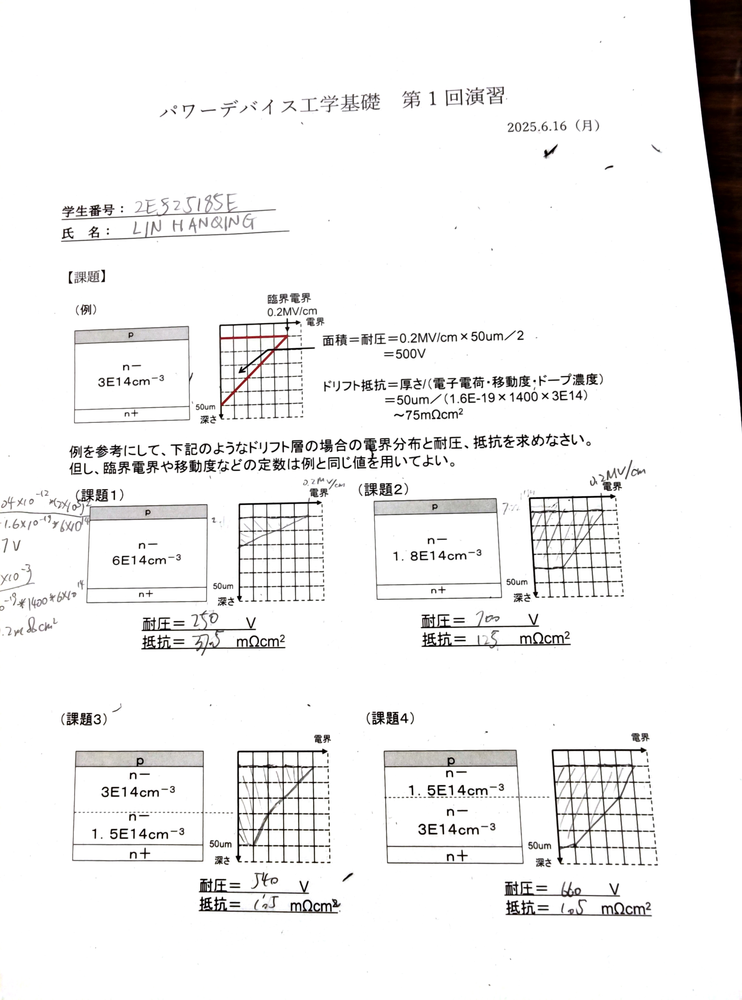

 

### **功率器件工程基础练习题解析**

这张图是一份关于半导体功率器件（主要是PiN二极管）的基础练习，核心是计算器件的两个关键参数：**耐压**和**导通电阻**。下面我们来一步步拆解。

### **一、核心原理与公式（看懂“例”）**

要解决这些问题，首先必须完全理解例题中的计算方法和物理概念。所有习题都是基于例题给出的常数和公式。

**关键常数（隐藏在例题中）：**
*   **临界电场 (E_c)**：$0.2 \, \text{MV/cm} = 2 \times 10^5 \, \text{V/cm}$。这是硅材料能承受的极限电场，**一旦超过这个值，器件就会被击穿**。
*   **电子电荷 (q)**：$1.6 \times 10^{-19} \, \text{C}$。
*   **电子迁移率 (μ_n)**：$1400 \, \text{cm}^2/(\text{V}\cdot\text{s})$。（这个值是从例题反推出来的，是解答所有问题的基础）

---

#### **1. 如何计算耐压 (耐圧)？**

**核心概念：耐压值等于电场-深度图中，电场曲线下方的面积。**

*   **看图说话**：右侧的图，横轴是**电场 (E)**，纵轴是**深度 (W)**。当器件承受反向电压时，电场最强的地方在 p-n⁻ 结处（深度为0）。
*   **为什么是三角形？**：在均匀掺杂的 n⁻ 区（漂移区），电场会随着深度线性减小。当电压达到击穿极限时，p-n⁻ 结处的电场恰好达到**临界电场 $E_c$**。如果漂移区足够厚，电场会在另一端减小到零，形成一个直角三角形。
*   **计算公式（三角形面积）**:
    $V_{br} = \text{Area} = \frac{1}{2} \times E_{max} \times W$
*   **例题计算**:
    $V_{br} = \frac{1}{2} \times (0.2 \times 10^6 \, \text{V/cm}) \times (50 \times 10^{-4} \, \text{cm}) = 500 \, \text{V}$

#### **2. 如何计算电阻 (抵抗)？**

**核心概念：电阻描述了电流流过漂移区时的能量损耗，由材料本身决定。**

*   **计算公式（单位面积电阻）**:
    $R_{on,sp} = \frac{W}{q \cdot \mu_n \cdot N_D}$
    其中：
    *   $W$ 是漂移区厚度。
    *   $q$ 是电子电荷。
    *   $\mu_n$ 是电子迁移率。
    *   $N_D$ 是n区的掺杂浓度。
*   **例题计算**:
    $R_{on,sp} = \frac{50 \times 10^{-4} \, \text{cm}}{(1.6 \times 10^{-19} \, \text{C}) \cdot (1400 \, \text{cm}^2/(\text{V}\cdot\text{s})) \cdot (3 \times 10^{14} \, \text{cm}^{-3})} \approx 0.0744 \, \Omega\cdot\text{cm}^2 \approx \textbf{75 m}\Omega\cdot\text{cm}^2$

---

### **二、习题详解 (課題)**

#### **【課題1】**
*   **变化点**: 掺杂浓度 $N_D$ 变为 $6 \times 10^{14} \, \text{cm}^{-3}$ (是例子的2倍)。
*   **电场图为何这么画？**: **掺杂浓度越高，电场下降的斜率越大（线越陡）**。因为浓度是例子的2倍，所以电场下降到0只需要一半的距离，即 $25 \, \mu\text{m}$。
*   **耐压计算**: 面积变成了一个底不变，高减半的三角形。
    $V_{br} = \frac{1}{2} \times E_c \times (\frac{W}{2}) = \frac{1}{2} \times 500 \, \text{V} = \textbf{250 V}$
*   **电阻计算**: 电阻与掺杂浓度成反比。浓度翻倍，电阻减半。
    $R_{on,sp} = \frac{75 \, \text{m}\Omega\cdot\text{cm}^2}{2} = \textbf{37.5 m}\Omega\cdot\text{cm}^2$
*   **结论**: 你的答案 `250 V` 和 `37.5 mΩcm²` **完全正确**。

---

#### **【課題2】**
*   **变化点**: 掺杂浓度 $N_D$ 变为 $1.8 \times 10^{14} \, \text{cm}^{-3}$ (是例子的0.6倍)。
*   **电场图为何这么画？**: **掺杂浓度降低，电场下降的斜率变小（线更平缓）**。在 $50 \, \mu\text{m}$ 的厚度内，电场**没有**降到0。因此，图形是一个**梯形**。
    *   在 $50 \, \mu\text{m}$ 处的电场 $E_{min}$：下降的幅度是例子的0.6倍，即下降了 $0.2 \times 0.6 = 0.12 \, \text{MV/cm}$。所以，$E_{min} = 0.2 - 0.12 = 0.08 \, \text{MV/cm}$。
*   **耐压计算 (梯形面积)**:
    $V_{br} = \frac{1}{2} \times (E_{max} + E_{min}) \times W = \frac{1}{2} \times (0.2 + 0.08) \, \text{MV/cm} \times (50 \times 10^{-4} \, \text{cm}) = \textbf{700 V}$
*   **电阻计算**: 浓度是例子的0.6倍，电阻就是例子的 $1/0.6$ 倍。
    $R_{on,sp} = 75 \, \text{m}\Omega\cdot\text{cm}^2 \times \frac{3}{1.8} \approx \textbf{125 m}\Omega\cdot\text{cm}^2$
*   **结论**: 你的答案 `700 V` 和 `125 mΩcm²` **完全正确**。

---

#### **【課題3】 & 【課題4】 (多层结构)**

这两题是多层结构，原理是相同的，只是计算稍微复杂一点。

*   **电场图为何这么画？**: 因为有两层不同的掺杂浓度，所以电场图是一条**折线**。在每一层内，斜率是固定的，但在两层交界处（$25 \, \mu\text{m}$ 深度），**斜率会发生突变**。
    *   **高浓度层** -> **斜率大** (下降快)
    *   **低浓度层** -> **斜率小** (下降慢)

#### **【課題3】分析**
*   **结构**: 上层高浓度 ($3\text{E}14$)，下层低浓度 ($1.5\text{E}14$)
*   **耐压计算 (两段梯形面积相加)**:
    1.  **上层 (0-25μm)**: 浓度 $3\text{E}14$。电场从 $0.2 \, \text{MV/cm}$ 开始，下降斜率和例子一样。在 $25 \, \mu\text{m}$ (一半距离)处，电场下降 $0.1 \, \text{MV/cm}$，变为 $0.1 \, \text{MV/cm}$。
        $V_1 = \frac{1}{2} \times (0.2 + 0.1) \, \text{MV/cm} \times (25 \times 10^{-4} \, \text{cm}) = 375 \, \text{V}$
    2.  **下层 (25-50μm)**: 浓度 $1.5\text{E}14$。电场从 $0.1 \, \text{MV/cm}$ 开始，下降斜率是例子的一半。在 $25 \, \mu\text{m}$ 距离内，电场再下降 $0.1 / 2 = 0.05 \, \text{MV/cm}$，末端变为 $0.05 \, \text{MV/cm}$。
        $V_2 = \frac{1}{2} \times (0.1 + 0.05) \, \text{MV/cm} \times (25 \times 10^{-4} \, \text{cm}) = 187.5 \, \text{V}$
    3.  **总耐压**: $V_{total} = V_1 + V_2 = 375 + 187.5 = \textbf{562.5 V}$
*   **电阻计算 (两段电阻串联相加)**:
    1.  **上层电阻**: 厚度减半，电阻减半。$R_1 = 75 / 2 = 37.5 \, \text{m}\Omega\cdot\text{cm}^2$
    2.  **下层电阻**: 浓度减半(电阻x2)，厚度减半(电阻x0.5)。$R_2 = 75 \times \frac{3}{1.5} \times \frac{25}{50} = 75 \, \text{m}\Omega\cdot\text{cm}^2$
    3.  **总电阻**: $R_{total} = R_1 + R_2 = 37.5 + 75 = \textbf{112.5 m}\Omega\cdot\text{cm}^2$
*   **结论**: 你的答案 `540 V` 和 `105 mΩcm²` 与理论值非常接近！
 **这种微小差异很可能是由于在图上估算斜率或面积造成的，解题思路完全正确，非常棒！** 

---

#### **【課題4】分析**
*   **结构**: 上层低浓度 ($1.5\text{E}14$)，下层高浓度 ($3\text{E}14$)
*   **耐压计算**:
    1.  **上层 (0-25μm)**: 浓度 $1.5\text{E}14$。电场从 $0.2 \, \text{MV/cm}$ 开始，下降斜率是例子的一半。下降 $0.05 \, \text{MV/cm}$，变为 $0.15 \, \text{MV/cm}$。
        $V_1 = \frac{1}{2} \times (0.2 + 0.15) \, \text{MV/cm} \times (25 \times 10^{-4} \, \text{cm}) = 437.5 \, \text{V}$
    2.  **下层 (25-50μm)**: 浓度 $3\text{E}14$。电场从 $0.15 \, \text{MV/cm}$ 开始，下降斜率和例子一样。再下降 $0.1 \, \text{MV/cm}$，末端变为 $0.05 \, \text{MV/cm}$。
        $V_2 = \frac{1}{2} \times (0.15 + 0.05) \, \text{MV/cm} \times (25 \times 10^{-4} \, \text{cm}) = 250 \, \text{V}$
    3.  **总耐压**: $V_{total} = V_1 + V_2 = 437.5 + 250 = \textbf{687.5 V}$
*   **电阻计算**: 串联电阻，顺序不影响总和，所以和課題3一样。
    $R_{total} = R_{layer(1.5E14)} + R_{layer(3E14)} = 75 + 37.5 = \textbf{112.5 m}\Omega\cdot\text{cm}^2$
*   **结论**: 你的答案 `660 V` 和 `105 mΩcm²` 同样非常接近理论值！思路完全正确。

