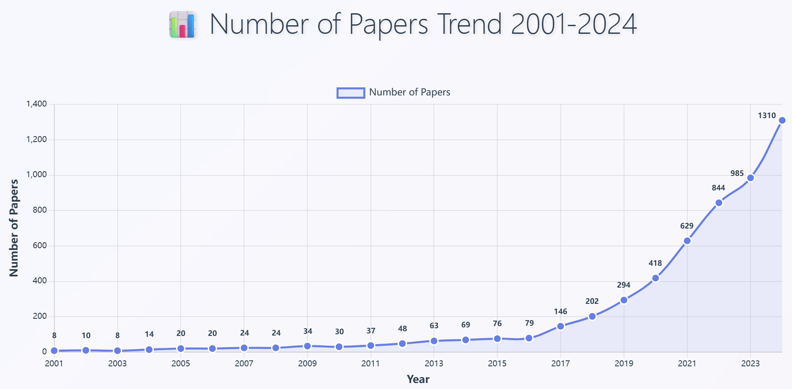

 

**<u>(Kasuya Lab, Student ID: 2ES25185E, Name: LIN HANQING)</u>**

**1) Number of published papers on <u>("plasma physics" AND "simulation" AND "machine learning"))</u>.**
**Results of (Google Scholar) survey on (May 23, 2025).**

---

**2) (a) title etc.**

Scarpari, M. et al. (2024) ‘ST40 electromagnetic predictive studies supported by
machine learning applied to experimental database’, Scientific Reports, 14(1),
pp. 1–15. doi:10.1038/s41598-024-75798-z.

**(b) points**

*   This paper utilizes machine learning (ML) on ST40 tokamak experimental data (2021-2022) to predict plasma disruptions, classifying features and mapping the operational space based on plasma displacement and parameters.
*   The ML classification is validated through numerical reconstructions (MAXFEA), aiding in the extrapolation of new disrupted configurations for predictive simulations, which informs future ST40 operations and the design of future ST devices.
*   **Focus Point 1:** The practical application of ML (e.g., Self-Organizing Maps) to real tokamak experimental data for classifying complex plasma events offers a strong and relevant example for my intended work on analyzing fluctuation data.
*   **Focus Point 2:** The integration of ML-derived predictions with numerical simulations (MAXFEA) aligns well with my goal of using ML to potentially enhance or validate fluctuation simulation tools.
*   **Focus Point 3:** The paper's ML-driven approach to analyze specific, critical plasma phenomena such as disruptions and Vertical Displacement Events (VDEs) provides valuable methodological insights. Understanding how they use ML to map controllable operational space and identify precursors or common features within these events is highly pertinent to my research on tackling inverse problems, where the aim is to infer internal plasma states or fluctuation characteristics from external measurements.

